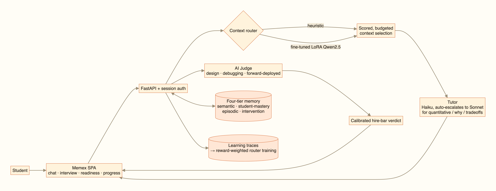
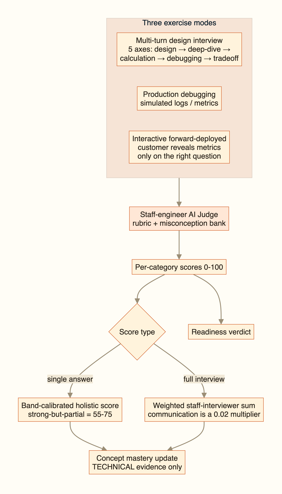
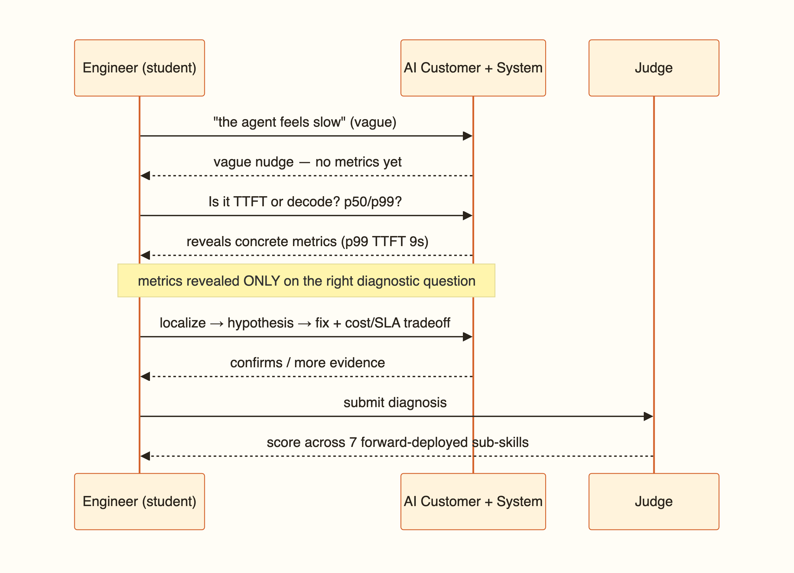
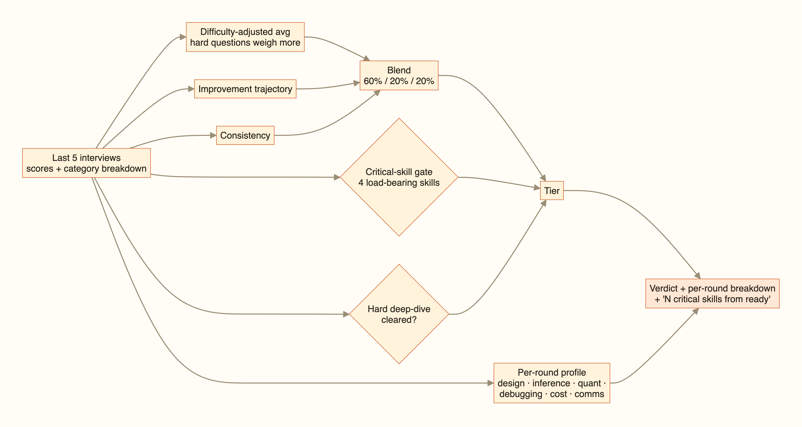
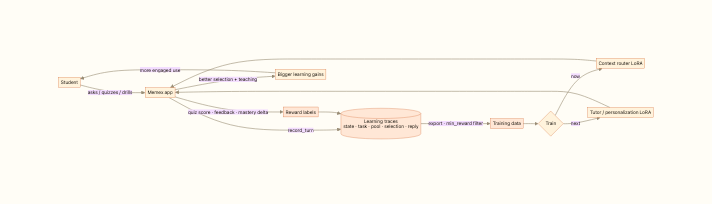
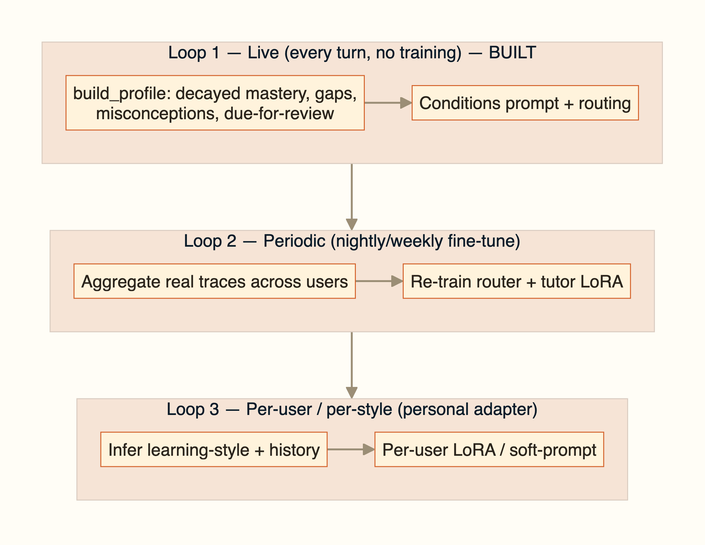
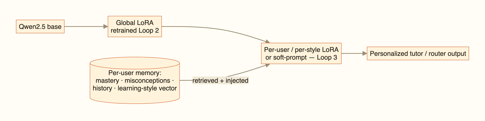

# Memex — LeetCode for ML-systems design

> *An ML-infra **interview simulator** that teaches you to think like the engineer on call for a frontier-model serving system — with a self-improving AI staff engineer that **models what you know**, **routes only the context you need** (with a router we fine-tuned ourselves), and gives you a **calibrated hire-bar verdict** that improves over time.*

CS 153 (Building Frontier-Model Applications) final project. Memex is an adaptive
interview-prep simulator for ML-systems engineering (the CS336 / CS349D body of
knowledge). A staff-engineer AI judge runs mock design interviews and production
debugging incidents, scoring you against a real hire bar; a **persistent, structured
learner model** tracks every concept; and a **learned context-selection router** keeps
the tutor's context tight. The product it sells is the **calibrated readiness verdict** —
proof you'd clear the bar, not just answer text.

---

## Why this isn't just a Claude Project / Custom GPT

A generic "chat with memory" (Claude Projects, ChatGPT memory) answers questions and
keeps loose notes. Memex differs structurally:

| | Claude Project / ChatGPT | **Memex** |
|---|---|---|
| Learner model | opaque, uncontrollable notes | **explicit per-concept mastery + confidence, misconceptions, prerequisites, spaced-repetition schedule** |
| Context selection | stuff the window (opaque, costly) | **a fine-tuned router** selects the optimal subset under a token budget — *observable, scored, cheap* |
| Outcomes | none | **calibrated hire-bar verdict** (60% interview avg + 20% trajectory + 20% consistency, gated by 4 load-bearing skills) that improves over time — proof you'd clear the bar (a stateless tutor can't produce this) |
| Pedagogy | reactive Q&A | misconception **diagnostics**, **adaptive-difficulty** quizzes, spaced-repetition resurfacing |
| Ownership | vendor silo | **self-hostable**; your data; per-user trajectory capture for further fine-tuning |

The thing we sell is the **differentiator**: the outcomes-proven readiness report — not the answer text (which is a commodity).

---

## How it works (the three lenses)

**System at a glance** — every turn flows through a context router (heuristic or our fine-tuned LoRA) into a mastery-aware tutor, while the AI Judge grades interviews into a calibrated hire-bar verdict; all of it reads and writes a four-tier memory and emits training traces.



### [1] Research — a learned context router (oracle distillation)
The core research question: *can a small model match a frontier oracle at **context selection** — picking which memory items to put in a tutor's context under a token budget?*
- **Data:** 5,000 routing trajectories (`data/trajectories/val.jsonl`) — `(student_state, task, candidate_pool, budget) → oracle_selection`.
- **Training:** LoRA SFT of four Qwen2.5 sizes (0.5B / 1.5B / 3B / 7B) on a shared **32×H100 SLURM cluster** (`cluster/`, `scripts/finetune_router.py`, `src/learning_memory_os/router/finetune.py`).
- **Result:** held-out **selection Jaccard vs. the oracle** — 0.5B 0.33 → 1.5B 0.39 → 3B 0.55 → **7B 0.81**, with an accuracy-vs-latency **Pareto** (`scripts/eval_routers.py`, `scripts/plot_pareto.py`, `data/eval/pareto.png`). The 7B dominates the 3B. Adapters published to the HF Hub (private).

### [2] Application / Product
- **Backend:** FastAPI (`src/learning_memory_os/api.py`) over Postgres + **pgvector**; four-tier memory (semantic / student-mastery / episodic / intervention) plus an XTrace tier.
- **Frontend:** a no-build SPA (`web/`) — Home, **Interview Readiness**, **Mock Interview**, Profile, Chat, Progress, Path, Your AI. Auth (sessions). A server-side entitlement layer + **Stripe billing** (`src/learning_memory_os/billing.py`) exists for a Pro tier, but **all features are free for now** (the gating is flipped off in `api.py`).
- **Deployment:** self-host the trained router via **DigitalOcean GPU Droplet + vLLM** (`deploy/digitalocean/`) or Modal; the product can call it as a remote OpenAI-compatible endpoint.

### [3] Agent / automation
- **InterviewAgent** (`src/learning_memory_os/agents/interview.py`): three staff-engineer exercise modes graded against a real hire bar —
  - **Multi-turn design interview** — a back-and-forth: the interviewer asks follow-up probes that drill into the weakest part of your last answer, then grades the *whole conversation* across 10 rubric categories.
  - **Production debugging** — a realistic incident (simulated logs/metrics) graded on your debugging *process*.
  - **Forward-deployed engineer** — a vague customer complaint ("our agent feels slow") graded on the 7 sub-skills that separate forward-deployed work from pure backend: framing, metric selection, localization, hypothesis iteration, the fix, its cost/SLA tradeoff, and explaining it to a non-expert.
  The overall score is the **staff-interviewer weighted sum** of categories (communication is a 0.02 multiplier, not a driver), feeding the calibrated readiness verdict.

  **The interview engine** — three modes → a staff-engineer judge → per-category scores that are calibrated differently for a single answer vs. a full interview, and that update *concept* mastery only from technical evidence:

  

  **The interactive forward-deployed loop** — the AI customer/system reveals metrics *only* when the engineer asks the right diagnostic question, mirroring real customer engineering:

  

  **The readiness verdict** is a calibrated hire-bar profile, not a single number — a difficulty-adjusted blend, two hard gates (load-bearing skills + a required deep-dive), a per-round breakdown, and a "distance to next tier" plan:

  
- **TutorAgent** (`src/learning_memory_os/agents/tutor.py`): mastery-aware prompting (skips mastered topics, targets weak ones, confronts active misconceptions), with a **diagnostic remediation** loop and **adaptive-difficulty** quizzes (difficulty scales with mastery + recent scores).
- **RoutingEngine** (heuristic, scored on relevance/recency/misconception/prerequisite/reuse) **or** the fine-tuned router, selectable per request.
- **Trace capture** (`src/learning_memory_os/memory/trace.py`): every turn is logged as a training trajectory for future per-user fine-tuning.

---

## The context routers (deep dive)

The router is the heart of the project. Every tutor turn has to answer: *out of all
the memory items we could show the model, **which subset do we actually put in the
context window**, under a token budget?* Stuffing everything is expensive and triggers
"lost-in-the-middle" degradation; picking well is the whole game. Memex treats this
**context selection** as a first-class, swappable component with two backends.

### What a router does
Input → output, identical across backends (`router/prompt.py`):
- **Input:** the `StudentState` (per-concept mastery, active misconceptions, recent
  items), the `task` (type + text), a **candidate pool** of memory items
  (`[id] (tokens=…) title :: excerpt`), and a **token budget**.
- **Output:** a comma-separated list of the item **ids** to include — nothing else.

### Backend A — heuristic engine (`selector/`)
A transparent, scored optimizer: each candidate gets sub-scores for **relevance,
recency, misconception-match, prerequisite-coverage, and reuse**, then a budgeted
pack selects the set. Fast, explainable, zero model cost — the default, and the
teacher-signal baseline. The "Context for this answer" panel surfaces these scores.

### Backend B — learned routers (the research contribution)
*Can a small model match a frontier oracle at context selection?*

- **Oracle distillation.** A frontier LLM acts as the **oracle**, producing the gold
  selection for each trajectory. We then **distill** that behavior into small models —
  so at serve time you get oracle-quality selection without calling a frontier model.
  (Honest framing: this is *distillation*, so the ceiling is the oracle's judgment;
  beating it would require RL from real learning outcomes — see "What's next".)
- **Data** (`scripts/generate_trajectories.py`, `trajectories/sampler.py`): 5,000
  synthetic-but-realistic trajectories — `sample_candidate_pool` draws topic items +
  distractors from the real corpus; `sample_student_state` synthesizes bimodal mastery
  + misconceptions. Serialized to input→target pairs (`trajectories/serializer.py`).
  Held-out split used for eval. Stored in `data/trajectories/val.jsonl`.
- **Models & training** (`router/finetune.py`, `config/router_sizes.yaml`): **LoRA SFT**
  of four **Qwen2.5-Instruct** sizes — **0.5B / 1.5B / 3B / 7B** (7B in 4-bit). LoRA
  `r=16, α=32` on `q/k/v/o`, seq-len 2048, 2 epochs. Run on a shared **32×H100 SLURM
  cluster** via pyxis/enroot in an NGC PyTorch container (`cluster/`).

### Results (held-out, vs. the oracle's selection)

| Router | Precision | Recall | **Jaccard** | ms/call |
|---|---|---|---|---|
| Qwen2.5-0.5B | 0.52 | 0.45 | 0.33 | ~2300 |
| Qwen2.5-1.5B | 0.57 | 0.51 | 0.39 | ~2800 |
| Qwen2.5-3B | 0.65 | 0.72 | 0.55 | ~3900 |
| **Qwen2.5-7B** | **0.91** | **0.88** | **0.81** | ~3200 |

Generated by `scripts/eval_routers.py` → `scripts/plot_pareto.py` (`data/eval/pareto.png`).
Selection accuracy scales cleanly with size; the **7B reaches 0.81 Jaccard and Pareto-
dominates the 3B** (higher accuracy *and* lower latency — it emits tighter, correct
selections). The accuracy-vs-cost frontier is exactly the artifact that says which size
is worth its compute.

> **How we keep the claims honest** — the router is measured on *two* axes (selection
> Jaccard vs. the oracle **and** downstream learning-outcome quality), the readiness verdict
> is a calibrated hire-bar mapping (not a raw average), and the learning result is reported
> as a within-subject n=1 design with named threats. Full methodology, including the
> three-phase router objective and the claim boundary for each number:
> [`docs/EVAL_METHODOLOGY.md`](docs/EVAL_METHODOLOGY.md).

### Serving the learned router
- **In-process** for small sizes during local/dev use: `router/infer.py` loads
  `base + LoRA adapter` (CUDA→MPS→CPU). `router/product_adapter.py` bridges the live
  product's `MemoryItem` candidates + DB student state into the exact trained
  `PoolItem`/`StudentState` format, then maps selected short-ids back to candidates.
- **Hosted** for the 7B: `scripts/merge_adapter.py` merges the LoRA into the base; serve
  with **vLLM** behind an OpenAI-compatible API (`deploy/digitalocean/`). The product
  calls it remotely via `router/remote.py` (`/v1/completions`, raw prompt — matching
  training), enabled with `LMOS_ROUTER_ENDPOINT`.
- **In the product:** the chat **Router** selector chooses *Heuristic*, a *Fine-tuned*
  size, or *Hosted (vLLM)* per request; `tutor.answer(preselected_items=…)` then builds
  the context from the router's choice. The selection is observable in the context panel.

### Why it matters
A learned router gives **budget-aware, observable, cheap** context selection instead of
a black-box context window — better quality per token, controllable latency/cost, and
(at cohort scale) materially lower inference spend than routing through a frontier model.
The research *is* the product's unit economics.

---

## Continuous improvement → a personalized, self-adapting tutor

When AI writes the code, the durable human skill is **systems-engineering judgment**.
Memex's long game is a tutor that **learns *how* you learn**, **remembers what you've
learned**, and trains that judgment with a model that keeps improving. Every turn is
captured as fine-tune-ready data (`memory/trace.py`), turning usage into compounding
model quality. Full design: [`docs/superpowers/specs/2026-06-03-continuous-improvement-personalized-llm-design.md`](docs/superpowers/specs/2026-06-03-continuous-improvement-personalized-llm-design.md).

**The data flywheel** — labeled *learning outcomes* (not answers) are the asset that compounds:



**Three adaptation loops** at different timescales (Loop 1 is live today):



**The personalized model** — shared base, a globally-improving adapter, and a thin
per-user / per-learning-style layer conditioned on the student's own memory:



Shipped so far: **(Loop 1)** live per-turn personalization + inferred **learning style**
(`agents/learning_style.py`) injected into the tutor; **reward-weighted export** +
**realized-mastery-gain rewards** (`memory/trace.py`); and a **Loop-2 training-set
builder** (`scripts/build_training_set.py`) that mixes real reward-weighted traces with
the synthetic set for cluster retraining. Next: RL-from-outcomes and per-user adapters.
(More diagrams — `rl_from_outcomes`, `memory_lifecycle` — in [`docs/diagrams/`](docs/diagrams/).)

---

## Setup

Prereqs: Python 3.11+, [`uv`](https://github.com/astral-sh/uv), Docker.

```bash
git clone https://github.com/HivaMohammadzadeh1/CS153-frontier-systems.git
cd CS153-frontier-systems

cp .env.example .env          # fill in ANTHROPIC_API_KEY, OPENAI_API_KEY, DATABASE_URL
docker compose up -d db       # Postgres + pgvector on :5433
uv sync                       # install deps
uv run python scripts/migrate.py   # apply migrations/ (schema, auth, billing, mastery_history)
uv run pytest                 # (optional) tests
```

Optional env (off by default): `STRIPE_SECRET_KEY` / `STRIPE_PRICE_ID` / `STRIPE_WEBHOOK_SECRET` (billing), `LMOS_ROUTER_ENDPOINT` (use a remotely-hosted fine-tuned router).

## Usage

```bash
uv run python -m scripts.serve --port 8000     # web app -> http://localhost:8000
```
Sign up, then: **Chat** (ask anything; pick a topic; hit 🎯 Test for an adaptive quiz),
**🧭 Readiness** (your interview-readiness %, gaps, drill plan — Pro), **Progress** /
**Path** (mastery + curriculum map). The "Context for this answer" panel shows *why*
each memory item was selected.

Other entry points:
- `uv run streamlit run scripts/app.py` — backend-dev Streamlit view.
- Fine-tune the routers on the cluster: see `cluster/README.md`.
- Evaluate + plot the Pareto: `scripts/eval_routers.py`, `scripts/plot_pareto.py`.
- Merge a LoRA for serving: `python -m scripts.merge_adapter --size qwen2_5_7b --out data/merged/qwen2_5_7b`.
- Deploy the 7B router: `deploy/digitalocean/README.md`.

## Repository layout

```
src/learning_memory_os/   backend: api, agents, router, selector, memory, eval, trajectories, auth, billing
web/                      no-build SPA (index.html, app.js, styles.css)
scripts/                  CLIs: serve, finetune_router, eval_routers, merge_adapter, generate_trajectories, …
cluster/                  SLURM fine-tuning sweep (sbatch + runbook) for the H100 cluster
deploy/digitalocean/      GPU-Droplet + vLLM hosting for the trained router
config/                   router_sizes.yaml, topics.yaml (the curriculum)
migrations/               Postgres schema (001–008)
data/trajectories/        routing training/eval data
docs/superpowers/specs/   design specs for each subsystem
```

## AI usage disclosure

- **Built with [Claude Code](https://claude.com/claude-code)** (Anthropic) as the primary coding agent, under human direction, throughout the project. Design specs in `docs/superpowers/specs/` were drafted collaboratively.
- **Runtime models:** the **tutor's explanations** are generated by **Anthropic Claude** (Opus/Sonnet); **embeddings** use OpenAI `text-embedding-3-small`; the **context routers** are **our own** fine-tunes of **Qwen2.5-Instruct** (LoRA), trained for this project.
- No project code was copied from external repositories; third-party libraries are used via their public packages (see citations).

## Citations & acknowledgements

- **Curriculum** distilled from Stanford **CS336** (Language Modeling from Scratch) and **CS349D** (Systems for ML); topic list in `config/topics.yaml`.
- **Base models:** [Qwen2.5-Instruct](https://huggingface.co/Qwen) (Alibaba). **Serving:** [vLLM](https://github.com/vllm-project/vllm). **Fine-tuning:** 🤗 [PEFT](https://github.com/huggingface/peft) + [Transformers](https://github.com/huggingface/transformers).
- **Stack:** FastAPI, PostgreSQL + [pgvector](https://github.com/pgvector/pgvector), Stripe, Streamlit, Tailwind.
- **Compute:** shared 32×H100 SLURM cluster (Omniva / Teleport access), provided for CS 153.

## External resources

- GitHub: https://github.com/HivaMohammadzadeh1/CS153-frontier-systems
- Fine-tuned router adapters (HF Hub, private): `hivamoh/lmos-router-qwen2_5_{0_5b,1_5b,3b,7b}`
- Demo video: *(link in Gradescope submission)*

## License / academic honesty

Coursework for CS 153. Built during the course. See AI usage disclosure above.
