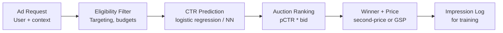
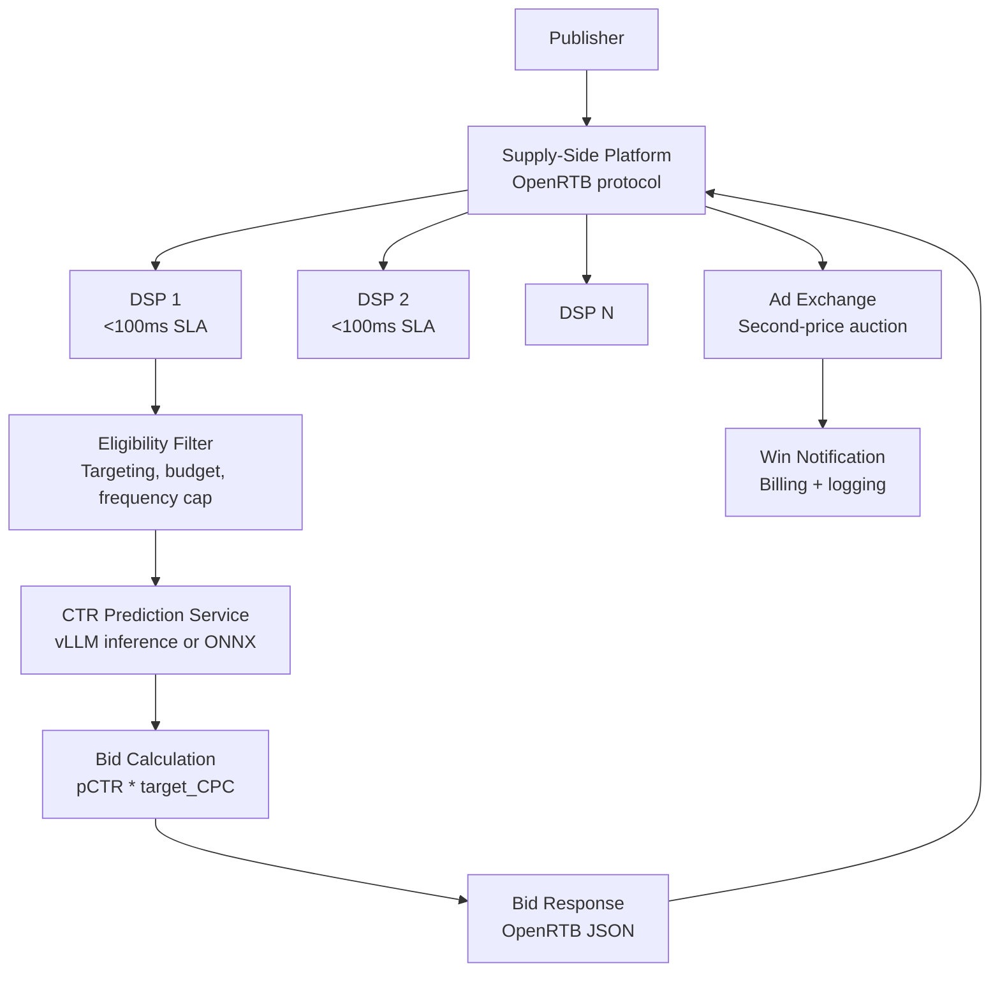

# Ad Systems: Auction Mechanics, CTR Prediction, Calibration, and RTB

**Area G — ML System Design | Learning Memory OS Curriculum**

---

## 1. Why Ad Systems Are ML System Design Challenges

Online advertising is one of the largest deployed ML systems in existence. Google's ad system processes 8.5 billion ad requests per day. The core challenge is a real-time market: for each ad slot (a page load, a search result, a social feed position), an auction runs in under 100ms, selecting which advertiser wins and how much they pay. ML sits at every stage: predicting click-through rates, estimating conversion probabilities, calibrating predictions to be reliable probabilities, and managing spend pacing across days and budgets.



---

## 2. Auction Mechanics

### 2.1 Second-Price (Vickrey) Auction

The dominant auction mechanism for display ads. The highest bidder wins and pays the second-highest bid. This incentivizes advertisers to bid their true value.

```python
from dataclasses import dataclass
from typing import List, Optional, Tuple
import random

@dataclass
class Bid:
    advertiser_id: str
    bid_price: float      # max cost-per-click the advertiser is willing to pay
    quality_score: float  # platform-estimated relevance (0-1)

def second_price_auction(bids: List[Bid]) -> Tuple[Optional[Bid], float]:
    """
    Run a second-price auction.
    Ranking is by effective_cpm = bid * quality_score (Generalized Second Price).
    Returns (winning_bid, price_to_pay).
    """
    if not bids:
        return None, 0.0
    
    # Rank by effective bid (bid * quality score)
    ranked = sorted(bids, key=lambda b: b.bid_price * b.quality_score, reverse=True)
    winner = ranked[0]
    
    if len(ranked) == 1:
        return winner, ranked[0].bid_price * ranked[0].quality_score * 0.01  # floor price
    
    # Second price: winner pays second-highest effective bid / winner's quality score
    # (so advertiser pays per-click, not per-impression)
    second_effective = ranked[1].bid_price * ranked[1].quality_score
    price_per_click = second_effective / winner.quality_score
    return winner, price_per_click


def simulate_auction_market(num_advertisers: int = 10,
                             num_slots: int = 1000,
                             seed: int = 42) -> dict:
    """
    Simulate a second-price auction market and compute revenue stats.
    """
    random.seed(seed)
    wins = {i: 0 for i in range(num_advertisers)}
    payments = {i: 0.0 for i in range(num_advertisers)}
    
    for _ in range(num_slots):
        # Random bids with log-normal distribution (realistic)
        bids = [
            Bid(
                advertiser_id=str(i),
                bid_price=max(0.01, random.lognormvariate(0, 0.5)),
                quality_score=random.uniform(0.3, 1.0),
            )
            for i in range(num_advertisers)
        ]
        winner, price = second_price_auction(bids)
        if winner:
            wins[int(winner.advertiser_id)] += 1
            payments[int(winner.advertiser_id)] += price
    
    return {
        "wins": wins,
        "total_revenue": sum(payments.values()),
        "avg_price": sum(payments.values()) / num_slots,
    }


if __name__ == "__main__":
    result = simulate_auction_market(num_advertisers=10, num_slots=10000)
    print(f"Total revenue: ${result['total_revenue']:.2f}")
    print(f"Avg price per slot: ${result['avg_price']:.4f}")
```

---

## 3. CTR Prediction

### 3.1 Logistic Regression Baseline

The industry baseline for CTR prediction is logistic regression with sparse features (user demographics, ad creative features, context). Despite its simplicity, it trained on billions of examples is hard to beat on latency-constrained systems.

```python
import numpy as np
from sklearn.linear_model import LogisticRegression
from sklearn.preprocessing import OneHotEncoder
from sklearn.pipeline import Pipeline
from sklearn.metrics import roc_auc_score, log_loss

def generate_synthetic_criteo_data(n_samples: int = 100_000, seed: int = 42):
    """
    Synthetic Criteo-like click log:
    - 13 integer features (counts)
    - 26 categorical features (hashed)
    - binary click label
    """
    rng = np.random.RandomState(seed)
    # Integer features (log-transformed counts)
    int_features = rng.exponential(scale=100, size=(n_samples, 13)).astype(int)
    int_features = np.log1p(int_features)  # log-transform sparse counts
    
    # Categorical features (simulate hashed IDs, 0-999)
    cat_features = rng.randint(0, 1000, size=(n_samples, 26))
    
    # Click probability: logistic function of a linear combination
    w = rng.randn(13 + 26) * 0.1
    X = np.hstack([int_features, cat_features])
    p = 1 / (1 + np.exp(-(X @ w)))
    y = (rng.uniform(size=n_samples) < p).astype(int)
    
    return int_features, cat_features, y

def train_ctr_model(n_samples: int = 100_000):
    """Train a simple logistic regression CTR model."""
    int_feats, cat_feats, y = generate_synthetic_criteo_data(n_samples)
    
    # One-hot encode categoricals (in production: use feature hashing)
    # Here we use 10-bucket bucketing per categorical for tractability
    cat_bucketed = cat_feats % 10  # simulate bucketing
    cat_onehot = np.zeros((n_samples, 26 * 10))
    for j in range(26):
        for i in range(n_samples):
            cat_onehot[i, j * 10 + cat_bucketed[i, j]] = 1.0
    
    X = np.hstack([int_feats, cat_onehot])
    split = int(0.8 * n_samples)
    X_train, X_val = X[:split], X[split:]
    y_train, y_val = y[:split], y[split:]
    
    model = LogisticRegression(C=1.0, max_iter=200, solver='lbfgs')
    model.fit(X_train, y_train)
    
    p_val = model.predict_proba(X_val)[:, 1]
    print(f"AUC-ROC: {roc_auc_score(y_val, p_val):.4f}")
    print(f"Log-loss: {log_loss(y_val, p_val):.4f}")
    return model
```

### 3.2 Deep CTR Models (Wide & Deep)

```python
import torch
import torch.nn as nn
import torch.nn.functional as F

class WideDeeepCTR(nn.Module):
    """
    Wide & Deep model (Cheng et al., 2016).
    Wide part: linear model for memorization.
    Deep part: MLP for generalization.
    """
    def __init__(self, wide_dim: int, num_categoricals: int,
                 embed_dim: int = 8, deep_hidden: int = 256):
        super().__init__()
        # Wide: linear over sparse features
        self.wide = nn.Linear(wide_dim, 1, bias=True)
        # Deep: embeddings + MLP
        self.embeddings = nn.Embedding(num_categoricals, embed_dim)
        deep_input_dim = embed_dim * 10  # 10 categorical features embedded
        self.deep = nn.Sequential(
            nn.Linear(deep_input_dim, deep_hidden),
            nn.ReLU(),
            nn.Dropout(0.2),
            nn.Linear(deep_hidden, deep_hidden // 2),
            nn.ReLU(),
            nn.Linear(deep_hidden // 2, 1),
        )

    def forward(self, wide_x: torch.Tensor,
                cat_ids: torch.Tensor) -> torch.Tensor:
        """
        wide_x: (B, wide_dim) sparse binary features
        cat_ids: (B, num_cat) categorical feature indices
        Returns: (B,) click probability logits
        """
        wide_out = self.wide(wide_x).squeeze(-1)    # (B,)
        embs = self.embeddings(cat_ids)              # (B, num_cat, embed_dim)
        deep_input = embs.flatten(start_dim=1)       # (B, num_cat * embed_dim)
        deep_out = self.deep(deep_input).squeeze(-1) # (B,)
        return wide_out + deep_out                   # logit, apply sigmoid for prob
```

---

## 4. Calibration with Isotonic Regression

CTR models trained on data with different click rates than the serving distribution will be miscalibrated. Calibration ensures that a predicted CTR of 5% actually corresponds to 5% click probability. This is critical because auction bids are often expressed as expected value = pCTR * bid, so miscalibration directly costs money.

```python
import numpy as np
from sklearn.isotonic import IsotonicRegression
from sklearn.calibration import calibration_curve
import matplotlib.pyplot as plt

def calibrate_ctr_predictions(raw_scores: np.ndarray,
                               labels: np.ndarray,
                               method: str = "isotonic"):
    """
    Calibrate CTR model predictions.
    raw_scores: model output probabilities (before calibration)
    labels: binary click labels
    method: 'isotonic' or 'sigmoid' (Platt scaling)
    """
    if method == "isotonic":
        calibrator = IsotonicRegression(out_of_bounds="clip")
        calibrator.fit(raw_scores, labels)
        return calibrator
    elif method == "sigmoid":
        from sklearn.linear_model import LogisticRegression
        calibrator = LogisticRegression()
        calibrator.fit(raw_scores.reshape(-1, 1), labels)
        return calibrator
    else:
        raise ValueError(f"Unknown method: {method}")

def plot_calibration(raw_scores: np.ndarray,
                     calibrated_scores: np.ndarray,
                     labels: np.ndarray, n_bins: int = 20):
    """Plot reliability diagram (calibration curve)."""
    frac_raw, mean_raw = calibration_curve(labels, raw_scores, n_bins=n_bins)
    frac_cal, mean_cal = calibration_curve(labels, calibrated_scores, n_bins=n_bins)
    
    plt.figure(figsize=(6, 6))
    plt.plot([0, 1], [0, 1], 'k--', label='Perfect calibration')
    plt.plot(mean_raw, frac_raw, 'b-o', label='Before calibration')
    plt.plot(mean_cal, frac_cal, 'r-o', label='After isotonic calibration')
    plt.xlabel("Mean predicted probability")
    plt.ylabel("Fraction of positives")
    plt.title("Calibration curve")
    plt.legend()
    plt.tight_layout()
    plt.savefig("/tmp/calibration_curve.png")
    plt.close()

def expected_calibration_error(scores: np.ndarray, labels: np.ndarray,
                                n_bins: int = 10) -> float:
    """ECE: weighted average miscalibration across bins."""
    bin_edges = np.linspace(0, 1, n_bins + 1)
    ece = 0.0
    n = len(scores)
    for lo, hi in zip(bin_edges[:-1], bin_edges[1:]):
        mask = (scores >= lo) & (scores < hi)
        if not mask.any():
            continue
        bin_scores = scores[mask]
        bin_labels = labels[mask]
        bin_frac = mask.sum() / n
        ece += bin_frac * abs(bin_scores.mean() - bin_labels.mean())
    return float(ece)
```

---

## 5. Budget Pacing Controller

Advertisers have daily budgets. Without pacing, a high-bid advertiser could exhaust their budget in the first hour and miss peak traffic periods. Pacing throttles bid eligibility to spread spend evenly.

```python
import time
from dataclasses import dataclass, field
from typing import Dict

@dataclass
class PacingController:
    """
    Token bucket pacing controller for ad budgets.
    Smooths spending over the day using a PI controller.
    """
    advertiser_id: str
    daily_budget: float
    day_start_ts: float = field(default_factory=time.time)
    day_duration_seconds: float = 86400.0
    spent: float = 0.0
    
    def _ideal_spend_rate(self) -> float:
        """How much per second should we spend to hit budget by EOD?"""
        return self.daily_budget / self.day_duration_seconds
    
    def _elapsed_fraction(self) -> float:
        elapsed = time.time() - self.day_start_ts
        return min(elapsed / self.day_duration_seconds, 1.0)
    
    def throttle_probability(self) -> float:
        """
        Return probability [0,1] that this advertiser should participate in auction.
        If ahead of spend schedule -> lower probability.
        If behind schedule -> higher probability (up to 1.0).
        """
        ideal_spent = self.daily_budget * self._elapsed_fraction()
        if ideal_spent <= 0:
            return 0.5  # start at 50% to avoid burst
        ratio = self.spent / ideal_spent  # >1 means ahead of schedule
        # Proportional control: throttle down if spending too fast
        p = min(1.0, max(0.0, 1.0 / max(ratio, 0.01)))
        return p
    
    def record_win(self, cost: float):
        self.spent += cost
    
    def should_bid(self) -> bool:
        """Probabilistically decide whether to enter auction."""
        import random
        return random.random() < self.throttle_probability()
    
    def status(self) -> dict:
        elapsed_pct = self._elapsed_fraction() * 100
        spent_pct = self.spent / self.daily_budget * 100 if self.daily_budget > 0 else 0
        return {
            "advertiser_id": self.advertiser_id,
            "elapsed_pct": round(elapsed_pct, 1),
            "spent_pct": round(spent_pct, 1),
            "remaining_budget": self.daily_budget - self.spent,
            "throttle_prob": round(self.throttle_probability(), 3),
        }
```

---

## 6. Real-Time Bidding (RTB) System Architecture



The OpenRTB protocol (open standard) defines the bid request/response JSON schema. A DSP must respond within 100ms including network latency, typically achieving 80ms budget for computation.

---

## 7. Common Misconceptions

**Misconception: "Highest bidder always wins in online ad auctions."**
Correction: Most modern ad auctions use quality-weighted ranking: effective_bid = pCTR * bid (or pCVR * bid). This is Generalized Second Price (GSP). Google's Quality Score means an advertiser with lower bid but higher quality score can outrank a higher bidder. This incentivizes relevant ads and improves user experience.

**Misconception: "CTR models should be trained to maximize AUC-ROC."**
Correction: High AUC-ROC doesn't mean the model is well-calibrated. For auction systems, the absolute value of pCTR matters — it sets the bid multiplier. A model with AUC=0.80 but systematic underestimation of click rate causes underbidding and missed wins. Both AUC (ranking quality) and ECE/log-loss (calibration quality) must be monitored.

**Misconception: "Adding more features always improves CTR prediction."**
Correction: Feature engineering for CTR models must account for selection bias. Features that are informative of click intent but only observed post-click (e.g., dwell time) create data leakage. Features correlated with ad placement position introduce position bias. Careful feature selection and causal analysis are required.

**Misconception: "Budget pacing just means stopping bids when the budget is exhausted."**
Correction: Hard stopping causes spiky spend patterns — all budget goes to low-CPM early-day traffic, missing high-value afternoon peaks. Smooth pacing controllers (token bucket, PI controller) spread spend across the day's traffic quality distribution, improving advertiser ROI and platform revenue.

**Misconception: "RTB and programmatic advertising are the same thing."**
Correction: RTB (Real-Time Bidding) is a specific mechanism where bids are placed in real time per impression. Programmatic advertising is the broader category — it includes RTB, private marketplaces (PMP), preferred deals, and programmatic direct (guaranteed deals). RTB is a subset of programmatic.

---

## 8. Hands-On Labs

### Exercise 1: Second-Price Auction Simulator

**Goal**: Build an auction simulator and analyze how quality scores affect winner distribution and revenue.

**Starter code**:
```python
import numpy as np
from typing import List, Tuple

def run_auction_simulation(num_advertisers: int = 5,
                            num_auctions: int = 10_000,
                            seed: int = 42) -> dict:
    """
    Simulate auction market with heterogeneous advertisers.
    Each advertiser has:
    - bid_distribution: lognormal with different means
    - quality_score_distribution: beta with different params
    Returns revenue statistics and win rate per advertiser.
    """
    rng = np.random.RandomState(seed)
    
    # Advertiser parameters (bid_mean, quality_alpha, quality_beta)
    advertiser_params = [
        (1.5, 5, 2),   # High quality, medium bid
        (3.0, 2, 5),   # Low quality, high bid
        (1.0, 3, 3),   # Medium quality, low bid
        (2.0, 4, 2),   # High quality, high bid
        (0.5, 2, 2),   # Medium quality, very low bid
    ]
    
    win_counts = np.zeros(num_advertisers)
    total_revenue = 0.0
    
    for _ in range(num_auctions):
        bids = []
        for i, (bid_mean, qa, qb) in enumerate(advertiser_params[:num_advertisers]):
            bid = rng.lognormal(mean=np.log(bid_mean), sigma=0.3)
            qs = rng.beta(qa, qb)
            bids.append(Bid(advertiser_id=str(i), bid_price=bid, quality_score=qs))
        
        winner, price = second_price_auction(bids)
        if winner is not None:
            win_counts[int(winner.advertiser_id)] += 1
            total_revenue += price
    
    return {
        "win_rates": dict(zip(range(num_advertisers),
                               (win_counts / num_auctions).tolist())),
        "total_revenue": total_revenue,
        "avg_cpm": total_revenue / num_auctions * 1000,
    }
```

**Acceptance criteria**: Advertiser 3 (high quality, high bid) wins the most auctions. Advertiser 1 (low quality, high bid) wins fewer than Advertiser 3 despite higher bids. Total revenue increases relative to a uniform-quality baseline.
**Stretch**: Implement a first-price auction variant and compare seller revenue and advertiser surplus to the second-price auction.

---

### Exercise 2: CTR Calibration Pipeline

**Goal**: Train an uncalibrated CTR model, apply isotonic regression calibration, and show ECE improvement.

**Starter code**:
```python
import numpy as np
from sklearn.linear_model import LogisticRegression
from sklearn.isotonic import IsotonicRegression

def train_and_calibrate_ctr(n_train: int = 50_000, n_val: int = 10_000):
    """
    1. Generate synthetic click data with systematic imbalance.
    2. Train logistic regression CTR model.
    3. Compute ECE before calibration.
    4. Apply isotonic regression calibration.
    5. Compute ECE after calibration.
    6. Assert ECE improves by >30%.
    """
    # Generate data
    int_feats, cat_feats, y = generate_synthetic_criteo_data(n_train + n_val)
    # TODO: train model, calibrate, evaluate ECE before and after
    pass
```

**Acceptance criteria**: ECE after isotonic regression calibration is < 0.02, and at least 30% lower than before calibration.
**Stretch**: Implement Platt scaling (sigmoid calibration) and compare ECE with isotonic regression. Plot reliability diagrams for both.

---

## 9. Click-Through Rate Model Evaluation in Production

Evaluating CTR models offline is tricky due to feedback loops. Metrics that matter:

```python
import numpy as np
from sklearn.metrics import roc_auc_score, log_loss, brier_score_loss

def comprehensive_ctr_evaluation(y_true: np.ndarray,
                                   y_pred: np.ndarray) -> dict:
    """
    Full suite of CTR model evaluation metrics.
    y_true: binary click labels (0/1)
    y_pred: predicted click probabilities
    """
    auc_roc = roc_auc_score(y_true, y_pred)
    nll = log_loss(y_true, y_pred)           # negative log-likelihood
    brier = brier_score_loss(y_true, y_pred)  # mean squared error in probability space
    
    # Relative Information Gain (RIG): how much better than predicting base rate
    base_rate = y_true.mean()
    nll_baseline = log_loss(y_true, np.full_like(y_pred, base_rate))
    rig = 1.0 - nll / nll_baseline
    
    # Expected Calibration Error
    ece = expected_calibration_error(y_pred, y_true)
    
    return {
        "auc_roc": float(auc_roc),
        "nll": float(nll),
        "brier": float(brier),
        "rig": float(rig),   # normalized information gain vs. base rate
        "ece": float(ece),
        "base_rate": float(base_rate),
        "pred_mean": float(y_pred.mean()),
        "calibration_bias": float(y_pred.mean() - base_rate),  # positive = over-estimates
    }

def feature_importance_analysis(model, feature_names: list) -> dict:
    """
    For LightGBM/tree models: analyze feature importance.
    Returns sorted dict of feature -> importance.
    """
    importance_gain = model.feature_importance(importance_type="gain")
    importance_split = model.feature_importance(importance_type="split")
    result = {
        name: {"gain": float(g), "split": int(s)}
        for name, g, s in zip(feature_names, importance_gain, importance_split)
    }
    return dict(sorted(result.items(), key=lambda x: x[1]["gain"], reverse=True))
```

---

### Exercise 3: Pacing Controller Simulation

**Goal**: Simulate a day of ad serving with and without pacing and compare spend curves.

**Starter code**:
```python
import numpy as np
import matplotlib.pyplot as plt

def simulate_spend_with_pacing(daily_budget: float = 1000.0,
                                traffic_multipliers: List[float] = None,
                                use_pacing: bool = True) -> List[float]:
    """
    Simulate hourly spend over a 24-hour day.
    traffic_multipliers: relative traffic volume per hour (24 values, sum to 24)
    Returns list of 24 hourly spend values.
    """
    if traffic_multipliers is None:
        # Realistic traffic: low at night, peak at noon and evening
        traffic_multipliers = [0.3, 0.2, 0.2, 0.2, 0.3, 0.5,
                                1.0, 1.5, 1.8, 1.9, 2.0, 2.1,
                                2.0, 1.8, 1.7, 1.9, 2.1, 2.3,
                                2.2, 1.8, 1.5, 1.0, 0.6, 0.4]
    # TODO: simulate hourly spend with and without pacing controller
    pass
```

**Acceptance criteria**: With pacing, spend is distributed proportionally to traffic (correlation > 0.9). Without pacing, budget exhausts by hour 8-12. Plot both curves.
**Stretch**: Implement a feedback-loop pacing controller that adjusts throttle probability hourly based on actual vs. target spend rate.

---
