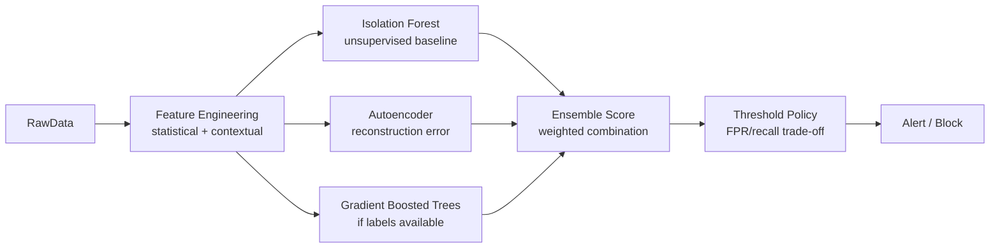

# Anomaly Detection Systems: Isolation Forests, Autoencoders, and Fraud Detection

**Area G — ML System Design | Learning Memory OS Curriculum**

---

## 1. Why Anomaly Detection Is Hard

Anomaly detection is fundamentally different from supervised classification. Labels are scarce and expensive (manually labeling anomalies requires domain experts), the class imbalance can be extreme (fraud rate: 0.1-2%), and the definition of "anomaly" shifts over time as attack patterns evolve. A fraud model trained in January may degrade by March as fraudsters adapt.

Three key problem types:
1. **Point anomalies**: individual data points that deviate from normal (unusual transaction amount)
2. **Contextual anomalies**: normal value in unusual context (large transaction in new location)
3. **Collective anomalies**: groups of individually normal points that together are anomalous (multiple small transactions across multiple cards from same IP)



---

## 2. Isolation Forest

Isolation Forest is the most widely used unsupervised anomaly detection algorithm. It works by randomly partitioning the feature space: anomalies are isolated in fewer steps than normal points because they're sparse.

```python
import numpy as np
from sklearn.ensemble import IsolationForest
from sklearn.preprocessing import StandardScaler
from sklearn.metrics import roc_auc_score, precision_recall_curve
import matplotlib.pyplot as plt

def generate_fraud_dataset(n_normal: int = 9000, n_fraud: int = 100,
                            n_features: int = 10, seed: int = 42) -> tuple:
    """
    Synthetic fraud detection dataset.
    Normal transactions: multivariate Gaussian
    Fraud: different distribution (shifted mean, larger variance)
    Returns (X, y) where y=1 means fraud.
    """
    rng = np.random.RandomState(seed)
    # Normal transactions
    X_normal = rng.randn(n_normal, n_features)
    y_normal = np.zeros(n_normal)
    # Fraud: shifted, larger variance
    X_fraud = rng.randn(n_fraud, n_features) * 2.0 + 3.0
    y_fraud = np.ones(n_fraud)
    X = np.vstack([X_normal, X_fraud])
    y = np.hstack([y_normal, y_fraud])
    # Shuffle
    idx = rng.permutation(len(X))
    return X[idx], y[idx]

def train_isolation_forest(X: np.ndarray, y: np.ndarray,
                            contamination: float = 0.01) -> dict:
    """
    Train Isolation Forest and evaluate AUC-ROC and PR-AUC.
    contamination: expected fraction of anomalies in training data.
    """
    scaler = StandardScaler()
    X_scaled = scaler.fit_transform(X)
    
    # Train on all data (unsupervised: doesn't use labels)
    model = IsolationForest(
        n_estimators=200,
        contamination=contamination,
        max_samples='auto',
        random_state=42,
        n_jobs=-1,
    )
    model.fit(X_scaled)
    
    # Anomaly scores: lower = more anomalous (sklearn convention: negate for AUC)
    raw_scores = model.decision_function(X_scaled)
    anomaly_scores = -raw_scores  # higher score = more anomalous
    
    auc_roc = roc_auc_score(y, anomaly_scores)
    precision, recall, thresholds = precision_recall_curve(y, anomaly_scores)
    pr_auc = np.trapz(precision[::-1], recall[::-1])
    
    print(f"Isolation Forest — AUC-ROC: {auc_roc:.4f}, PR-AUC: {pr_auc:.4f}")
    return {
        "model": model, "scaler": scaler,
        "auc_roc": auc_roc, "pr_auc": pr_auc,
        "anomaly_scores": anomaly_scores,
    }

def find_threshold_at_recall(anomaly_scores: np.ndarray, y: np.ndarray,
                              target_recall: float = 0.90) -> float:
    """
    Find the anomaly score threshold that achieves target_recall.
    At this threshold, compute precision.
    """
    precision, recall, thresholds = precision_recall_curve(y, anomaly_scores)
    # Find smallest threshold where recall >= target_recall
    valid = np.where(recall[:-1] >= target_recall)[0]
    if len(valid) == 0:
        return float(anomaly_scores.max())
    idx = valid[-1]  # highest threshold (lowest recall) that still meets target
    return float(thresholds[idx])
```

---

## 3. Autoencoder for Tabular Anomalies

Autoencoders learn a compressed representation of normal data. At inference time, anomalies have high reconstruction error because the encoder never learned to represent them.

```python
import torch
import torch.nn as nn
import torch.optim as optim
from torch.utils.data import DataLoader, TensorDataset

class TabularAutoencoder(nn.Module):
    """
    Autoencoder for tabular anomaly detection.
    Trained only on normal data; high reconstruction error = anomaly.
    """
    def __init__(self, input_dim: int, encoding_dim: int = 8,
                 hidden_dim: int = 32):
        super().__init__()
        self.encoder = nn.Sequential(
            nn.Linear(input_dim, hidden_dim),
            nn.BatchNorm1d(hidden_dim),
            nn.ReLU(),
            nn.Linear(hidden_dim, encoding_dim),
        )
        self.decoder = nn.Sequential(
            nn.Linear(encoding_dim, hidden_dim),
            nn.BatchNorm1d(hidden_dim),
            nn.ReLU(),
            nn.Linear(hidden_dim, input_dim),
        )

    def forward(self, x: torch.Tensor) -> torch.Tensor:
        z = self.encoder(x)
        x_hat = self.decoder(z)
        return x_hat

    def reconstruction_error(self, x: torch.Tensor) -> torch.Tensor:
        """Per-sample mean squared reconstruction error."""
        x_hat = self.forward(x)
        return ((x - x_hat) ** 2).mean(dim=-1)


def train_autoencoder(X_normal: np.ndarray, epochs: int = 50,
                      batch_size: int = 256, lr: float = 1e-3) -> TabularAutoencoder:
    """
    Train autoencoder on normal data only.
    X_normal: (N, D) array of normal samples (no anomalies!)
    """
    X_tensor = torch.tensor(X_normal, dtype=torch.float32)
    dataset = TensorDataset(X_tensor)
    loader = DataLoader(dataset, batch_size=batch_size, shuffle=True)
    
    model = TabularAutoencoder(input_dim=X_normal.shape[1])
    optimizer = optim.AdamW(model.parameters(), lr=lr, weight_decay=1e-5)
    criterion = nn.MSELoss()
    
    model.train()
    for epoch in range(epochs):
        epoch_loss = 0.0
        for (batch,) in loader:
            optimizer.zero_grad()
            x_hat = model(batch)
            loss = criterion(x_hat, batch)
            loss.backward()
            optimizer.step()
            epoch_loss += loss.item()
        if (epoch + 1) % 10 == 0:
            print(f"Epoch {epoch+1:3d}/{epochs}: loss={epoch_loss/len(loader):.6f}")
    
    return model


def evaluate_autoencoder(model: TabularAutoencoder,
                          X: np.ndarray, y: np.ndarray) -> dict:
    """Evaluate autoencoder anomaly detection via reconstruction error."""
    model.eval()
    X_tensor = torch.tensor(X, dtype=torch.float32)
    with torch.no_grad():
        errors = model.reconstruction_error(X_tensor).numpy()
    auc_roc = roc_auc_score(y, errors)
    print(f"Autoencoder — AUC-ROC: {auc_roc:.4f}")
    return {"auc_roc": auc_roc, "reconstruction_errors": errors}
```

---

## 4. Streaming Anomaly Detection with Online Statistics

Batch anomaly detection doesn't work for real-time fraud detection. Online statistics allow detecting anomalies as they arrive.

```python
from collections import deque
import math
from typing import Optional

class OnlineZScore:
    """
    Compute Z-score of incoming values using Welford's online algorithm.
    Detects point anomalies in a stream without storing all history.
    """
    def __init__(self, window_size: int = 1000):
        self.window_size = window_size
        self.window = deque()
        self.count = 0
        self.mean = 0.0
        self.m2 = 0.0  # sum of squared differences from mean

    def _update_welford(self, x: float):
        """Welford's online variance update."""
        self.count += 1
        delta = x - self.mean
        self.mean += delta / self.count
        delta2 = x - self.mean
        self.m2 += delta * delta2

    def _remove_welford(self, x: float):
        """Remove a value from Welford stats (for sliding window)."""
        if self.count <= 1:
            self.count = 0
            self.mean = 0.0
            self.m2 = 0.0
            return
        self.count -= 1
        delta = x - self.mean
        self.mean -= delta / self.count
        delta2 = x - self.mean
        self.m2 -= delta * delta2

    @property
    def variance(self) -> float:
        if self.count < 2:
            return 0.0
        return self.m2 / (self.count - 1)

    @property
    def std(self) -> float:
        return math.sqrt(max(self.variance, 0.0))

    def score(self, x: float) -> float:
        """
        Compute Z-score of x given current window statistics.
        Returns 0.0 if insufficient history.
        """
        if self.count < 10 or self.std < 1e-9:
            return 0.0
        return abs(x - self.mean) / self.std

    def update(self, x: float) -> float:
        """
        Update with new value x, return anomaly Z-score.
        Maintains sliding window: removes oldest value when full.
        """
        z = self.score(x)
        # Sliding window: remove oldest if at capacity
        if len(self.window) >= self.window_size:
            oldest = self.window.popleft()
            self._remove_welford(oldest)
        self.window.append(x)
        self._update_welford(x)
        return z


class StreamingAnomalyDetector:
    """
    Multi-feature streaming anomaly detector.
    Maintains per-feature online Z-score trackers.
    Alert if any feature exceeds threshold.
    """
    def __init__(self, features: list, threshold: float = 4.0,
                 window_size: int = 1000):
        self.features = features
        self.threshold = threshold
        self.trackers = {f: OnlineZScore(window_size) for f in features}

    def process(self, record: dict) -> dict:
        """Process one streaming record and return anomaly assessment."""
        scores = {}
        for feat in self.features:
            val = record.get(feat, 0.0)
            z = self.trackers[feat].update(val)
            scores[feat] = z
        max_score = max(scores.values())
        is_anomaly = max_score > self.threshold
        return {
            "scores": scores,
            "max_z": max_score,
            "is_anomaly": is_anomaly,
            "anomalous_feature": max(scores, key=scores.get),
        }


# Example: streaming transaction monitoring
if __name__ == "__main__":
    import random
    detector = StreamingAnomalyDetector(
        features=["amount", "hour_of_day", "merchant_distance_km"],
        threshold=4.0,
    )
    random.seed(42)
    for i in range(2000):
        if i == 1500:  # inject anomaly
            record = {"amount": 9999.0, "hour_of_day": 3, "merchant_distance_km": 8000}
        else:
            record = {
                "amount": random.lognormvariate(3, 1),
                "hour_of_day": random.randint(8, 22),
                "merchant_distance_km": random.expovariate(1/50),
            }
        result = detector.process(record)
        if result["is_anomaly"]:
            print(f"Step {i}: ANOMALY detected in {result['anomalous_feature']}, "
                  f"Z={result['max_z']:.2f}")
```

---

## 5. Evaluation Under Label Scarcity

### 5.1 Precision-Recall Trade-off Under Imbalance

AUC-ROC can be misleading when classes are extremely imbalanced. For 1% fraud rate, a model that outputs constant 0 achieves AUC-ROC = 0.5 but PR-AUC << 0.5. Always report PR-AUC for imbalanced problems.

```python
from sklearn.metrics import (average_precision_score, roc_auc_score,
                              confusion_matrix, classification_report)
import numpy as np

def evaluate_anomaly_detector(y_true: np.ndarray, scores: np.ndarray,
                               threshold: float = None) -> dict:
    """
    Comprehensive evaluation for anomaly detection under imbalance.
    If threshold is None, find optimal threshold on F1.
    """
    auc_roc = roc_auc_score(y_true, scores)
    pr_auc = average_precision_score(y_true, scores)  # area under P-R curve
    
    if threshold is None:
        # Find threshold maximizing F1 (F-beta with beta=2 weights recall more)
        from sklearn.metrics import precision_recall_curve
        precision, recall, thresholds = precision_recall_curve(y_true, scores)
        f1_scores = 2 * precision * recall / (precision + recall + 1e-9)
        best_idx = np.argmax(f1_scores)
        threshold = thresholds[best_idx]
    
    y_pred = (scores >= threshold).astype(int)
    cm = confusion_matrix(y_true, y_pred)
    tn, fp, fn, tp = cm.ravel()
    
    metrics = {
        "auc_roc": auc_roc,
        "pr_auc": pr_auc,
        "threshold": threshold,
        "precision": tp / max(tp + fp, 1),
        "recall": tp / max(tp + fn, 1),
        "fpr": fp / max(fp + tn, 1),
        "f1": 2 * tp / max(2 * tp + fp + fn, 1),
        "tp": int(tp), "fp": int(fp), "fn": int(fn), "tn": int(tn),
    }
    return metrics
```

### 5.2 Ensemble: Combining Isolation Forest and Autoencoder

```python
import numpy as np
from scipy.stats import rankdata

def ensemble_anomaly_scores(scores_list: list,
                             method: str = "mean_rank") -> np.ndarray:
    """
    Combine anomaly scores from multiple detectors.
    method: 'mean' for score averaging, 'mean_rank' for rank averaging.
    """
    if method == "mean":
        # Normalize scores to [0,1] per model, then average
        normalized = []
        for scores in scores_list:
            s_min, s_max = scores.min(), scores.max()
            normalized.append((scores - s_min) / max(s_max - s_min, 1e-9))
        return np.mean(normalized, axis=0)
    elif method == "mean_rank":
        # Average percentile ranks across models
        ranked = [rankdata(scores) / len(scores) for scores in scores_list]
        return np.mean(ranked, axis=0)
    else:
        raise ValueError(f"Unknown method: {method}")
```

---

## 6. Common Misconceptions

**Misconception: "AUC-ROC is the right metric for fraud detection."**
Correction: With 0.5% fraud rate, a model that assigns random high scores to 0.5% of transactions achieves AUC-ROC ≈ 0.75 while being useless. PR-AUC (average precision) and the precision-recall trade-off at the operating threshold are the appropriate metrics. Report both, but make decisions based on PR-AUC and the threshold that matches your FPR budget.

**Misconception: "Unsupervised methods are always better than supervised when labels are scarce."**
Correction: If you have any labels (even 100 fraud examples), a supervised model with strong priors (gradient boosting with high regularization) typically outperforms purely unsupervised methods like Isolation Forest. Weakly supervised methods (positive-unlabeled learning, label propagation from known fraud patterns) often beat both. Use labels when you have them.

**Misconception: "You can train the autoencoder on all data, including anomalies."**
Correction: Autoencoders detect anomalies by high reconstruction error only if they were trained on normal data. If anomalies are included in training, the autoencoder may learn to reconstruct them too, reducing reconstruction error on anomalies. Filter known anomalies from training data, or use a semi-supervised approach where anomaly rate is very low (< 1%).

**Misconception: "A fixed threshold works well for streaming anomaly detection."**
Correction: Normal behavior changes over time (seasonality, user growth, product launches). A fixed threshold calibrated in January will either generate too many alerts in December (when transaction volumes are higher) or miss anomalies. Adaptive thresholds that track rolling statistics or use percent-of-daily-volume are necessary.

**Misconception: "Isolation Forest's contamination parameter should equal the true anomaly rate."**
Correction: The contamination parameter affects the decision threshold, not the model itself. The model is trained the same way regardless of contamination. Setting contamination to the true anomaly rate in production is often too low (0.5-2%), generating too few alerts. In practice, tune contamination on a validation set with known labels to match your desired operating point.

---

## 7. Hands-On Labs

### Exercise 1: Isolation Forest on a Real Dataset

**Goal**: Apply Isolation Forest to the Credit Card Fraud Detection dataset (Kaggle) and achieve PR-AUC ≥ 0.40.

**Starter code**:
```python
import pandas as pd
import numpy as np
from sklearn.ensemble import IsolationForest
from sklearn.preprocessing import StandardScaler

def train_isolation_forest_creditcard(csv_path: str = "creditcard.csv",
                                       contamination: float = 0.001) -> dict:
    """
    Load Credit Card Fraud dataset (284,807 transactions, 492 fraud).
    Train Isolation Forest, evaluate AUC-ROC and PR-AUC.
    """
    df = pd.read_csv(csv_path)
    X = df.drop(columns=["Class", "Time"]).values
    y = df["Class"].values
    
    # Log-transform the Amount column (highly skewed)
    X[:, -1] = np.log1p(X[:, -1])
    
    # 1. Scale features
    # 2. Train Isolation Forest (train on full data or only non-fraud?)
    # 3. Compute anomaly scores
    # 4. Evaluate with evaluate_anomaly_detector(y, scores)
    pass
```

**Acceptance criteria**: PR-AUC ≥ 0.40 on the full dataset. Identify which features contribute most to anomaly scores (partial dependence or feature importance via permutation).
**Stretch**: Train on first 80% of data (by Time), evaluate on last 20%. Does performance degrade? Why might temporal generalization be harder?

---

### Exercise 2: Autoencoder for Tabular Fraud Detection

**Goal**: Train an autoencoder on legitimate transactions only and detect fraud via reconstruction error.

**Starter code**:
```python
import torch
import numpy as np
from sklearn.preprocessing import StandardScaler

def autoencoder_fraud_detection(X: np.ndarray, y: np.ndarray,
                                  encoding_dim: int = 8,
                                  epochs: int = 50) -> dict:
    """
    Train autoencoder on legitimate transactions only.
    Evaluate on full dataset (including fraud).
    """
    # 1. Split: train only on X[y==0] (legitimate)
    X_normal = X[y == 0]
    
    scaler = StandardScaler()
    X_normal_scaled = scaler.fit_transform(X_normal)
    X_all_scaled = scaler.transform(X)
    
    # 2. Train autoencoder on X_normal_scaled
    # 3. Compute reconstruction errors on X_all_scaled
    # 4. Evaluate with AUC-ROC and PR-AUC
    pass
```

**Acceptance criteria**: AUC-ROC ≥ 0.92 and PR-AUC ≥ 0.35 on Credit Card Fraud dataset.
**Stretch**: Implement a Variational Autoencoder (VAE). Use the ELBO reconstruction probability (not MSE) as the anomaly score and compare performance.

---

## 8. Graph-Based Anomaly Detection for Fraud Networks

Individual transaction anomalies miss coordinated fraud rings. Graph analysis reveals groups of accounts behaving suspiciously together.

```python
import networkx as nx
import numpy as np
from typing import List, Tuple, Dict

def build_transaction_graph(transactions: List[Dict]) -> nx.DiGraph:
    """
    Build a directed graph from transaction logs.
    Nodes: accounts (sender and receiver)
    Edges: transactions (with amount and timestamp as attributes)
    """
    G = nx.DiGraph()
    for txn in transactions:
        sender = txn["sender_id"]
        receiver = txn["receiver_id"]
        G.add_edge(
            sender, receiver,
            amount=txn["amount"],
            timestamp=txn["timestamp"],
            txn_id=txn["txn_id"],
        )
    return G

def detect_fraud_rings(G: nx.DiGraph,
                         min_cycle_length: int = 3,
                         max_cycle_length: int = 6) -> List[List]:
    """
    Detect suspicious cycles in the transaction graph.
    A cycle (A -> B -> C -> A) may indicate money laundering or fraud rings.
    Returns list of cycles.
    """
    # Use simple_cycles from networkx (computationally expensive for large graphs)
    # In production: use approximation or pattern-matching heuristics
    cycles = []
    for cycle in nx.simple_cycles(G):
        if min_cycle_length <= len(cycle) <= max_cycle_length:
            cycles.append(cycle)
    return cycles

def community_anomaly_score(G: nx.DiGraph, node: str) -> float:
    """
    Compute anomaly score for a node based on graph topology.
    Nodes with high out-degree relative to in-degree may be money mules.
    Nodes with many unique counterparties are suspicious.
    """
    if node not in G:
        return 0.0
    in_deg = G.in_degree(node)
    out_deg = G.out_degree(node)
    n_unique_receivers = len(set(G.successors(node)))
    n_unique_senders = len(set(G.predecessors(node)))
    
    # Mule pattern: many senders, few receivers (aggregation)
    aggregation_score = max(0, n_unique_senders - n_unique_receivers) / max(1, n_unique_senders)
    # Dispersion pattern: one sender, many receivers (layering)
    dispersion_score = max(0, n_unique_receivers - n_unique_senders) / max(1, n_unique_receivers)
    return max(aggregation_score, dispersion_score)
```

---

### Exercise 3: Streaming Detector Benchmarking

**Goal**: Benchmark `StreamingAnomalyDetector` against batch Isolation Forest on a synthetic streaming dataset with known injection points.

**Starter code**:
```python
import numpy as np
import time

def generate_streaming_dataset(n_normal: int = 10_000,
                                n_anomalies: int = 50,
                                n_features: int = 5,
                                inject_every: int = 200,
                                seed: int = 42) -> list:
    """
    Generate a streaming dataset with anomalies injected every inject_every steps.
    Returns list of (record_dict, is_anomaly_bool) tuples.
    """
    rng = np.random.RandomState(seed)
    feature_names = [f"f{i}" for i in range(n_features)]
    records = []
    for i in range(n_normal):
        is_anomaly = (i % inject_every == 0 and i > 0)
        if is_anomaly:
            vals = rng.randn(n_features) * 5 + 10
        else:
            vals = rng.randn(n_features)
        record = dict(zip(feature_names, vals.tolist()))
        records.append((record, is_anomaly))
    return records

def benchmark_streaming_vs_batch(records: list):
    """
    Compare StreamingAnomalyDetector (online) vs IsolationForest (batch retrained).
    Report precision, recall, latency per sample.
    """
    # TODO: implement benchmark
    # streaming_detector: process each record in stream
    # batch_detector: retrain every 500 records, predict on next 500
    pass
```

**Acceptance criteria**: Streaming detector achieves recall ≥ 0.70 with latency < 1ms per record. Batch detector has higher precision but higher latency and lag.
**Stretch**: Implement concept drift detection (ADWIN algorithm) to signal when the normal distribution has shifted, triggering a model reset.

---
