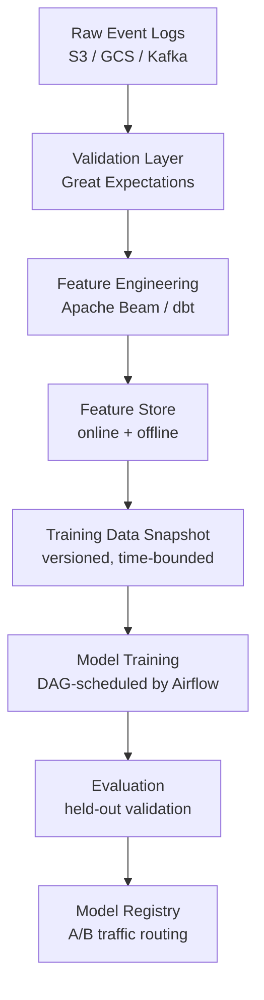

# Data Pipelines for ML: Airflow, Beam, Flink, dbt, and Data Lineage

**Area D — Data & Alignment | Learning Memory OS Curriculum**

---

## 1. Why ML Data Pipelines Are Different

ML data pipelines are more demanding than traditional ETL pipelines because:
1. **Temporal correctness**: features must only use data available at prediction time (no data leakage from future)
2. **Data quality gates**: downstream models silently degrade on bad data — quality checks must be enforced
3. **Reproducibility**: the exact dataset used to train a model must be recoverable for audit and debugging
4. **Feature freshness**: stale features (user's last-week activity fed to a model making real-time decisions) degrade performance
5. **Scale**: ML training datasets can be petabytes; feature engineering pipelines process billions of rows daily



---

## 2. Airflow: Orchestrating ML Training Pipelines

Apache Airflow is the standard tool for scheduling complex DAGs of ML pipeline tasks. Each node in the DAG is an operator (Python function, Bash script, or cloud task); Airflow tracks execution, handles retries, and provides monitoring.

### 2.1 Daily Training Data Refresh DAG

```python
from airflow import DAG
from airflow.operators.python import PythonOperator
from airflow.operators.bash import BashOperator
from airflow.providers.google.cloud.operators.bigquery import BigQueryInsertJobOperator
from datetime import datetime, timedelta
import logging

# Default arguments: retries, email on failure, timeout
default_args = {
    "owner": "ml-platform",
    "depends_on_past": False,
    "start_date": datetime(2025, 1, 1),
    "email_on_failure": True,
    "email": ["ml-oncall@example.com"],
    "retries": 2,
    "retry_delay": timedelta(minutes=10),
    "execution_timeout": timedelta(hours=4),
}

def extract_training_data(execution_date: str, **context):
    """
    Extract raw interaction events for the training window.
    Uses execution_date to avoid data leakage: only use data up to T-1 day.
    """
    from google.cloud import bigquery
    client = bigquery.Client()
    # Feature window: 30 days before execution_date, exclusive of execution_date
    query = f"""
        SELECT
            user_id,
            item_id,
            interaction_type,
            timestamp,
            -- Features: aggregate over past 7 days (relative to event time)
            COUNT(*) OVER (
                PARTITION BY user_id
                ORDER BY timestamp
                RANGE BETWEEN INTERVAL 7 DAY PRECEDING AND CURRENT ROW
            ) AS user_7d_events,
        FROM `project.events.interactions`
        WHERE DATE(timestamp) < '{execution_date}'
          AND DATE(timestamp) >= DATE_SUB('{execution_date}', INTERVAL 30 DAY)
    """
    job = client.query(query)
    result = job.result()
    logging.info(f"Extracted {result.total_rows} training rows")
    return result.total_rows

def validate_training_data(execution_date: str, **context):
    """Run data quality checks before training."""
    import great_expectations as gx
    context_ge = gx.get_context()
    # Validate: row count, null rates, label distribution
    # Raise ValueError if checks fail to stop downstream tasks
    pass

def trigger_training_job(execution_date: str, **context):
    """Launch model training on the validated dataset."""
    import subprocess
    result = subprocess.run([
        "python", "-m", "scripts.train",
        "--training-date", execution_date,
        "--config", "config/model_config.yaml",
        "--output-dir", f"gs://models/daily/{execution_date}",
    ], capture_output=True, text=True, check=True)
    logging.info(result.stdout)

def evaluate_and_gate(execution_date: str, **context):
    """Evaluate new model; fail DAG if metrics regress."""
    # Load metrics from training output
    import json, os
    metrics_path = f"/tmp/metrics_{execution_date}.json"
    with open(metrics_path) as f:
        metrics = json.load(f)
    if metrics["auc_roc"] < 0.82:
        raise ValueError(f"Model quality gate failed: AUC-ROC={metrics['auc_roc']:.4f} < 0.82")
    logging.info(f"Quality gate passed: AUC-ROC={metrics['auc_roc']:.4f}")

with DAG(
    dag_id="daily_recommendation_model_training",
    default_args=default_args,
    schedule_interval="0 4 * * *",   # Run at 4 AM daily
    catchup=False,
    max_active_runs=1,
    tags=["ml", "recommendations", "daily"],
) as dag:
    
    t_extract = PythonOperator(
        task_id="extract_training_data",
        python_callable=extract_training_data,
        op_kwargs={"execution_date": "{{ ds }}"},  # Jinja templated
    )
    
    t_validate = PythonOperator(
        task_id="validate_training_data",
        python_callable=validate_training_data,
        op_kwargs={"execution_date": "{{ ds }}"},
    )
    
    t_train = PythonOperator(
        task_id="trigger_training_job",
        python_callable=trigger_training_job,
        op_kwargs={"execution_date": "{{ ds }}"},
    )
    
    t_evaluate = PythonOperator(
        task_id="evaluate_and_gate",
        python_callable=evaluate_and_gate,
        op_kwargs={"execution_date": "{{ ds }}"},
    )
    
    t_deploy = BashOperator(
        task_id="promote_model_to_staging",
        bash_command=(
            "python -m scripts.promote_model"
            " --date {{ ds }}"
            " --registry gs://model-registry/staging"
        ),
    )
    
    t_extract >> t_validate >> t_train >> t_evaluate >> t_deploy
```

### 2.2 Dynamic DAGs for Multi-Model Training

```python
from airflow import DAG
from airflow.operators.python import PythonOperator

MODEL_CONFIGS = [
    {"name": "ctr_model", "features": ["user", "item", "context"], "target": "click"},
    {"name": "cvr_model", "features": ["user", "item", "purchase_context"], "target": "purchase"},
    {"name": "like_model", "features": ["user", "item"], "target": "like"},
]

def create_model_training_dag(model_config: dict) -> DAG:
    """Factory function to create one DAG per model."""
    with DAG(
        dag_id=f"train_{model_config['name']}",
        schedule_interval="0 6 * * *",
        default_args=default_args,
        catchup=False,
    ) as dag:
        def train_model(**context):
            print(f"Training {model_config['name']} with features {model_config['features']}")
        PythonOperator(task_id="train", python_callable=train_model)
    return dag

# Dynamically register DAGs
for config in MODEL_CONFIGS:
    globals()[f"dag_{config['name']}"] = create_model_training_dag(config)
```

---

## 3. Apache Beam: Feature Engineering at Scale

Apache Beam provides a unified API for batch and streaming data processing. Features computed in Beam can run on Google Cloud Dataflow, Apache Flink, or Apache Spark — write once, run anywhere.

```python
import apache_beam as beam
from apache_beam.options.pipeline_options import PipelineOptions
import json
from typing import Iterator

class ParseInteractionEvent(beam.DoFn):
    """Parse raw JSON interaction events."""
    def process(self, element: bytes) -> Iterator[dict]:
        try:
            event = json.loads(element)
            # Validate required fields
            if "user_id" in event and "item_id" in event and "timestamp" in event:
                yield event
        except (json.JSONDecodeError, KeyError) as e:
            beam.metrics.Metrics.counter("parsing", "parse_errors").inc()

class ExtractUserFeatures(beam.DoFn):
    """
    Compute per-user aggregate features.
    Called once per (user_id, events_list) pair after GroupByKey.
    """
    def process(self, element) -> Iterator[dict]:
        user_id, events = element
        events_list = list(events)
        events_list.sort(key=lambda e: e["timestamp"])
        
        n_events = len(events_list)
        unique_items = len(set(e["item_id"] for e in events_list))
        click_rate = sum(1 for e in events_list if e.get("clicked", False)) / max(n_events, 1)
        
        yield {
            "user_id": user_id,
            "feature_n_events_30d": n_events,
            "feature_unique_items_30d": unique_items,
            "feature_click_rate_30d": click_rate,
            "feature_last_active_hours": (
                (events_list[-1]["timestamp"] - events_list[0]["timestamp"]) / 3600
                if n_events > 1 else 0.0
            ),
        }


def build_feature_pipeline(input_path: str, output_path: str,
                             pipeline_options: PipelineOptions = None):
    """
    Full Beam pipeline for ML feature engineering.
    Reads raw events, computes user features, writes to BigQuery.
    """
    if pipeline_options is None:
        pipeline_options = PipelineOptions(
            runner="DirectRunner",  # local; change to DataflowRunner for production
            project="my-gcp-project",
            region="us-central1",
        )
    
    with beam.Pipeline(options=pipeline_options) as p:
        raw_events = (
            p
            | "ReadFromGCS" >> beam.io.ReadFromText(input_path)
            | "ParseJSON" >> beam.ParDo(ParseInteractionEvent())
        )
        
        # 30-day window of events
        user_features = (
            raw_events
            | "FilterByDate" >> beam.Filter(
                lambda e: e["timestamp"] > (1700000000 - 30*86400)  # 30 days ago
            )
            | "KeyByUser" >> beam.Map(lambda e: (e["user_id"], e))
            | "GroupByUser" >> beam.GroupByKey()
            | "ComputeUserFeatures" >> beam.ParDo(ExtractUserFeatures())
        )
        
        (
            user_features
            | "WriteToBigQuery" >> beam.io.WriteToBigQuery(
                table=f"{output_path}",
                write_disposition=beam.io.BigQueryDisposition.WRITE_TRUNCATE,
                create_disposition=beam.io.BigQueryDisposition.CREATE_IF_NEEDED,
            )
        )
    
    return p


class RunningAverageDoFn(beam.DoFn):
    """
    Stateful streaming feature computation with Beam.
    Computes running average of item interaction rate per user using state.
    """
    AVERAGE_STATE = beam.transforms.userstate.BagStateSpec(
        'state', beam.coders.FastPrimitivesCoder()
    )

    def process(self, element, state=beam.DoFn.StateParam(AVERAGE_STATE)):
        user_id, event = element
        current = list(state.read()) or [0.0, 0]
        total, count = current[0], current[1]
        reward = float(event.get("clicked", 0))
        new_total = total + reward
        new_count = count + 1
        state.clear()
        state.add((new_total, new_count))
        yield (user_id, new_total / new_count)
```

---

## 4. dbt: SQL-Based Feature Engineering with Lineage

dbt (data build tool) transforms raw tables into feature tables using SQL, with automatic dependency tracking, testing, and documentation.

```sql
-- models/features/user_interaction_features.sql
-- dbt model: computes user features for the recommendation system

{{ config(
    materialized='incremental',
    unique_key='user_id',
    incremental_strategy='merge',
    tags=['daily', 'user_features', 'ml_features']
) }}

WITH events_30d AS (
    SELECT
        user_id,
        item_id,
        interaction_type,
        ts,
        -- Point-in-time correct: use only events before the current run
        created_at
    FROM {{ source('raw', 'interaction_events') }}
    WHERE ts >= CURRENT_DATE - INTERVAL '30' DAY
    
    -- Incremental: only process events since last run
    AND created_at > (SELECT MAX(updated_at) FROM {{ this }})
    
),

user_aggregates AS (
    SELECT
        user_id,
        COUNT(*) AS n_events_30d,
        COUNT(DISTINCT item_id) AS unique_items_30d,
        COUNT(DISTINCT DATE(ts)) AS active_days_30d,
        AVG(CASE WHEN interaction_type = 'click' THEN 1.0 ELSE 0.0 END) AS click_rate_30d,
        MAX(ts) AS last_active_ts,
        MIN(ts) AS first_event_ts_30d
    FROM events_30d
    GROUP BY user_id
)

SELECT
    user_id,
    n_events_30d,
    unique_items_30d,
    active_days_30d,
    click_rate_30d,
    EXTRACT(EPOCH FROM (CURRENT_TIMESTAMP - last_active_ts)) / 3600 AS hours_since_last_active,
    LOG(1 + n_events_30d) AS log_n_events_30d,  -- log-transform for model
    CURRENT_TIMESTAMP AS updated_at
FROM user_aggregates
```

```yaml
# models/features/schema.yml — data quality tests
version: 2
models:
  - name: user_interaction_features
    description: "30-day user interaction features for recommendation model"
    columns:
      - name: user_id
        description: "Unique user identifier"
        tests:
          - not_null
          - unique
      - name: n_events_30d
        tests:
          - not_null
          - dbt_expectations.expect_column_values_to_be_between:
              min_value: 0
              max_value: 100000
      - name: click_rate_30d
        tests:
          - not_null
          - dbt_expectations.expect_column_values_to_be_between:
              min_value: 0.0
              max_value: 1.0
```

---

## 5. Great Expectations: Data Quality Gates

```python
import great_expectations as gx
from great_expectations.core.batch import RuntimeBatchRequest
import pandas as pd
import numpy as np

def validate_training_dataset(df: pd.DataFrame,
                                suite_name: str = "ml_training_data") -> dict:
    """
    Validate a training dataset with Great Expectations.
    Returns validation results; raises if critical expectations fail.
    """
    context = gx.get_context()
    
    # Create or load expectation suite
    try:
        suite = context.get_expectation_suite(suite_name)
    except Exception:
        suite = context.create_expectation_suite(suite_name)
    
    validator = context.get_validator(
        batch_request=RuntimeBatchRequest(
            datasource_name="pandas_datasource",
            data_connector_name="runtime_data_connector",
            data_asset_name="training_data",
            runtime_parameters={"batch_data": df},
            batch_identifiers={"run_id": "latest"},
        ),
        expectation_suite=suite,
    )
    
    # Row count check
    validator.expect_table_row_count_to_be_between(min_value=10_000, max_value=100_000_000)
    
    # No nulls in critical columns
    for col in ["user_id", "item_id", "label"]:
        validator.expect_column_values_to_not_be_null(column=col)
    
    # Label distribution check (fraud use case: expect 0.1-5% positive rate)
    validator.expect_column_mean_to_be_between(
        column="label", min_value=0.001, max_value=0.05
    )
    
    # Feature range checks
    validator.expect_column_values_to_be_between(
        column="user_age_bucket", min_value=0, max_value=10
    )
    
    # No duplicate (user_id, item_id) pairs
    validator.expect_compound_columns_to_be_unique(
        column_list=["user_id", "item_id", "request_id"]
    )
    
    results = validator.validate()
    n_failed = sum(1 for r in results.results if not r.success)
    
    if n_failed > 0:
        failed = [r.expectation_config.expectation_type
                  for r in results.results if not r.success]
        raise ValueError(f"Data validation failed ({n_failed} checks): {failed}")
    
    return {"status": "passed", "n_checks": len(results.results)}


def check_feature_drift(reference_df: pd.DataFrame,
                          current_df: pd.DataFrame,
                          feature_cols: list,
                          ks_threshold: float = 0.1) -> dict:
    """
    Detect feature distribution drift using KS test.
    Returns list of drifted features.
    """
    from scipy import stats
    drift_report = {}
    for col in feature_cols:
        if col not in reference_df or col not in current_df:
            continue
        ks_stat, p_value = stats.ks_2samp(
            reference_df[col].dropna().values,
            current_df[col].dropna().values,
        )
        drift_report[col] = {
            "ks_statistic": float(ks_stat),
            "p_value": float(p_value),
            "drifted": ks_stat > ks_threshold,
        }
    drifted = [col for col, r in drift_report.items() if r["drifted"]]
    print(f"Drifted features ({len(drifted)}/{len(feature_cols)}): {drifted}")
    return drift_report
```

---

## 6. Data Lineage

Data lineage tracks the provenance of each feature: which raw source it came from, which transformations were applied, and which models consumed it. This is critical for debugging, compliance (GDPR right-to-erasure), and model governance.

```python
from dataclasses import dataclass, field
from typing import List, Optional
from datetime import datetime

@dataclass
class DataAsset:
    asset_id: str
    name: str
    description: str
    location: str            # GCS path, BigQuery table, etc.
    schema: dict
    tags: List[str] = field(default_factory=list)
    created_at: datetime = field(default_factory=datetime.utcnow)

@dataclass
class LineageEdge:
    source_id: str
    target_id: str
    transformation: str      # e.g., "dbt:user_interaction_features", "beam:aggregate_30d"
    created_at: datetime = field(default_factory=datetime.utcnow)

class LineageRegistry:
    """
    Simple in-process lineage registry.
    Production: use OpenLineage, DataHub, or Apache Atlas.
    """
    def __init__(self):
        self.assets: dict = {}
        self.edges: List[LineageEdge] = []
    
    def register_asset(self, asset: DataAsset):
        self.assets[asset.asset_id] = asset
    
    def record_transformation(self, source_ids: List[str], target_id: str,
                               transformation: str):
        for src in source_ids:
            self.edges.append(LineageEdge(
                source_id=src, target_id=target_id,
                transformation=transformation,
            ))
    
    def get_upstream(self, asset_id: str) -> List[str]:
        """Return all upstream asset IDs (transitive)."""
        upstream = set()
        queue = [asset_id]
        while queue:
            current = queue.pop()
            for edge in self.edges:
                if edge.target_id == current and edge.source_id not in upstream:
                    upstream.add(edge.source_id)
                    queue.append(edge.source_id)
        return list(upstream)
    
    def get_downstream(self, asset_id: str) -> List[str]:
        """Return all downstream assets — useful for impact analysis."""
        downstream = set()
        queue = [asset_id]
        while queue:
            current = queue.pop()
            for edge in self.edges:
                if edge.source_id == current and edge.target_id not in downstream:
                    downstream.add(edge.target_id)
                    queue.append(edge.target_id)
        return list(downstream)


# OpenLineage integration (industry standard)
def emit_openlineage_event(job_name: str, run_id: str,
                            input_datasets: list, output_datasets: list):
    """
    Emit OpenLineage lineage event for integration with DataHub, Marquez, etc.
    """
    from openlineage.client import OpenLineageClient, OpenLineageClientOptions
    from openlineage.client.run import (RunEvent, Run, Job,
                                         InputDataset, OutputDataset, RunState)
    client = OpenLineageClient.from_environment()
    client.emit(RunEvent(
        eventType=RunState.COMPLETE,
        eventTime=datetime.utcnow().isoformat() + "Z",
        run=Run(runId=run_id),
        job=Job(namespace="ml-platform", name=job_name),
        inputs=[InputDataset(namespace="bigquery", name=ds) for ds in input_datasets],
        outputs=[OutputDataset(namespace="bigquery", name=ds) for ds in output_datasets],
    ))
```

---

## 7. Common Misconceptions

**Misconception: "Data pipelines only need to be correct; performance is secondary."**
Correction: ML data pipelines run daily on petabyte-scale data. A pipeline that takes 12 hours for a 24-hour refresh cycle misses its SLA. Performance engineering (partition pruning, incremental processing, vectorized UDFs, Beam/Spark parallelism) is a first-class concern. Start with correctness but design for scale from the beginning.

**Misconception: "You can use the label from the same event used to generate training features."**
Correction: This is the training-serving skew / data leakage problem. If the label (e.g., "user purchased this item") is derived from the same event as features, the model sees information that won't be available at inference time. Features must be computed from data strictly before the prediction time; labels can use future data. Always implement point-in-time correct feature computation.

**Misconception: "Airflow tasks should do as much work as possible to minimize overhead."**
Correction: Monolithic tasks are harder to debug, retry, and monitor. Best practice: each task should do one logical unit of work (extract, validate, transform, load, evaluate). Atomicity and idempotency per task allows retrying individual failed steps without rerunning the full pipeline.

**Misconception: "Great Expectations validation is sufficient for data quality."**
Correction: Great Expectations catches statistical anomalies and schema violations but misses semantic errors (correct schema, wrong values) and temporal errors (correct values, wrong time window). A comprehensive quality system also needs: anomaly detection on feature distributions (drift monitoring), point-in-time correctness tests, and end-to-end pipeline integration tests.

**Misconception: "dbt is only for data warehouses; you need Spark for ML-scale feature engineering."**
Correction: Modern data warehouses (BigQuery, Snowflake, Databricks SQL) process petabytes efficiently using SQL. dbt + BigQuery can handle feature tables with billions of rows via incremental models and clustering. Spark is necessary for unstructured data (text, images) or custom Python logic, but SQL-based feature engineering covers most tabular ML use cases and is easier to test and lineage-track.

---

## 8. Hands-On Labs

### Exercise 1: Build an Airflow DAG for Daily Model Retraining

**Goal**: Implement a complete Airflow DAG that extracts data, validates it, trains a model, evaluates quality, and deploys on success.

**Starter code**:
```python
from airflow import DAG
from airflow.operators.python import PythonOperator
from datetime import datetime, timedelta
import pandas as pd
import numpy as np
from sklearn.ensemble import GradientBoostingClassifier
from sklearn.metrics import roc_auc_score
import json

def extract_data(execution_date: str, **context) -> str:
    """
    Simulate extracting training data for a given date.
    Returns path to extracted data.
    """
    rng = np.random.RandomState(int(execution_date.replace("-", "")))
    n = 10_000
    X = rng.randn(n, 10)
    y = (rng.random(n) < 0.05).astype(int)  # 5% positive rate
    df = pd.DataFrame(X, columns=[f"f{i}" for i in range(10)])
    df["label"] = y
    path = f"/tmp/training_{execution_date}.csv"
    df.to_csv(path, index=False)
    return path

def validate_data(execution_date: str, **context) -> None:
    """Validate the extracted dataset."""
    path = f"/tmp/training_{execution_date}.csv"
    df = pd.read_csv(path)
    assert len(df) >= 1000, f"Too few rows: {len(df)}"
    assert df.isnull().sum().sum() == 0, "Found null values"
    positive_rate = df["label"].mean()
    assert 0.001 < positive_rate < 0.5, f"Unexpected label rate: {positive_rate}"
    print(f"Validation passed: {len(df)} rows, {positive_rate:.3f} positive rate")

def train_model(execution_date: str, **context) -> str:
    """Train a gradient boosted model and save metrics."""
    import pickle
    path = f"/tmp/training_{execution_date}.csv"
    df = pd.read_csv(path)
    X = df.drop(columns=["label"]).values
    y = df["label"].values
    split = int(0.8 * len(X))
    model = GradientBoostingClassifier(n_estimators=100, random_state=42)
    model.fit(X[:split], y[:split])
    p = model.predict_proba(X[split:])[:, 1]
    auc = roc_auc_score(y[split:], p)
    metrics = {"auc_roc": auc, "n_train": split, "n_val": len(X) - split}
    metrics_path = f"/tmp/metrics_{execution_date}.json"
    with open(metrics_path, "w") as f:
        json.dump(metrics, f)
    model_path = f"/tmp/model_{execution_date}.pkl"
    with open(model_path, "wb") as f:
        pickle.dump(model, f)
    print(f"Trained model: AUC-ROC={auc:.4f}")
    return model_path

# TODO: build DAG with tasks: extract -> validate -> train -> evaluate -> promote
# Acceptance: DAG runs successfully for 3 consecutive dates without errors
```

**Acceptance criteria**: DAG completes for 3 consecutive `execution_date` values (simulating 3 days). A date with poor data (inject nulls or bad label rate) fails validation and stops without training.
**Stretch**: Add XCom to pass metrics between tasks. Add a SLA miss alert if the DAG takes longer than 30 minutes.

---

### Exercise 2: Apache Beam Feature Engineering Pipeline

**Goal**: Build a Beam pipeline that computes 7-day and 30-day user interaction features from raw event logs.

**Starter code**:
```python
import apache_beam as beam
from apache_beam.testing.test_pipeline import TestPipeline

def generate_test_events(n_users: int = 100, n_events: int = 10_000, seed: int = 42):
    """Generate synthetic interaction events for testing."""
    import random
    random.seed(seed)
    import time
    now = time.time()
    return [
        {
            "user_id": f"u{random.randint(0, n_users-1)}",
            "item_id": f"i{random.randint(0, 500)}",
            "interaction_type": random.choice(["click", "view", "purchase"]),
            "timestamp": now - random.uniform(0, 30*86400),
            "clicked": random.random() < 0.1,
        }
        for _ in range(n_events)
    ]

def build_test_feature_pipeline(events: list) -> list:
    """
    Build a Beam pipeline on test data.
    Returns list of user feature dicts.
    """
    results = []
    with TestPipeline() as p:
        output = (
            p
            | "CreateEvents" >> beam.Create(events)
            # TODO: implement user feature computation
            # Output: one dict per user with 7d and 30d features
        )
        output | "Collect" >> beam.Map(results.append)
    return results
```

**Acceptance criteria**: For 10K events over 100 users, the pipeline outputs one feature record per user with: n_events_7d, n_events_30d, unique_items_7d, click_rate_30d. All features must use only events before the current timestamp (no data leakage).
**Stretch**: Add a streaming version using Beam's windowed aggregations. Use a 7-day sliding window with 1-day steps. Verify that the streaming pipeline produces the same features as the batch pipeline on the same data.

---

### Exercise 3: Data Quality Gate with Great Expectations

**Goal**: Build a validation suite that catches 3 classes of data quality issues: schema violations, label distribution anomalies, and feature drift.

**Starter code**:
```python
import pandas as pd
import numpy as np
from scipy import stats

def generate_drift_dataset(seed: int = 42, drift: bool = False) -> pd.DataFrame:
    """Generate a dataset with optional feature drift."""
    rng = np.random.RandomState(seed)
    n = 50_000
    if drift:
        # Simulate drift: feature means shift by 2 standard deviations
        df = pd.DataFrame({
            "user_id": range(n),
            "feature_clicks": rng.exponential(scale=10 + 20, size=n),  # drifted!
            "feature_age_bucket": rng.randint(0, 11, n),
            "label": (rng.random(n) < 0.002).astype(int),  # drift in label rate too
        })
    else:
        df = pd.DataFrame({
            "user_id": range(n),
            "feature_clicks": rng.exponential(scale=10, size=n),
            "feature_age_bucket": rng.randint(0, 11, n),
            "label": (rng.random(n) < 0.03).astype(int),
        })
    return df

def create_validation_suite(reference_df: pd.DataFrame) -> dict:
    """
    Create validation expectations based on a reference dataset.
    Returns a validation configuration dict.
    """
    # Compute reference statistics
    return {
        "label_mean_range": (
            reference_df["label"].mean() * 0.5,
            reference_df["label"].mean() * 2.0,
        ),
        "feature_stats": {
            col: {
                "mean": reference_df[col].mean(),
                "std": reference_df[col].std(),
            }
            for col in reference_df.select_dtypes(include=[np.number]).columns
            if col != "label"
        },
    }

def validate_against_suite(df: pd.DataFrame, suite: dict,
                             ks_threshold: float = 0.05) -> dict:
    """Validate df against a pre-built expectation suite. Return pass/fail per check."""
    # TODO: implement validation checks
    pass
```

**Acceptance criteria**: The validation suite correctly flags the drifted dataset (drift=True) and passes the clean dataset (drift=False). Drift detection catches the shift in feature_clicks (KS test p-value < 0.05) and the change in label rate.
**Stretch**: Integrate with Great Expectations library to produce an HTML validation report with charts. Add a PSI (Population Stability Index) drift metric as an alternative to the KS test.

---
