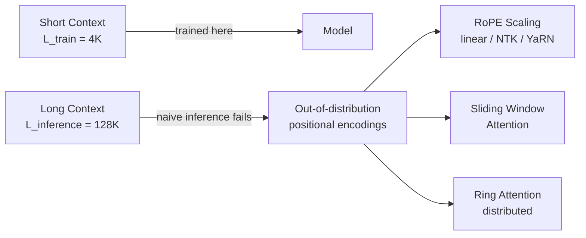

# Long Context Methods: RoPE Scaling, YaRN, Sliding Window Attention, and NIAH Eval

**Area C — Inference Infrastructure | Learning Memory OS Curriculum**

---

## 1. Why Long Context is Hard

Transformer attention has O(n^2) complexity in sequence length. A 128K-token context requires 128^2 = 16,384x more attention computation than a 1K-token context. Memory scales similarly: the KV cache for a 70B model at 128K tokens in bf16 is approximately:

```
KV cache = 2 * n_layers * n_kv_heads * head_dim * seq_len * 2 bytes
         = 2 * 80 * 8 * 128 * 131072 * 2 bytes ≈ 43 GB
```

Beyond computational cost, there's a generalization problem: models trained on sequences up to L_max tokens don't naturally generalize to longer sequences — positional embeddings are typically not trained beyond L_max, and attention patterns may not extend correctly.



---

## 2. Rotary Position Embeddings (RoPE)

RoPE encodes position by rotating the query and key vectors in 2D planes. The key property: the dot product between query at position m and key at position n depends only on m-n (relative position), not absolute positions.

### 2.1 RoPE Implementation from Scratch

```python
import torch
import torch.nn as nn
import math

def precompute_freqs_cis(head_dim: int, max_seq_len: int,
                          theta: float = 10000.0) -> torch.Tensor:
    """
    Precompute the complex exponentials for RoPE.
    Returns freqs_cis of shape (max_seq_len, head_dim//2).
    """
    # Frequencies: theta^(-2i/d) for i in [0, d/2)
    freqs = 1.0 / (theta ** (torch.arange(0, head_dim, 2).float() / head_dim))
    t = torch.arange(max_seq_len).float()  # positions [0, 1, ..., max_seq_len-1]
    # Outer product: (max_seq_len, head_dim//2)
    freqs_matrix = torch.outer(t, freqs)
    # Convert to complex: e^(i * freqs_matrix)
    freqs_cis = torch.polar(torch.ones_like(freqs_matrix), freqs_matrix)
    return freqs_cis

def apply_rotary_emb(xq: torch.Tensor, xk: torch.Tensor,
                      freqs_cis: torch.Tensor) -> tuple:
    """
    Apply RoPE to query and key tensors.
    xq, xk: (batch, seq_len, n_heads, head_dim) in float
    freqs_cis: (seq_len, head_dim//2) complex tensor
    Returns: rotated (xq, xk)
    """
    # Reshape to complex: (batch, seq_len, n_heads, head_dim//2)
    xq_c = torch.view_as_complex(xq.float().reshape(*xq.shape[:-1], -1, 2))
    xk_c = torch.view_as_complex(xk.float().reshape(*xk.shape[:-1], -1, 2))
    
    # Broadcast freqs_cis over batch and heads: (1, seq_len, 1, head_dim//2)
    freqs_cis = freqs_cis.unsqueeze(0).unsqueeze(2)
    
    # Apply rotation: multiply in complex space
    xq_rot = torch.view_as_real(xq_c * freqs_cis).flatten(-2)
    xk_rot = torch.view_as_real(xk_c * freqs_cis).flatten(-2)
    
    return xq_rot.type_as(xq), xk_rot.type_as(xk)


class RotaryAttention(nn.Module):
    """Self-attention with RoPE positional encoding."""
    def __init__(self, d_model: int = 512, n_heads: int = 8,
                  max_seq_len: int = 4096, theta: float = 10000.0):
        super().__init__()
        self.d_model = d_model
        self.n_heads = n_heads
        self.head_dim = d_model // n_heads
        self.Wq = nn.Linear(d_model, d_model, bias=False)
        self.Wk = nn.Linear(d_model, d_model, bias=False)
        self.Wv = nn.Linear(d_model, d_model, bias=False)
        self.Wo = nn.Linear(d_model, d_model, bias=False)
        freqs = precompute_freqs_cis(self.head_dim, max_seq_len, theta)
        self.register_buffer("freqs_cis", freqs)

    def forward(self, x: torch.Tensor, mask: torch.Tensor = None) -> torch.Tensor:
        B, T, C = x.shape
        q = self.Wq(x).view(B, T, self.n_heads, self.head_dim)
        k = self.Wk(x).view(B, T, self.n_heads, self.head_dim)
        v = self.Wv(x).view(B, T, self.n_heads, self.head_dim)
        
        # Apply RoPE
        q, k = apply_rotary_emb(q, k, self.freqs_cis[:T])
        
        # Standard attention
        q = q.transpose(1, 2)   # (B, H, T, head_dim)
        k = k.transpose(1, 2)
        v = v.transpose(1, 2)
        scale = self.head_dim ** -0.5
        attn = torch.matmul(q, k.transpose(-2, -1)) * scale
        if mask is not None:
            attn = attn.masked_fill(mask == 0, float('-inf'))
        attn = torch.softmax(attn, dim=-1)
        out = torch.matmul(attn, v).transpose(1, 2).reshape(B, T, C)
        return self.Wo(out)
```

---

## 3. RoPE Position Interpolation: Extending Context Beyond Training Length

When a model trained at 4K tokens receives 32K input, the rotational frequencies are out-of-distribution. The fix: rescale positions so that the 32K input appears to the model as if it were 4K.

### 3.1 Linear Scaling (Position Interpolation)

```python
def linear_rope_scaling(freqs_cis: torch.Tensor,
                          scale_factor: float) -> torch.Tensor:
    """
    Linear position interpolation (Chen et al., 2023).
    Scale positions by 1/scale_factor to compress longer contexts
    into the trained frequency range.
    
    If model was trained at 4K and we want 16K: scale_factor = 4.
    """
    # freqs_cis encodes positions 0..max_seq_len
    # We want to stretch it to cover 0..max_seq_len*scale_factor
    # by recomputing with scaled positions
    return freqs_cis  # placeholder: recompute with t = t / scale_factor

def precompute_freqs_cis_scaled(head_dim: int, max_seq_len: int,
                                  theta: float = 10000.0,
                                  scale_factor: float = 1.0) -> torch.Tensor:
    """RoPE with linear position scaling for context extension."""
    freqs = 1.0 / (theta ** (torch.arange(0, head_dim, 2).float() / head_dim))
    # Scale positions: divide by scale_factor
    t = torch.arange(max_seq_len).float() / scale_factor
    freqs_matrix = torch.outer(t, freqs)
    return torch.polar(torch.ones_like(freqs_matrix), freqs_matrix)
```

### 3.2 NTK-Aware Scaling

NTK (Neural Tangent Kernel) scaling adjusts the base theta rather than scaling positions. It preserves high-frequency components (local structure) while extending low-frequency components (long-range structure).

```python
def precompute_freqs_cis_ntk(head_dim: int, max_seq_len: int,
                               original_max_seq_len: int = 4096,
                               theta: float = 10000.0) -> torch.Tensor:
    """
    NTK-aware scaling: adjust theta to extend context length.
    Scale factor a = L_new / L_old.
    New theta = theta * (a ^ (d / (d - 2)))
    """
    scale_factor = max_seq_len / original_max_seq_len
    new_theta = theta * (scale_factor ** (head_dim / (head_dim - 2)))
    freqs = 1.0 / (new_theta ** (torch.arange(0, head_dim, 2).float() / head_dim))
    t = torch.arange(max_seq_len).float()
    freqs_matrix = torch.outer(t, freqs)
    return torch.polar(torch.ones_like(freqs_matrix), freqs_matrix)
```

### 3.3 YaRN: Yet Another RoPE Extension

YaRN (Peng et al., 2023) is the current state of the art for RoPE extension. It uses a frequency-dependent scaling: high-frequency components (local attention) are not scaled; low-frequency components (long-range) are scaled.

```python
def precompute_freqs_cis_yarn(head_dim: int, max_seq_len: int,
                               original_max_seq_len: int = 4096,
                               theta: float = 10000.0,
                               alpha: float = 1.0, beta: float = 32.0) -> torch.Tensor:
    """
    YaRN RoPE scaling.
    alpha: low-frequency threshold (in tokens). Dims with wavelength > alpha * L_old are not scaled.
    beta: high-frequency threshold. Dims with wavelength < beta are interpolated linearly.
    Dims in between use NTK scaling.
    """
    scale_factor = max_seq_len / original_max_seq_len
    t = torch.arange(max_seq_len).float()
    
    freqs = 1.0 / (theta ** (torch.arange(0, head_dim, 2).float() / head_dim))
    
    # Compute wavelength for each frequency dimension
    # wavelength = 2 * pi / freq
    wavelengths = 2 * math.pi / freqs  # (head_dim//2,)
    
    # Per-dimension scale factor based on wavelength
    scaled_freqs = torch.zeros_like(freqs)
    for i, (freq, wl) in enumerate(zip(freqs.tolist(), wavelengths.tolist())):
        if wl < beta:
            # High frequency: no scaling (local structure preserved)
            scaled_freqs[i] = freq
        elif wl > alpha * original_max_seq_len:
            # Low frequency: NTK-like scaling
            scaled_freqs[i] = freq / scale_factor
        else:
            # Medium frequency: linear interpolation
            scaled_freqs[i] = freq / ((1 - alpha) * scale_factor + alpha)
    
    freqs_matrix = torch.outer(t, scaled_freqs)
    return torch.polar(torch.ones_like(freqs_matrix), freqs_matrix)
```

---

## 4. Sliding Window Attention

Sliding window attention limits each token to attending only to a local window of W tokens instead of all previous tokens. This reduces attention from O(n^2) to O(n*W). Mistral-7B uses window size W=4096 with full attention on every 4th layer.

```python
import torch
import torch.nn.functional as F

def sliding_window_attention_mask(seq_len: int, window_size: int,
                                   device: str = "cpu") -> torch.Tensor:
    """
    Create a causal attention mask with sliding window.
    Each token can attend to at most window_size previous tokens.
    Returns (1, 1, seq_len, seq_len) boolean mask (True = can attend).
    """
    # Causal mask
    mask = torch.tril(torch.ones(seq_len, seq_len, dtype=torch.bool, device=device))
    # Apply sliding window: zero out tokens beyond window_size
    for i in range(seq_len):
        start = max(0, i - window_size + 1)
        mask[i, :start] = False
    return mask.unsqueeze(0).unsqueeze(0)


def local_attention_forward(q: torch.Tensor, k: torch.Tensor, v: torch.Tensor,
                              window_size: int) -> torch.Tensor:
    """
    Sliding window attention using chunked computation.
    q, k, v: (batch, n_heads, seq_len, head_dim)
    Returns: (batch, n_heads, seq_len, head_dim)
    """
    B, H, T, D = q.shape
    scale = D ** -0.5
    
    # Compute attention in windows for efficiency
    output = torch.zeros_like(q)
    for start in range(0, T, window_size // 2):
        end = min(start + window_size, T)
        q_chunk = q[:, :, start:end, :]
        # Key/value window: tokens in [max(0, start - window_size), end]
        k_start = max(0, start - window_size + 1)
        k_chunk = k[:, :, k_start:end, :]
        v_chunk = v[:, :, k_start:end, :]
        
        attn = torch.matmul(q_chunk, k_chunk.transpose(-2, -1)) * scale
        # Causal mask within chunk
        causal = torch.tril(torch.ones(end-start, end-k_start,
                                        device=q.device, dtype=torch.bool))
        attn = attn.masked_fill(~causal.unsqueeze(0).unsqueeze(0), float('-inf'))
        attn = F.softmax(attn, dim=-1)
        output[:, :, start:end, :] = torch.matmul(attn, v_chunk)
    return output
```

---

## 5. Needle-in-a-Haystack (NIAH) Evaluation

NIAH tests whether a model can retrieve a specific fact ("the needle") from a long context document ("the haystack"). It's the standard benchmark for long-context models.

```python
import json
import random
import re
from typing import Optional

def build_niah_test(needle: str = "The secret passcode is: PURPLE42",
                     haystack_template: str = None,
                     context_length_tokens: int = 32768,
                     needle_depth_pct: float = 0.5,
                     filler_text: str = None) -> dict:
    """
    Build a Needle-in-a-Haystack test case.
    
    needle: the fact to retrieve
    context_length_tokens: target total context length
    needle_depth_pct: position of needle as fraction of total context (0=start, 1=end)
    Returns dict with context, question, expected_answer.
    """
    import tiktoken
    enc = tiktoken.get_encoding("cl100k_base")
    
    if filler_text is None:
        # Use a long repeated passage as filler
        filler_text = ("Paul Graham is a programmer, writer, and investor. "
                       "He is best known for co-founding Viaweb and Y Combinator. "
                       "He has written essays on startups, programming, and philosophy. ") * 500
    
    needle_tokens = len(enc.encode(needle))
    filler_tokens_needed = context_length_tokens - needle_tokens - 50  # buffer
    
    # Truncate filler to needed length
    filler_encoded = enc.encode(filler_text)[:filler_tokens_needed]
    filler_text_truncated = enc.decode(filler_encoded)
    
    # Insert needle at the specified depth
    words = filler_text_truncated.split()
    insert_idx = int(len(words) * needle_depth_pct)
    words_with_needle = words[:insert_idx] + [needle] + words[insert_idx:]
    context = " ".join(words_with_needle)
    
    return {
        "context": context,
        "question": "What is the secret passcode mentioned in the document?",
        "expected_answer": "PURPLE42",
        "context_length_tokens": context_length_tokens,
        "needle_depth_pct": needle_depth_pct,
    }

def evaluate_niah(model_fn, context_lengths: list, depth_percentages: list,
                   n_trials: int = 3, seed: int = 42) -> dict:
    """
    Run NIAH evaluation across a grid of context lengths and needle depths.
    model_fn: callable(context, question) -> str (model response)
    Returns dict with success_rate matrix (context_length, depth_pct).
    """
    random.seed(seed)
    results = {}
    for ctx_len in context_lengths:
        results[ctx_len] = {}
        for depth in depth_percentages:
            successes = 0
            for trial in range(n_trials):
                # Vary the needle text per trial
                needle = f"The secret code for trial {trial} is: TOKEN_{random.randint(1000,9999)}"
                expected = needle.split("TOKEN_")[1]
                test = build_niah_test(
                    needle=needle,
                    context_length_tokens=ctx_len,
                    needle_depth_pct=depth,
                )
                response = model_fn(test["context"], test["question"])
                if expected in response:
                    successes += 1
            results[ctx_len][depth] = successes / n_trials
    return results

def plot_niah_heatmap(results: dict):
    """Plot NIAH results as a heatmap (context_length x needle_depth)."""
    import matplotlib.pyplot as plt
    import numpy as np
    ctx_lengths = sorted(results.keys())
    depths = sorted(next(iter(results.values())).keys())
    matrix = np.array([[results[cl][d] for d in depths] for cl in ctx_lengths])
    
    fig, ax = plt.subplots(figsize=(12, 6))
    im = ax.imshow(matrix, cmap='RdYlGn', vmin=0, vmax=1, aspect='auto')
    ax.set_xticks(range(len(depths)))
    ax.set_xticklabels([f"{int(d*100)}%" for d in depths])
    ax.set_yticks(range(len(ctx_lengths)))
    ax.set_yticklabels([f"{cl//1000}K" for cl in ctx_lengths])
    ax.set_xlabel("Needle Depth (% of context)")
    ax.set_ylabel("Context Length (tokens)")
    ax.set_title("NIAH Evaluation: Retrieval Success Rate")
    plt.colorbar(im, ax=ax, label="Success Rate")
    plt.tight_layout()
    plt.savefig("/tmp/niah_heatmap.png")
```

---

## 6. Ring Attention: Distributing Long Contexts

Ring attention (Liu et al., 2023) distributes the sequence dimension across devices. Each device holds a chunk of the sequence; devices communicate in a ring pattern to compute attention over the full sequence.

```python
# Ring attention sketch (illustrative, not production-ready)
# Real implementation: https://github.com/zhuzilin/ring-flash-attention

def ring_attention_forward_sketch(q_local: torch.Tensor,
                                   k_local: torch.Tensor,
                                   v_local: torch.Tensor,
                                   rank: int, world_size: int,
                                   process_group) -> torch.Tensor:
    """
    Sketch of ring attention: each device holds seq_len/world_size tokens.
    Devices pass K,V tensors around the ring; each accumulates its attention output.
    
    q_local: (B, n_heads, local_seq_len, head_dim) — this device's queries
    k_local, v_local: (B, n_heads, local_seq_len, head_dim) — this device's KV
    """
    import torch.distributed as dist
    
    B, H, L, D = q_local.shape
    scale = D ** -0.5
    
    # Initialize output accumulator and softmax normalizer
    output = torch.zeros_like(q_local)
    softmax_numer = torch.zeros(B, H, L, D, device=q_local.device)
    softmax_denom = torch.zeros(B, H, L, 1, device=q_local.device)
    
    k_recv = k_local.clone()
    v_recv = v_local.clone()
    
    for step in range(world_size):
        # Compute attention from q_local to k_recv, v_recv
        attn_logits = torch.matmul(q_local, k_recv.transpose(-2, -1)) * scale
        attn_weights = torch.softmax(attn_logits, dim=-1)
        partial_output = torch.matmul(attn_weights, v_recv)
        # Accumulate (this is a simplified version; real ring attention uses log-sum-exp)
        output = output + partial_output
        
        # Pass K, V to next device in ring
        k_send = k_recv.clone()
        v_send = v_recv.clone()
        dist.all_to_all_single(k_recv, k_send, group=process_group)
        dist.all_to_all_single(v_recv, v_send, group=process_group)
    
    return output / world_size  # simplified: real version uses proper normalization
```

---

## 7. Common Misconceptions

**Misconception: "Long context models can perfectly recall any fact from any position in a 128K context."**
Correction: NIAH evaluations consistently show performance degradation at extreme depths (middle of a very long context) and long context lengths. "Lost in the middle" (Liu et al., 2023) demonstrates that LLMs process information at the beginning and end of context more reliably than the middle. Long context capability is a spectrum, not a binary property.

**Misconception: "Linear position scaling is a free way to extend context length."**
Correction: Linear position scaling allows inference on longer sequences but degrades perplexity on the out-of-distribution positions without fine-tuning. The model needs continued pre-training or supervised fine-tuning on long-sequence examples to learn to use the extended context effectively. Llama 2's long-context variants were fine-tuned on long documents, not just rescaled at inference time.

**Misconception: "Sliding window attention misses long-range dependencies."**
Correction: In multi-layer transformers, information can propagate long distances through the network even with local attention at each layer. With a window size W and L layers, tokens can influence tokens up to W*L positions away. Additionally, some architectures use alternating local and global attention layers to capture both local and long-range structure (Longformer, BigBird).

**Misconception: "NTK scaling and YaRN produce the same results."**
Correction: NTK scaling applies a uniform theta adjustment, which over-scales low-frequency components. YaRN applies frequency-dependent scaling, preserving high-frequency (local) components while extending low-frequency (long-range) components. YaRN achieves higher performance on long-context benchmarks with the same compute budget.

**Misconception: "KV cache memory for long contexts is fixed per token regardless of model size."**
Correction: KV cache scales with: n_layers * n_kv_heads * head_dim * seq_len * 2 bytes. Multi-Query Attention (MQA) and Grouped Query Attention (GQA) reduce n_kv_heads from n_heads to 1 or a small constant, dramatically reducing KV cache. Llama 3.1-8B uses GQA with 8 KV heads vs. 32 query heads — 4x KV cache reduction.

---

## 8. Hands-On Labs

### Exercise 1: Implement and Verify RoPE

**Goal**: Implement RoPE from scratch and verify that attention scores depend only on relative positions.

**Starter code**:
```python
import torch

def verify_rope_relative_position_property():
    """
    Verify that RoPE attention depends only on relative position.
    If token A is at position 3 and token B is at position 1 (relative distance 2),
    the attention score should equal the score when A is at position 103 and B is at 101.
    """
    head_dim = 64
    max_seq_len = 256
    freqs = precompute_freqs_cis(head_dim, max_seq_len)
    
    torch.manual_seed(42)
    q = torch.randn(1, 1, head_dim)  # query for one head, seq_len=1
    k = torch.randn(1, 1, head_dim)  # key for one head
    
    # Compute attention for (pos 3, pos 1) vs (pos 103, pos 101)
    # Both have relative distance 2
    # TODO: implement and verify
    pass
```

**Acceptance criteria**: Attention scores at (pos 3, pos 1) and (pos 103, pos 101) differ by less than 1e-5 (demonstrating the relative position property).
**Stretch**: Visualize the attention pattern of a RoPE-equipped model as a function of relative distance. Show that attention scores decrease with distance (locality inductive bias).

---

### Exercise 2: Context Extension with NTK Scaling

**Goal**: Compare model perplexity with and without NTK scaling on sequences longer than training length.

**Starter code**:
```python
import torch
from transformers import AutoTokenizer, AutoModelForCausalLM

def evaluate_perplexity_vs_context_length(
    model_name: str = "meta-llama/Llama-3.2-1B",
    lengths: list = [2048, 4096, 8192, 16384],
    scale_type: str = "none",  # "none", "linear", "ntk", "yarn"
) -> dict:
    """
    Evaluate model perplexity at different context lengths with different scaling methods.
    Returns dict {length: perplexity}.
    NOTE: requires HuggingFace model access.
    """
    tokenizer = AutoTokenizer.from_pretrained(model_name)
    model = AutoModelForCausalLM.from_pretrained(model_name, torch_dtype=torch.bfloat16)
    # Apply scaling to model's RoPE config
    for length in lengths:
        # TODO: configure RoPE scaling, compute perplexity on a standard text
        pass
```

**Acceptance criteria**: NTK scaling achieves lower perplexity than linear scaling at 4x context extension. Both degrade compared to no scaling within the training window.
**Stretch**: Fine-tune a small model (GPT-2 scale) on long text using NTK-scaled RoPE and compare to the unscaled baseline. Measure training steps needed to recover baseline perplexity.

---

### Exercise 3: NIAH Evaluation

**Goal**: Implement the full NIAH evaluation pipeline and generate a heatmap for a long-context model.

**Starter code**:
```python
import anthropic
import os

def model_fn_claude(context: str, question: str) -> str:
    """Query Claude as the model under test for NIAH."""
    client = anthropic.Anthropic(api_key=os.environ["ANTHROPIC_API_KEY"])
    response = client.messages.create(
        model="claude-3-5-haiku-20241022",
        max_tokens=100,
        messages=[{
            "role": "user",
            "content": f"{context}\n\n{question}\nAnswer in one word or phrase only."
        }],
    )
    return response.content[0].text

def run_full_niah_eval(context_lengths: list = [4096, 8192, 16384, 32768],
                        depth_percentages: list = [0.1, 0.3, 0.5, 0.7, 0.9],
                        n_trials: int = 2):
    """Run full NIAH grid evaluation and plot heatmap."""
    results = evaluate_niah(
        model_fn=model_fn_claude,
        context_lengths=context_lengths,
        depth_percentages=depth_percentages,
        n_trials=n_trials,
    )
    plot_niah_heatmap(results)
    return results
```

**Acceptance criteria**: Heatmap reveals patterns in model performance (typically: performance degrades at the deepest contexts and the middle of very long sequences). Generate a heatmap for at least 4 context lengths x 5 depth percentages.
**Stretch**: Compare two models (e.g., claude-3-5-haiku and a local Llama model) on the same NIAH grid and produce side-by-side heatmaps.

---

## 9. Reference Reading

- Su et al. (2024): RoFormer: Enhanced Transformer with Rotary Position Embedding
- Chen et al. (2023): Extending Context Window of Large Language Models via Positional Interpolation
- Peng et al. (2023): YaRN: Efficient Context Window Extension of Large Language Models
- Liu et al. (2023): Lost in the Middle: How Language Models Use Long Contexts
- Liu et al. (2023): Ring Attention with Blockwise Transformers for Near-Infinite Context
