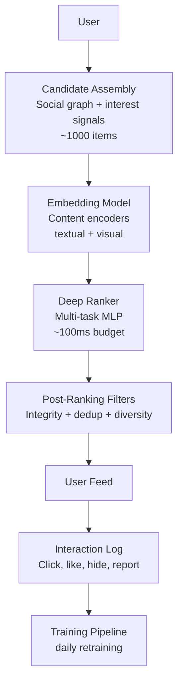

# Newsfeed Ranking: Multi-Stage, Position Bias, Freshness, and Integrity

**Area G — ML System Design | Learning Memory OS Curriculum**

---

## 1. Why Newsfeed Ranking is Fundamentally Different from Search

In search, the user's intent is explicit — they typed a query. In newsfeed ranking, there is no query. The system must infer what a user wants to see from their implicit behavior history, social graph, and contextual signals. The objective function is also more complex: a ranking that maximizes clicks leads to engagement bait and misinformation; one that maximizes dwell time leads to addictive content; one that maximizes return visits must balance novelty with reliability.

Newsfeed ranking combines elements of recommendation systems, multi-objective optimization, and online learning — all under millisecond latency constraints for billions of daily active users.



---

## 2. Multi-Stage Candidate Assembly

Candidate assembly gathers items the user might want to see. Sources include:
- **Social graph posts**: content from friends and pages followed
- **Interest-based retrieval**: two-tower retrieval from embedding index (similar to recommendation systems)
- **Trending content**: popular items in user's region/language
- **Injected content**: ads, promoted content, sponsored posts

```python
from dataclasses import dataclass, field
from typing import List, Optional
import time

@dataclass
class FeedItem:
    item_id: str
    author_id: str
    content_type: str           # "post", "video", "photo", "link"
    created_at: float           # Unix timestamp
    source: str                 # "social_graph", "interest", "trending", "ad"
    raw_score: float = 0.0      # from candidate generation stage
    rank_score: float = 0.0     # from deep ranker
    final_score: float = 0.0    # after post-ranking adjustments


def assemble_candidates(user_id: str,
                         social_graph_store,
                         interest_index,
                         trending_store,
                         max_candidates: int = 1000) -> List[FeedItem]:
    """
    Multi-source candidate assembly for newsfeed.
    In production each source has a budget; social graph gets ~60%, interest ~30%, trending ~10%.
    """
    candidates: List[FeedItem] = []
    
    # 1. Social graph: recent posts from friends/follows
    social_budget = int(max_candidates * 0.60)
    social_items = social_graph_store.get_recent_posts(
        follower_id=user_id, limit=social_budget, max_age_hours=72
    )
    candidates.extend(social_items)
    
    # 2. Interest-based: two-tower ANN retrieval
    interest_budget = int(max_candidates * 0.30)
    user_embedding = interest_index.get_user_embedding(user_id)
    interest_items = interest_index.search(user_embedding, k=interest_budget)
    candidates.extend(interest_items)
    
    # 3. Trending: top-N items in user's country/language
    trending_items = trending_store.get_trending(
        locale=user_id, limit=max_candidates - len(candidates)
    )
    candidates.extend(trending_items)
    
    return candidates
```

---

## 3. Deep Ranker with Multi-Task Learning

The deep ranker simultaneously predicts multiple objectives: probability of like, comment, share, click, and negative signals (hide, report). Multi-task learning shares representations across tasks while allowing task-specific heads.

```python
import torch
import torch.nn as nn
import torch.nn.functional as F

class NewsfeedRanker(nn.Module):
    """
    Multi-task deep ranker for newsfeed.
    Shared bottom + task-specific towers.
    """
    def __init__(self, user_dim: int = 128, item_dim: int = 128,
                 context_dim: int = 32, hidden: int = 512):
        super().__init__()
        # Shared bottom: encode concatenated features
        input_dim = user_dim + item_dim + context_dim
        self.shared_bottom = nn.Sequential(
            nn.Linear(input_dim, hidden),
            nn.LayerNorm(hidden),
            nn.ReLU(),
            nn.Dropout(0.1),
            nn.Linear(hidden, hidden // 2),
            nn.ReLU(),
        )
        tower_input = hidden // 2
        # Task-specific heads
        self.click_head = nn.Linear(tower_input, 1)
        self.like_head = nn.Linear(tower_input, 1)
        self.comment_head = nn.Linear(tower_input, 1)
        self.share_head = nn.Linear(tower_input, 1)
        self.hide_head = nn.Linear(tower_input, 1)   # negative signal

    def forward(self, user_emb: torch.Tensor,
                item_emb: torch.Tensor,
                context_emb: torch.Tensor):
        """
        user_emb: (B, user_dim)
        item_emb: (B, item_dim)
        context_emb: (B, context_dim)
        Returns dict of predictions, each (B,) probability.
        """
        x = torch.cat([user_emb, item_emb, context_emb], dim=-1)
        shared = self.shared_bottom(x)
        return {
            "p_click": torch.sigmoid(self.click_head(shared).squeeze(-1)),
            "p_like": torch.sigmoid(self.like_head(shared).squeeze(-1)),
            "p_comment": torch.sigmoid(self.comment_head(shared).squeeze(-1)),
            "p_share": torch.sigmoid(self.share_head(shared).squeeze(-1)),
            "p_hide": torch.sigmoid(self.hide_head(shared).squeeze(-1)),
        }


def compute_ranking_score(predictions: dict, weights: dict = None) -> torch.Tensor:
    """
    Combine multi-task predictions into a single ranking score.
    Positive signals: click, like, comment, share
    Negative signals: hide (penalized)
    """
    if weights is None:
        weights = {
            "p_click": 1.0,
            "p_like": 2.0,
            "p_comment": 3.0,
            "p_share": 4.0,
            "p_hide": -5.0,  # strong penalty for hide signal
        }
    score = sum(w * predictions[k] for k, w in weights.items())
    return score
```

---

## 4. Position Bias Correction

Items shown at position 1 are clicked more than items at position 5 — not necessarily because they're more relevant, but because users see them first. Training on biased click logs without correction teaches the model that position-1 items are better, creating a feedback loop.

**Inverse Propensity Scoring (IPS)**: Upweight clicks from lower positions.

```python
import numpy as np
from sklearn.linear_model import LogisticRegression

def estimate_position_bias(click_logs: list) -> np.ndarray:
    """
    Estimate examination probability p(examined | position) using
    a randomization experiment or the regression approach.
    
    click_logs: list of {"position": int, "clicked": bool, "item_id": str}
    Returns: array of examination probabilities indexed by position.
    """
    max_pos = max(log["position"] for log in click_logs) + 1
    pos_clicks = np.zeros(max_pos)
    pos_impressions = np.zeros(max_pos)
    for log in click_logs:
        pos = log["position"]
        pos_impressions[pos] += 1
        if log["clicked"]:
            pos_clicks[pos] += 1
    # CTR as proxy for examination probability (assumes relevance is uniform)
    exam_prob = pos_clicks / np.maximum(pos_impressions, 1)
    # Normalize to position-1
    exam_prob = exam_prob / max(exam_prob[0], 1e-9)
    return exam_prob


def ips_weighted_loss(predictions: torch.Tensor,
                       labels: torch.Tensor,
                       positions: torch.Tensor,
                       exam_probs: torch.Tensor) -> torch.Tensor:
    """
    Inverse Propensity Scoring weighted binary cross-entropy loss.
    exam_probs: (B,) examination probability at each item's position
    Upweights clicks at low-examination positions.
    """
    propensity = exam_probs[positions]  # (B,)
    # IPS weight: 1/propensity for clicked items
    weights = torch.where(labels > 0, 1.0 / propensity.clamp(min=0.01),
                           torch.ones_like(propensity))
    bce = F.binary_cross_entropy(predictions, labels.float(), reduction='none')
    return (bce * weights).mean()
```

### 4.1 Position-Aware Features

An alternative to IPS: include position as an input feature at training time, but set it to 0 (or the desired position) at inference time.

```python
class PositionAwareRanker(nn.Module):
    """Ranker that takes position as input (for training) and ignores it at inference."""
    def __init__(self, feature_dim: int, max_positions: int = 20, hidden: int = 256):
        super().__init__()
        self.pos_emb = nn.Embedding(max_positions, 16)
        self.net = nn.Sequential(
            nn.Linear(feature_dim + 16, hidden),
            nn.ReLU(),
            nn.Linear(hidden, 1),
        )

    def forward(self, features: torch.Tensor,
                positions: torch.Tensor,
                inference: bool = False) -> torch.Tensor:
        """At inference time, set position to 0 to remove position bias."""
        if inference:
            positions = torch.zeros_like(positions)
        pos_feat = self.pos_emb(positions)
        x = torch.cat([features, pos_feat], dim=-1)
        return torch.sigmoid(self.net(x).squeeze(-1))
```

---

## 5. Freshness Penalty and Deduplication

### 5.1 Freshness Scoring

Content relevance decays over time. Different content types have different half-lives: breaking news decays in hours; evergreen content decays in weeks.

```python
import math
from datetime import datetime, timezone

CONTENT_HALFLIFE_HOURS = {
    "breaking_news": 2.0,
    "news": 12.0,
    "post": 24.0,
    "video": 72.0,
    "photo": 48.0,
    "evergreen": 720.0,  # 30 days
}

def freshness_score(item: FeedItem, content_type: str,
                     halflife_hours: float = None) -> float:
    """
    Exponential decay freshness bonus.
    Score = exp(-lambda * age_hours) where lambda = ln(2) / halflife
    Returns a multiplier in (0, 1].
    """
    if halflife_hours is None:
        halflife_hours = CONTENT_HALFLIFE_HOURS.get(content_type, 24.0)
    now = datetime.now(timezone.utc).timestamp()
    age_hours = (now - item.created_at) / 3600.0
    decay_rate = math.log(2) / halflife_hours
    return math.exp(-decay_rate * age_hours)

def apply_freshness_to_scores(items: List[FeedItem],
                               freshness_weight: float = 0.2) -> List[FeedItem]:
    """Adjust rank scores by a freshness multiplier."""
    for item in items:
        fs = freshness_score(item, item.content_type)
        item.final_score = item.rank_score * (1 + freshness_weight * fs)
    return items
```

### 5.2 Near-Duplicate Deduplication by Cluster

Users shouldn't see 10 posts about the same news story. Cluster similar items by content embedding and show only the best-ranked per cluster.

```python
import numpy as np
from sklearn.cluster import MiniBatchKMeans

def dedup_by_cluster(items: List[FeedItem],
                      embeddings: np.ndarray,
                      n_clusters: int = 50,
                      max_per_cluster: int = 1) -> List[FeedItem]:
    """
    Cluster feed candidates by content embedding and keep top-scored item per cluster.
    items: list of FeedItem with final_scores set
    embeddings: (N, D) content embeddings aligned with items
    n_clusters: number of topic clusters
    """
    if len(items) <= n_clusters:
        return sorted(items, key=lambda x: x.final_score, reverse=True)
    
    kmeans = MiniBatchKMeans(n_clusters=n_clusters, random_state=42)
    cluster_ids = kmeans.fit_predict(embeddings)
    
    # For each cluster, keep top max_per_cluster items by final_score
    from collections import defaultdict
    clusters: dict = defaultdict(list)
    for item, cid in zip(items, cluster_ids):
        clusters[cid].append(item)
    
    selected = []
    for cid, cluster_items in clusters.items():
        top = sorted(cluster_items, key=lambda x: x.final_score, reverse=True)
        selected.extend(top[:max_per_cluster])
    
    return sorted(selected, key=lambda x: x.final_score, reverse=True)
```

---

## 6. Integrity Filtering

Misinformation and harmful content must be filtered before serving. This is applied as a post-ranking filter, not as a ranking signal (so models don't learn to partially suppress harmful content rather than fully removing it).

```python
from typing import Set

class IntegrityFilter:
    """
    Post-ranking integrity filter.
    Applies hard rules for policy violations and soft demotions for quality signals.
    """
    def __init__(self, blocked_items: Set[str], blocked_authors: Set[str]):
        self.blocked_items = blocked_items
        self.blocked_authors = blocked_authors

    def hard_filter(self, items: List[FeedItem]) -> List[FeedItem]:
        """Remove items that violate hard content policies."""
        return [
            item for item in items
            if item.item_id not in self.blocked_items
            and item.author_id not in self.blocked_authors
        ]

    def soft_demote(self, items: List[FeedItem],
                    borderline_items: Set[str],
                    demote_factor: float = 0.5) -> List[FeedItem]:
        """Soft demote borderline content: reduce score, don't remove."""
        for item in items:
            if item.item_id in borderline_items:
                item.final_score *= demote_factor
        return sorted(items, key=lambda x: x.final_score, reverse=True)

    def apply(self, items: List[FeedItem],
              borderline_items: Set[str] = None) -> List[FeedItem]:
        filtered = self.hard_filter(items)
        if borderline_items:
            filtered = self.soft_demote(filtered, borderline_items)
        return filtered
```

---

## 7. Common Misconceptions

**Misconception: "Newsfeed ranking should maximize engagement (clicks, likes)."**
Correction: Engagement maximization creates feedback loops toward sensational and divisive content. Facebook's research showed that optimizing directly for engagement increased polarizing content. Production systems use composite objectives that include negative signals (hide, unfollow, report) and long-term satisfaction metrics (next-day retention, survey-based wellbeing scores).

**Misconception: "More items in the feed = more engagement."**
Correction: Users have finite attention. Showing 50 items when 20 are optimal leads to decision fatigue and lower engagement per item. The optimal feed length is a function of session context (mobile vs. desktop, time of day) and is typically learned from A/B experiments on session duration and return rate.

**Misconception: "Position bias only matters for click signals."**
Correction: Position bias affects all feedback signals: likes, shares, comments, and even hides. Items shown at position 1 get more of all signals — positive and negative — because they're seen by more users. IPS and position-feature approaches must be applied to all training signals, not just clicks.

**Misconception: "Deduplication should happen before ranking."**
Correction: Deduplication before ranking removes content without knowing which version is most relevant to the user. Best practice is to rank all candidates, then deduplicate — keeping the highest-ranked item per near-duplicate cluster. This ensures the best representation of each topic is shown.

**Misconception: "Freshness always improves feed quality."**
Correction: Freshness is a proxy for novelty, but newer is not always better. An authoritative 3-day-old article about a medical topic is better than a 1-hour-old rumor. Freshness scores should be weighted by content type and domain, and balanced against quality signals (author credibility, engagement rate normalized by reach).

---

## 8. Hands-On Labs

### Exercise 1: Build a Position Bias Estimator

**Goal**: Estimate position-dependent examination probabilities from simulated click logs.

**Starter code**:
```python
import numpy as np

def simulate_biased_click_log(num_queries: int = 1000,
                               results_per_query: int = 10,
                               true_exam_probs: np.ndarray = None,
                               seed: int = 42) -> list:
    """
    Simulate click logs with known position bias.
    true_exam_probs: (num_positions,) probability of examining each position.
    Items have a latent relevance; click = examine AND relevant.
    Returns list of {"position": int, "clicked": bool, "item_id": str}.
    """
    rng = np.random.RandomState(seed)
    if true_exam_probs is None:
        # Typical position bias curve
        true_exam_probs = np.array([1.0, 0.85, 0.70, 0.55, 0.45,
                                     0.35, 0.28, 0.22, 0.18, 0.15])
    logs = []
    for q in range(num_queries):
        # True relevance for 10 items in this query (0.1-0.5 click rate)
        relevances = rng.uniform(0.05, 0.4, size=results_per_query)
        for pos in range(results_per_query):
            examined = rng.random() < true_exam_probs[pos]
            clicked = examined and (rng.random() < relevances[pos])
            logs.append({"position": pos, "clicked": clicked,
                          "item_id": f"q{q}_i{pos}"})
    return logs

def recover_position_bias(logs: list) -> np.ndarray:
    """
    Recover examination probabilities from click logs.
    Use the naive CTR-as-proxy approach: exam_prob[pos] ~ CTR[pos]
    """
    # TODO: implement
    pass
```

**Acceptance criteria**: Recovered examination probabilities correlate > 0.95 with true values. Show that without debiasing, a model trained on raw clicks ranks position-1 items higher regardless of relevance.
**Stretch**: Implement the randomization-based estimator: randomly swap items between positions in 5% of feeds, use the swapped data to estimate examination probabilities directly.

---

### Exercise 2: Multi-Task Ranker Training

**Goal**: Train the `NewsfeedRanker` on synthetic interaction data and verify all task heads learn.

**Starter code**:
```python
import torch
from torch.utils.data import Dataset, DataLoader

class SyntheticFeedDataset(Dataset):
    """Synthetic feed interaction dataset with multi-task labels."""
    def __init__(self, n_samples: int = 10_000, user_dim: int = 128,
                 item_dim: int = 128, context_dim: int = 32, seed: int = 42):
        rng = torch.manual_seed(seed)
        self.user_embs = torch.randn(n_samples, user_dim)
        self.item_embs = torch.randn(n_samples, item_dim)
        self.context_embs = torch.randn(n_samples, context_dim)
        # Labels: correlated tasks (if click high -> like high, hide low)
        click_logit = (self.user_embs * self.item_embs).sum(-1) * 0.1
        self.labels = {
            "click": torch.sigmoid(click_logit + torch.randn(n_samples) * 0.5) > 0.3,
            "like": torch.sigmoid(click_logit + torch.randn(n_samples) * 0.5) > 0.5,
            "hide": torch.sigmoid(-click_logit + torch.randn(n_samples) * 0.5) > 0.7,
        }

    def __len__(self): return len(self.user_embs)

    def __getitem__(self, idx):
        return (self.user_embs[idx], self.item_embs[idx],
                self.context_embs[idx],
                {k: v[idx].float() for k, v in self.labels.items()})

def train_multitask_ranker(epochs: int = 5) -> NewsfeedRanker:
    dataset = SyntheticFeedDataset()
    loader = DataLoader(dataset, batch_size=256, shuffle=True)
    model = NewsfeedRanker()
    optimizer = torch.optim.AdamW(model.parameters(), lr=1e-3)
    for epoch in range(epochs):
        total_loss = 0.0
        for user_e, item_e, ctx_e, labels in loader:
            preds = model(user_e, item_e, ctx_e)
            # TODO: compute multi-task loss and backprop
            pass
        print(f"Epoch {epoch+1}: loss={total_loss:.4f}")
    return model
```

**Acceptance criteria**: All three task heads achieve AUC-ROC > 0.60 on held-out data. The hide head should inversely correlate with click head predictions.
**Stretch**: Implement Mixture of Experts (MoE) gating instead of a shared bottom and measure if it improves per-task AUC.

---

### Exercise 2b: Position Bias Correction Validation

**Goal**: Show that IPS-corrected training improves the model's ranking quality on unbiased test data.

```python
import numpy as np
import torch

def simulate_biased_training_data(n_queries: int = 500,
                                   n_positions: int = 10,
                                   true_exam_probs: np.ndarray = None) -> dict:
    """
    Generate training data with position bias.
    Returns dict with biased_clicks, unbiased_clicks, item_relevances, positions.
    """
    rng = np.random.RandomState(42)
    if true_exam_probs is None:
        true_exam_probs = np.array([1.0, 0.8, 0.65, 0.52, 0.42,
                                     0.34, 0.27, 0.22, 0.18, 0.15])
    n_total = n_queries * n_positions
    relevances = rng.uniform(0.05, 0.5, n_total)
    positions = np.tile(np.arange(n_positions), n_queries)
    exam_probs = true_exam_probs[positions]
    # Biased clicks: click = examine AND relevant
    biased_clicks = (rng.random(n_total) < exam_probs * relevances).astype(float)
    # Unbiased clicks: examine with prob=1 (for test evaluation only)
    unbiased_clicks = (rng.random(n_total) < relevances).astype(float)
    return {
        "relevances": relevances,
        "positions": positions,
        "biased_clicks": biased_clicks,
        "unbiased_clicks": unbiased_clicks,
        "exam_probs": exam_probs,
    }
```

**Acceptance criteria**: A logistic regression model trained with IPS-weighted loss achieves Spearman rank correlation with unbiased_clicks ≥ 5 points higher than the model trained on raw biased_clicks.
**Stretch**: Use the recovered position bias from Exercise 1 (instead of the ground truth) for IPS weighting. Measure how estimation error in propensity scores affects the debiasing quality.

---

### Exercise 3: Dedup Pipeline with Embedding Clusters

**Goal**: Implement the near-duplicate deduplication pipeline and verify it reduces redundancy in feed candidates.

**Starter code**:
```python
from sentence_transformers import SentenceTransformer
import numpy as np

def build_dedup_pipeline(items: List[FeedItem],
                          item_texts: List[str]) -> List[FeedItem]:
    """
    1. Encode item texts with a sentence-transformer
    2. Cluster with MiniBatchKMeans (n_clusters=50)
    3. Keep top-scored item per cluster
    4. Return deduplicated, sorted items
    """
    model = SentenceTransformer("BAAI/bge-small-en-v1.5")
    embeddings = model.encode(item_texts, normalize_embeddings=True)
    # TODO: implement dedup_by_cluster and return results
    pass
```

**Acceptance criteria**: Given 200 feed candidates with 20 near-duplicate news stories in 5 topic clusters, the deduplication outputs at most 1 story per cluster (≤ 5 news stories in output), with the highest-ranked story retained per cluster.
**Stretch**: Implement soft clustering (GMM) instead of hard k-means and vary the cluster assignment threshold. Measure the trade-off between diversity and relevance at different thresholds.

---
