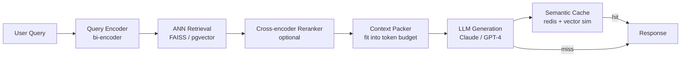

# RAG Architecture: Chunking, Reranking, Hybrid Retrieval, and Semantic Caching

**Area E — Agent Systems & Frontier Framing | Learning Memory OS Curriculum**

---

## 1. Why RAG Exists and When to Use It

Retrieval-Augmented Generation (RAG) addresses two fundamental limitations of LLMs: knowledge cutoff and hallucination under factual uncertainty. Instead of relying solely on parametric knowledge baked into weights, RAG retrieves relevant passages at inference time and grounds the LLM's response in retrieved evidence.

RAG is the right architecture when:
- The knowledge base changes frequently (news, product catalogs, code repos)
- Answers require specific facts not reliably encoded in weights
- You need citations and source attribution
- Fine-tuning the LLM is too expensive for the update frequency

RAG is the wrong architecture when:
- The task requires deep reasoning over long chains of implicit knowledge (LLM weights are better)
- Retrieval latency is unacceptable (sub-50ms requirements)
- The knowledge base is too small to benefit from indexing



---

## 2. Chunking Strategies

How you split documents into retrievable chunks has enormous impact on retrieval quality. The wrong chunking strategy is one of the most common RAG failures.

### 2.1 Fixed-Size Chunking

The simplest approach: split every N tokens with optional overlap. Fast but semantically incoherent — may split mid-sentence.

```python
from typing import List, Optional
import re

def fixed_size_chunker(text: str, chunk_size: int = 512,
                        overlap: int = 64,
                        encoding_name: str = "cl100k_base") -> List[str]:
    """
    Split text into chunks of exactly chunk_size tokens with overlap tokens of overlap.
    Uses tiktoken for accurate token counting.
    """
    import tiktoken
    enc = tiktoken.get_encoding(encoding_name)
    tokens = enc.encode(text)
    chunks = []
    start = 0
    while start < len(tokens):
        end = min(start + chunk_size, len(tokens))
        chunk_tokens = tokens[start:end]
        chunk_text = enc.decode(chunk_tokens)
        chunks.append(chunk_text)
        if end >= len(tokens):
            break
        start += chunk_size - overlap
    return chunks
```

### 2.2 Semantic / Paragraph-Aware Chunking

Split at natural boundaries (paragraphs, headings) and merge small chunks until a size target is reached.

```python
def semantic_chunker(text: str, max_tokens: int = 512,
                      encoding_name: str = "cl100k_base") -> List[str]:
    """
    Split text into semantically coherent chunks by paragraph boundaries.
    Merges small paragraphs; splits oversized ones.
    """
    import tiktoken
    enc = tiktoken.get_encoding(encoding_name)
    
    # Split on paragraph boundaries (double newline)
    paragraphs = re.split(r'\n\s*\n', text.strip())
    paragraphs = [p.strip() for p in paragraphs if p.strip()]
    
    chunks = []
    current_chunk = []
    current_tokens = 0
    
    for para in paragraphs:
        para_tokens = len(enc.encode(para))
        if para_tokens > max_tokens:
            # Paragraph too large: flush current, then split this para by sentences
            if current_chunk:
                chunks.append('\n\n'.join(current_chunk))
                current_chunk = []
                current_tokens = 0
            sentences = re.split(r'(?<=[.!?])\s+', para)
            sent_chunk = []
            sent_tokens = 0
            for sent in sentences:
                st = len(enc.encode(sent))
                if sent_tokens + st > max_tokens and sent_chunk:
                    chunks.append(' '.join(sent_chunk))
                    sent_chunk = [sent]
                    sent_tokens = st
                else:
                    sent_chunk.append(sent)
                    sent_tokens += st
            if sent_chunk:
                chunks.append(' '.join(sent_chunk))
        elif current_tokens + para_tokens > max_tokens and current_chunk:
            # Flush current chunk, start new
            chunks.append('\n\n'.join(current_chunk))
            current_chunk = [para]
            current_tokens = para_tokens
        else:
            current_chunk.append(para)
            current_tokens += para_tokens
    
    if current_chunk:
        chunks.append('\n\n'.join(current_chunk))
    
    return chunks


def late_chunking(text: str, model_name: str = "BAAI/bge-small-en-v1.5") -> List:
    """
    Late chunking: encode full document, then split embeddings by sentence.
    Preserves cross-sentence context in embeddings.
    Returns list of (sentence_text, sentence_embedding).
    """
    from sentence_transformers import SentenceTransformer
    import numpy as np
    model = SentenceTransformer(model_name)
    sentences = re.split(r'(?<=[.!?])\s+', text)
    # Encode full text as one sequence (preserves context)
    # NOTE: real late chunking requires model with token-level output (e.g. jina-embeddings-v2)
    # This is a simplified version using per-sentence encoding
    embeddings = model.encode(sentences, normalize_embeddings=True)
    return list(zip(sentences, embeddings))
```

---

## 3. Embedding and Indexing Pipeline

```python
from sentence_transformers import SentenceTransformer
import faiss
import numpy as np
import json
from pathlib import Path
from typing import List, Dict, Any

class RAGIndex:
    """
    In-memory RAG index with FAISS.
    For production: swap FAISS for pgvector or a managed vector DB.
    """
    def __init__(self, model_name: str = "BAAI/bge-small-en-v1.5"):
        self.model = SentenceTransformer(model_name)
        self.dim = self.model.get_sentence_embedding_dimension()
        self.index = faiss.IndexFlatIP(self.dim)
        self.chunks: List[str] = []
        self.metadata: List[Dict[str, Any]] = []

    def add_documents(self, documents: List[Dict[str, str]],
                       chunker=None, batch_size: int = 256):
        """
        Add documents to the index.
        documents: list of {"text": "...", "source": "...", "doc_id": "..."}
        """
        if chunker is None:
            chunker = semantic_chunker
        all_chunks = []
        all_meta = []
        for doc in documents:
            chunks = chunker(doc["text"])
            for i, chunk in enumerate(chunks):
                all_chunks.append(chunk)
                all_meta.append({
                    "source": doc.get("source", ""),
                    "doc_id": doc.get("doc_id", ""),
                    "chunk_idx": i,
                })
        # Encode in batches
        embeddings = self.model.encode(
            all_chunks, batch_size=batch_size, normalize_embeddings=True,
            show_progress_bar=True, convert_to_numpy=True,
        ).astype('float32')
        self.index.add(embeddings)
        self.chunks.extend(all_chunks)
        self.metadata.extend(all_meta)
        print(f"Indexed {len(all_chunks)} chunks from {len(documents)} documents")

    def search(self, query: str, k: int = 20) -> List[Dict]:
        """Retrieve top-k chunks for a query."""
        q_emb = self.model.encode(
            [query], normalize_embeddings=True, convert_to_numpy=True
        ).astype('float32')
        distances, indices = self.index.search(q_emb, k)
        results = []
        for dist, idx in zip(distances[0], indices[0]):
            if idx < 0:
                continue
            results.append({
                "chunk": self.chunks[idx],
                "score": float(dist),
                "metadata": self.metadata[idx],
            })
        return results
```

---

## 4. Cross-Encoder Reranking

```python
from sentence_transformers import CrossEncoder
from typing import List, Dict

def rerank_chunks(query: str,
                   candidates: List[Dict],
                   reranker_model: str = "cross-encoder/ms-marco-MiniLM-L-6-v2",
                   k: int = 5) -> List[Dict]:
    """
    Rerank retrieved chunks using a cross-encoder for higher precision.
    candidates: list of {"chunk": ..., "score": ..., "metadata": ...}
    Returns top-k reranked results.
    """
    reranker = CrossEncoder(reranker_model, max_length=512)
    pairs = [(query, c["chunk"]) for c in candidates]
    scores = reranker.predict(pairs)
    for cand, score in zip(candidates, scores):
        cand["rerank_score"] = float(score)
    reranked = sorted(candidates, key=lambda x: x["rerank_score"], reverse=True)
    return reranked[:k]
```

---

## 5. Minimal RAG with FastAPI + ChromaDB (< 100 lines)

```python
# rag_app.py — minimal RAG API with FastAPI + Chroma
# Run: uvicorn rag_app:app --reload
# pip install fastapi uvicorn chromadb sentence-transformers anthropic

from fastapi import FastAPI
from pydantic import BaseModel
from sentence_transformers import SentenceTransformer
import chromadb
from chromadb.utils import embedding_functions
import anthropic
import os

app = FastAPI()
client = anthropic.Anthropic(api_key=os.environ["ANTHROPIC_API_KEY"])
chroma_client = chromadb.Client()
model_name = "BAAI/bge-small-en-v1.5"
ef = embedding_functions.SentenceTransformerEmbeddingFunction(model_name=model_name)
collection = chroma_client.get_or_create_collection("rag_docs", embedding_function=ef)

class IngestRequest(BaseModel):
    documents: list[str]
    ids: list[str] = None
    metadatas: list[dict] = None

class QueryRequest(BaseModel):
    query: str
    k: int = 5
    system_prompt: str = "Answer based only on the provided context."

@app.post("/ingest")
def ingest(req: IngestRequest):
    ids = req.ids or [f"doc_{i}" for i in range(len(req.documents))]
    collection.add(documents=req.documents, ids=ids,
                   metadatas=req.metadatas or [{} for _ in req.documents])
    return {"indexed": len(req.documents)}

@app.post("/query")
def query(req: QueryRequest):
    results = collection.query(query_texts=[req.query], n_results=req.k)
    context_chunks = results["documents"][0]  # list of strings
    context = "\n\n---\n\n".join(
        f"[Source {i+1}]: {chunk}" for i, chunk in enumerate(context_chunks)
    )
    response = client.messages.create(
        model="claude-3-5-haiku-20241022",
        max_tokens=1024,
        system=req.system_prompt,
        messages=[{
            "role": "user",
            "content": f"Context:\n{context}\n\nQuestion: {req.query}"
        }],
    )
    return {
        "answer": response.content[0].text,
        "sources": results["metadatas"][0],
        "input_tokens": response.usage.input_tokens,
    }

@app.get("/health")
def health():
    return {"status": "ok", "docs_indexed": collection.count()}
```

---

## 6. Semantic Caching

Repeated or semantically similar queries can be served from a cache, reducing LLM API costs.

```python
import redis
import numpy as np
from sentence_transformers import SentenceTransformer
import json
import hashlib

class SemanticCache:
    """
    Semantic cache for RAG responses.
    Cache hit: query embedding cosine similarity > threshold with a cached query.
    """
    def __init__(self, redis_url: str = "redis://localhost:6379",
                  model_name: str = "BAAI/bge-small-en-v1.5",
                  similarity_threshold: float = 0.92,
                  ttl_seconds: int = 3600):
        self.redis = redis.from_url(redis_url)
        self.model = SentenceTransformer(model_name)
        self.threshold = similarity_threshold
        self.ttl = ttl_seconds

    def _embed(self, text: str) -> np.ndarray:
        return self.model.encode([text], normalize_embeddings=True)[0]

    def get(self, query: str) -> dict | None:
        """Check cache for a semantically similar query."""
        q_emb = self._embed(query)
        # Retrieve all cached embeddings (in production: use Redis + FAISS or RediSearch)
        cached_keys = self.redis.keys("cache:emb:*")
        best_sim = -1.0
        best_key = None
        for key in cached_keys:
            cached_emb = np.frombuffer(self.redis.get(key), dtype=np.float32)
            sim = float(np.dot(q_emb, cached_emb))  # cosine (L2-normalized)
            if sim > best_sim:
                best_sim = sim
                best_key = key
        if best_sim >= self.threshold and best_key:
            # Retrieve response from cache
            resp_key = best_key.decode().replace("emb:", "resp:")
            cached_resp = self.redis.get(resp_key)
            if cached_resp:
                return json.loads(cached_resp)
        return None

    def set(self, query: str, response: dict):
        """Store query embedding and response in cache."""
        q_emb = self._embed(query)
        key_hash = hashlib.md5(query.encode()).hexdigest()
        emb_key = f"cache:emb:{key_hash}"
        resp_key = f"cache:resp:{key_hash}"
        self.redis.setex(emb_key, self.ttl, q_emb.astype(np.float32).tobytes())
        self.redis.setex(resp_key, self.ttl, json.dumps(response))
```

---

## 7. Context Packing: Fitting Retrieved Chunks into Token Budget

```python
import tiktoken

def pack_context(chunks: List[Dict],
                  max_tokens: int = 8192,
                  encoding_name: str = "cl100k_base",
                  header: str = "Relevant context:\n\n") -> str:
    """
    Pack top-ranked chunks into a context string under a token budget.
    Inserts chunks in rank order until budget is exhausted.
    """
    enc = tiktoken.get_encoding(encoding_name)
    budget = max_tokens - len(enc.encode(header))
    packed = []
    used_tokens = 0
    for chunk_data in chunks:
        chunk_text = chunk_data["chunk"]
        separator = f"\n---\n"
        candidate = chunk_text + separator
        n_tokens = len(enc.encode(candidate))
        if used_tokens + n_tokens > budget:
            break
        packed.append(candidate)
        used_tokens += n_tokens
    return header + "".join(packed)
```

---

## 8. Common Misconceptions

**Misconception: "RAG eliminates hallucinations."**
Correction: RAG reduces factual hallucinations by grounding responses in retrieved context. However, the LLM can still hallucinate by: (1) misinterpreting the context, (2) mixing parametric and retrieved knowledge, (3) being unable to find the answer in context and generating one anyway. RAG must be paired with explicit "answer only from context" instructions and evaluation (faithfulness metrics, citation verification).

**Misconception: "Larger chunk sizes are always better."**
Correction: Larger chunks provide more context per retrieved item but reduce retrieval precision — the relevant sentence is buried in noise. Smaller chunks have higher retrieval precision but may lack context for answering. The optimal chunk size is task-dependent: typically 256-512 tokens for factual QA, 512-1024 for summarization tasks. Measure retrieval precision (is the answer in the top-k chunks?) across chunk sizes.

**Misconception: "You only need vector similarity for RAG retrieval."**
Correction: Dense-only retrieval fails on exact string matches, product IDs, names, and out-of-domain text. Hybrid retrieval (BM25 + dense + RRF) is superior in virtually all production benchmarks. Additionally, metadata filtering (date range, source domain, document type) is critical for reducing noise and should be applied as a hard filter before or after retrieval.

**Misconception: "The retrieval step is a solved problem — just use embeddings."**
Correction: Retrieval quality is heavily influenced by: embedding model choice (domain match matters enormously), chunking strategy (see above), query rewriting (HyDE: generate a hypothetical answer and embed it), and re-ranking. Each of these can move Recall@10 by 5-15 percentage points. Systematic ablation of each component is required.

**Misconception: "Adding more retrieved chunks always improves generation quality."**
Correction: Beyond a threshold, more context hurts. LLMs suffer from "lost in the middle" — information in the middle of a long context is processed less reliably than information at the beginning or end (Liu et al., 2023). Studies show that performance peaks at 5-10 relevant chunks and can decrease as irrelevant chunks are added. Reranking and context packing (only insert chunks that fit the budget and are relevant) is essential.

---

## 8b. Query Rewriting and Multi-Query Retrieval

User queries are often ambiguous or poorly phrased for retrieval. Query rewriting improves recall:

```python
import anthropic
import os
from typing import List

def rewrite_query_for_retrieval(query: str, n_variants: int = 3) -> List[str]:
    """
    Use an LLM to generate alternative phrasings of the query.
    Each variant may match different documents in the corpus.
    Retrieve for all variants and merge with deduplication.
    """
    client = anthropic.Anthropic(api_key=os.environ["ANTHROPIC_API_KEY"])
    prompt = (
        f"Generate {n_variants} alternative search queries for the following question. "
        f"Each query should capture a different aspect or phrasing that might match relevant documents. "
        f"Return only the queries, one per line.\n\nQuestion: {query}"
    )
    response = client.messages.create(
        model="claude-3-5-haiku-20241022",
        max_tokens=256,
        messages=[{"role": "user", "content": prompt}],
    )
    variants = [q.strip() for q in response.content[0].text.strip().split("\n") if q.strip()]
    return [query] + variants[:n_variants]  # original + variants


def multi_query_retrieval(query: str, rag_index: RAGIndex,
                           n_variants: int = 3, k_per_query: int = 10) -> List[Dict]:
    """
    Multi-query retrieval: rewrite query, retrieve for each variant, deduplicate.
    Returns deduplicated list of top results.
    """
    query_variants = rewrite_query_for_retrieval(query, n_variants)
    seen_chunks = set()
    all_results = []
    for variant in query_variants:
        results = rag_index.search(variant, k=k_per_query)
        for r in results:
            chunk_key = r["chunk"][:100]  # dedup by first 100 chars
            if chunk_key not in seen_chunks:
                seen_chunks.add(chunk_key)
                all_results.append(r)
    # Sort by score and return top results
    return sorted(all_results, key=lambda x: x["score"], reverse=True)


def hyde_retrieval(query: str, rag_index: RAGIndex, k: int = 10) -> List[Dict]:
    """
    HyDE (Hypothetical Document Embeddings): generate a hypothetical answer,
    embed it, and search for documents similar to the hypothetical answer.
    Often outperforms direct query embedding for factual QA.
    """
    client = anthropic.Anthropic(api_key=os.environ["ANTHROPIC_API_KEY"])
    response = client.messages.create(
        model="claude-3-5-haiku-20241022",
        max_tokens=256,
        messages=[{
            "role": "user",
            "content": (
                f"Write a brief, factual answer to the following question in 2-3 sentences. "
                f"Include specific details and terminology that might appear in a relevant document.\n\n"
                f"Question: {query}"
            )
        }],
    )
    hypothetical_answer = response.content[0].text.strip()
    # Retrieve using the hypothetical answer instead of the raw query
    return rag_index.search(hypothetical_answer, k=k)
```

---

## 9. Hands-On Labs

### Exercise 1: Chunk Strategy Ablation

**Goal**: Compare fixed-size vs. semantic chunking on retrieval recall.

**Starter code**:
```python
from datasets import load_dataset

def evaluate_chunking_strategy(chunker_fn, chunk_size: int = 512,
                                 model_name: str = "BAAI/bge-small-en-v1.5") -> dict:
    """
    Load SQUAD dataset. For each passage:
    1. Chunk it with chunker_fn
    2. Index chunks
    3. For each QA pair, retrieve top-3 chunks
    4. Check if the answer span is in any of the top-3 chunks (Answer Recall@3)
    """
    dataset = load_dataset("squad", split="validation[:500]")
    # Group by passage
    passages = {}
    for row in dataset:
        pid = row["id"]
        passages[pid] = {
            "text": row["context"],
            "questions": passages.get(pid, {}).get("questions", []) + [row["question"]],
            "answers": passages.get(pid, {}).get("answers", []) + [row["answers"]["text"][0]],
        }
    # TODO: build RAGIndex, evaluate Answer Recall@3 for each chunking strategy
    pass
```

**Acceptance criteria**: Semantic chunking achieves Answer Recall@3 ≥ 3 percentage points higher than fixed-size chunking on SQUAD passages.
**Stretch**: Implement "sliding window" chunking (chunk_size=512 with 128 token overlap) and compare to both. Plot chunk size vs. Answer Recall@3 for fixed chunking (sizes: 128, 256, 512, 1024).

---

### Exercise 2: Build a Minimal RAG API

**Goal**: Deploy the FastAPI RAG server with ChromaDB, ingest 100 Wikipedia articles, and verify it returns grounded answers.

**Starter code**:
```python
import requests

BASE_URL = "http://localhost:8000"

def test_rag_server():
    # 1. Ingest 5 test documents
    documents = [
        "The Eiffel Tower is a wrought-iron lattice tower in Paris, France, built 1887-1889.",
        "BERT is a transformer-based language model pre-trained on English text by Google.",
        "PostgreSQL is an open-source relational database management system.",
        "Python was created by Guido van Rossum and first released in 1991.",
        "The attention mechanism in transformers computes weighted sums of values.",
    ]
    resp = requests.post(f"{BASE_URL}/ingest",
                          json={"documents": documents, "ids": [f"d{i}" for i in range(5)]})
    assert resp.status_code == 200
    
    # 2. Query: should retrieve the Eiffel Tower document
    resp = requests.post(f"{BASE_URL}/query",
                          json={"query": "When was the Eiffel Tower built?", "k": 3})
    assert resp.status_code == 200
    result = resp.json()
    assert "1887" in result["answer"] or "1889" in result["answer"]
    print(f"Answer: {result['answer']}")
    print(f"Tokens used: {result['input_tokens']}")
```

**Acceptance criteria**: Server responds in < 2s for queries on a 100-document corpus. Answers include correct factual information from the context. Implement and verify the `/health` endpoint reports correct document count.
**Stretch**: Add the semantic cache layer. Verify that the second call to the same (or semantically similar) query is served from cache and uses 0 LLM tokens.

---

### Exercise 3: Retrieval Evaluation with RAGAS

**Goal**: Evaluate your RAG pipeline with RAGAS metrics: context precision, context recall, answer faithfulness, answer relevance.

**Starter code**:
```python
from ragas import evaluate
from ragas.metrics import (context_precision, context_recall,
                            faithfulness, answer_relevancy)
from datasets import Dataset

def evaluate_rag_pipeline(rag_index: RAGIndex, qa_pairs: list) -> dict:
    """
    qa_pairs: list of {"question": ..., "ground_truth": ...}
    """
    data = {"question": [], "answer": [], "contexts": [], "ground_truth": []}
    for qa in qa_pairs:
        query = qa["question"]
        chunks = rag_index.search(query, k=5)
        context_texts = [c["chunk"] for c in chunks]
        # Generate answer (replace with your LLM call)
        answer = "TODO: call LLM here"
        data["question"].append(query)
        data["answer"].append(answer)
        data["contexts"].append(context_texts)
        data["ground_truth"].append(qa["ground_truth"])
    
    dataset = Dataset.from_dict(data)
    result = evaluate(dataset, metrics=[
        context_precision, context_recall, faithfulness, answer_relevancy
    ])
    return result
```

**Acceptance criteria**: Context recall ≥ 0.70 (relevant information retrieved), faithfulness ≥ 0.80 (answer grounded in context) on a 50-question test set.
**Stretch**: Implement HyDE (Hypothetical Document Embeddings): generate a hypothetical answer to the question using the LLM, embed that answer, use it as the query vector. Measure if HyDE improves context recall vs. embedding the raw question.

---
