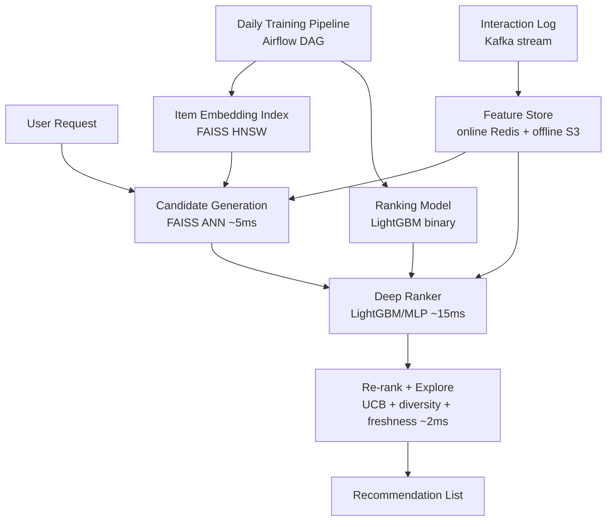

# Recommendation Systems: Two-Tower, Ranking, and Exploration

**Area G — ML System Design | Learning Memory OS Curriculum**

---

## 1. Why Recommendations Are an ML System Design Problem

Recommendation systems sit at the intersection of machine learning and systems engineering. The ML part — learning representations, predicting relevance, modeling uncertainty — is only half the problem. The other half is building infrastructure that delivers recommendations at latency measured in milliseconds, over catalogs with hundreds of millions of items, for billions of user sessions per day.

The canonical architecture is a **multi-stage funnel**: retrieve a manageable candidate set from a massive item space (candidate generation), then apply an expensive relevance model only to those candidates (ranking), then apply business logic to produce the final recommendation list (re-ranking, filtering, diversity).

This separation is fundamental. A neural ranking model processing all 500 million YouTube videos for every user request would require millions of FLOPs per request at infeasible latency. Candidate generation narrows the set to ~1,000 items; the ranking model then processes those 1,000 items deeply.


---

## 2. Candidate Generation

### 2.1 Collaborative Filtering and BPR

Collaborative filtering learns user and item embeddings from interaction histories. Bayesian Personalized Ranking (BPR) is the preferred loss for implicit feedback — it trains the model to score observed items above unobserved ones.

```python
import torch
import torch.nn as nn
import torch.optim as optim

class MatrixFactorization(nn.Module):
    def __init__(self, num_users: int, num_items: int, embed_dim: int = 64):
        super().__init__()
        self.user_emb = nn.Embedding(num_users, embed_dim)
        self.item_emb = nn.Embedding(num_items, embed_dim)
        nn.init.normal_(self.user_emb.weight, std=0.01)
        nn.init.normal_(self.item_emb.weight, std=0.01)

    def forward(self, user_ids: torch.Tensor, pos_ids: torch.Tensor,
                neg_ids: torch.Tensor):
        u = self.user_emb(user_ids)            # (B, D)
        pos = self.item_emb(pos_ids)           # (B, D)
        neg = self.item_emb(neg_ids)           # (B, D)
        pos_score = (u * pos).sum(-1)          # (B,)
        neg_score = (u * neg).sum(-1)          # (B,)
        bpr_loss = -torch.log(torch.sigmoid(pos_score - neg_score)).mean()
        return bpr_loss


def sample_bpr_batch(interactions, num_items, batch_size=1024):
    """Sample (user, pos_item, neg_item) triples for BPR training."""
    import random
    user_item_set = {(u, i) for u, i in interactions}
    batch = []
    while len(batch) < batch_size:
        u, pos = random.choice(interactions)
        neg = random.randint(0, num_items - 1)
        if (u, neg) not in user_item_set:
            batch.append((u, pos, neg))
    return (
        torch.tensor([x[0] for x in batch]),
        torch.tensor([x[1] for x in batch]),
        torch.tensor([x[2] for x in batch]),
    )
```

### 2.2 Two-Tower Model in PyTorch

The two-tower (dual encoder) model is the dominant candidate generation architecture. Both towers produce a fixed-size embedding; similarity is an inner product.

```python
import torch
import torch.nn as nn
import torch.nn.functional as F

class UserTower(nn.Module):
    def __init__(self, num_users: int, embed_dim: int = 128, hidden: int = 256):
        super().__init__()
        self.user_emb = nn.Embedding(num_users, embed_dim)
        self.mlp = nn.Sequential(
            nn.Linear(embed_dim, hidden),
            nn.ReLU(),
            nn.Linear(hidden, embed_dim),
        )

    def forward(self, user_ids: torch.Tensor) -> torch.Tensor:
        x = self.user_emb(user_ids)
        return F.normalize(self.mlp(x), dim=-1)  # L2-normalize for cosine

class ItemTower(nn.Module):
    def __init__(self, num_items: int, embed_dim: int = 128, hidden: int = 256):
        super().__init__()
        self.item_emb = nn.Embedding(num_items, embed_dim)
        self.mlp = nn.Sequential(
            nn.Linear(embed_dim, hidden),
            nn.ReLU(),
            nn.Linear(hidden, embed_dim),
        )

    def forward(self, item_ids: torch.Tensor) -> torch.Tensor:
        x = self.item_emb(item_ids)
        return F.normalize(self.mlp(x), dim=-1)

class TwoTowerModel(nn.Module):
    def __init__(self, num_users: int, num_items: int, embed_dim: int = 128):
        super().__init__()
        self.user_tower = UserTower(num_users, embed_dim)
        self.item_tower = ItemTower(num_items, embed_dim)
        self.temperature = nn.Parameter(torch.ones(1) * 0.07)

    def forward(self, user_ids, pos_item_ids):
        """In-batch negatives: all other items in the batch are negatives."""
        u = self.user_tower(user_ids)         # (B, D)
        i = self.item_tower(pos_item_ids)     # (B, D)
        logits = (u @ i.T) / self.temperature  # (B, B)
        labels = torch.arange(len(u), device=u.device)
        loss = F.cross_entropy(logits, labels)
        return loss

# Training loop
def train_two_tower(model, dataloader, epochs=5, lr=1e-3):
    optimizer = torch.optim.AdamW(model.parameters(), lr=lr)
    for epoch in range(epochs):
        total_loss = 0.0
        for user_ids, item_ids in dataloader:
            optimizer.zero_grad()
            loss = model(user_ids, item_ids)
            loss.backward()
            optimizer.step()
            total_loss += loss.item()
        print(f"Epoch {epoch+1}: loss={total_loss/len(dataloader):.4f}")
    return model
```

### 2.3 ANN Retrieval with FAISS

Once the item tower is trained, precompute all item embeddings and build a FAISS index for fast retrieval.

```python
import faiss
import numpy as np
import torch

def build_faiss_index(item_tower: ItemTower, num_items: int,
                      embed_dim: int = 128, batch_size: int = 4096) -> faiss.Index:
    """Build an HNSW FAISS index from item tower embeddings."""
    item_tower.eval()
    all_embeddings = []
    with torch.no_grad():
        for start in range(0, num_items, batch_size):
            end = min(start + batch_size, num_items)
            ids = torch.arange(start, end)
            embs = item_tower(ids).cpu().numpy()
            all_embeddings.append(embs)
    item_vectors = np.vstack(all_embeddings).astype('float32')

    # HNSW index: fast, accurate, but not quantized
    index = faiss.IndexHNSWFlat(embed_dim, 32)  # M=32 neighbors per layer
    index.hnsw.efConstruction = 200
    index.add(item_vectors)
    return index, item_vectors

def retrieve_candidates(user_tower: UserTower, index: faiss.Index,
                        user_id: int, k: int = 100) -> np.ndarray:
    """Retrieve top-k candidate items for a user."""
    user_tower.eval()
    with torch.no_grad():
        u = user_tower(torch.tensor([user_id])).cpu().numpy().astype('float32')
    distances, indices = index.search(u, k)
    return indices[0]  # shape (k,)

# IVF-PQ for large-scale deployment (500M items):
def build_ivfpq_index(item_vectors: np.ndarray, embed_dim: int = 128,
                      nlist: int = 4096, m: int = 16, nbits: int = 8):
    """IVF-PQ: clusters + product quantization, ~32x memory reduction."""
    quantizer = faiss.IndexFlatIP(embed_dim)
    index = faiss.IndexIVFPQ(quantizer, embed_dim, nlist, m, nbits)
    index.train(item_vectors)
    index.add(item_vectors)
    index.nprobe = 64  # probe 64 of 4096 clusters at query time
    return index
```

---

## 3. Ranking Model

### 3.1 Feature Engineering for Ranking

The ranking model receives ~1,000 candidates and their features. It must run within a tight latency budget (10-50ms). A gradient boosted tree (LightGBM) is a common choice for its speed, or a shallow MLP.

```python
import lightgbm as lgb
import numpy as np
from sklearn.model_selection import train_test_split

def build_ranking_features(candidates, user_features, item_features):
    """
    candidates: list of (user_id, item_id, label) triples
    Returns feature matrix X and labels y.
    """
    rows = []
    labels = []
    for user_id, item_id, label in candidates:
        uf = user_features[user_id]   # e.g. [age_bucket, active_days, ...]
        itf = item_features[item_id]  # e.g. [category, popularity, ...]
        # Cross features
        row = list(uf) + list(itf) + [
            uf[0] * itf[0],   # age x category
        ]
        rows.append(row)
        labels.append(label)
    return np.array(rows, dtype=np.float32), np.array(labels, dtype=np.float32)

def train_ranker(X_train, y_train, X_val, y_val, groups_train, groups_val):
    """LightGBM LambdaRank model."""
    train_data = lgb.Dataset(X_train, label=y_train, group=groups_train)
    val_data = lgb.Dataset(X_val, label=y_val, group=groups_val,
                           reference=train_data)
    params = {
        'objective': 'lambdarank',
        'metric': 'ndcg',
        'eval_at': [5, 10],
        'num_leaves': 63,
        'learning_rate': 0.05,
        'n_estimators': 500,
        'min_child_samples': 20,
    }
    model = lgb.train(params, train_data, valid_sets=[val_data],
                      callbacks=[lgb.early_stopping(50), lgb.log_evaluation(50)])
    return model
```

### 3.2 Evaluation: Recall@K and NDCG

```python
import numpy as np

def recall_at_k(retrieved_items: list, relevant_items: set, k: int) -> float:
    """Fraction of relevant items found in top-k retrieved."""
    top_k = retrieved_items[:k]
    hits = sum(1 for item in top_k if item in relevant_items)
    return hits / max(len(relevant_items), 1)

def ndcg_at_k(ranked_items: list, relevance_scores: dict, k: int) -> float:
    """Normalized Discounted Cumulative Gain."""
    import math
    dcg = 0.0
    for rank, item in enumerate(ranked_items[:k], start=1):
        rel = relevance_scores.get(item, 0)
        dcg += rel / math.log2(rank + 1)
    # Ideal DCG
    ideal_rels = sorted(relevance_scores.values(), reverse=True)[:k]
    idcg = sum(r / math.log2(i + 2) for i, r in enumerate(ideal_rels))
    return dcg / max(idcg, 1e-9)

def evaluate_retrieval(model, user_tower, index, test_interactions, k=100):
    """Evaluate retrieval Recall@K on held-out interactions."""
    user_to_held_out = {}
    for user_id, item_id in test_interactions:
        user_to_held_out.setdefault(user_id, set()).add(item_id)
    
    recalls = []
    for user_id, relevant in user_to_held_out.items():
        retrieved = retrieve_candidates(user_tower, index, user_id, k=k)
        recalls.append(recall_at_k(retrieved.tolist(), relevant, k))
    return np.mean(recalls)
```

---

## 4. A/B Testing Setup

Real deployment requires controlled experiments to measure lift on business metrics.

```python
import hashlib

def assign_bucket(user_id: str, experiment_id: str, num_buckets: int = 100) -> int:
    """Deterministic bucket assignment via hash."""
    key = f"{experiment_id}:{user_id}"
    digest = int(hashlib.md5(key.encode()).hexdigest(), 16)
    return digest % num_buckets

def route_experiment(user_id: str, experiment_id: str,
                     control_pct: int = 50) -> str:
    """Return 'control' or 'treatment' for a user."""
    bucket = assign_bucket(user_id, experiment_id)
    return "control" if bucket < control_pct else "treatment"

# Log experiment exposures
import json
from datetime import datetime

def log_exposure(user_id: str, experiment_id: str, variant: str,
                 recommendations: list, logfile: str = "/tmp/exposures.jsonl"):
    record = {
        "ts": datetime.utcnow().isoformat(),
        "user_id": user_id,
        "experiment_id": experiment_id,
        "variant": variant,
        "items": recommendations[:10],  # first 10
    }
    with open(logfile, "a") as f:
        f.write(json.dumps(record) + "\n")
```

---

## 5. Common Misconceptions

**Misconception: "A bigger embedding dimension always gives better recommendations."**
Correction: Embedding dimension should be tuned empirically. The standard range is 64-256. Larger embeddings increase memory, reduce cache efficiency for ANN indices, and can overfit on sparse interaction matrices. YouTube's two-tower uses 256d; many production systems use 64d.

**Misconception: "Collaborative filtering requires explicit ratings (stars, scores)."**
Correction: Most large-scale systems use implicit feedback — clicks, watches, purchases, dwell time. BPR loss is designed for this. The challenge is that unobserved = missing, not negative; negative sampling strategies matter.

**Misconception: "The recommendation system should optimize directly for clicks."**
Correction: Click-optimized systems develop feedback loops that amplify popular content and clickbait. Industrial systems optimize composite objectives: dwell time, completion rate, user satisfaction signals (thumbs up/down), return visit rate, and explicit diversity constraints.

**Misconception: "FAISS exact search is too slow for production."**
Correction: FAISS exact search (IndexFlatIP) over 1M items in 128d takes ~2ms on a single CPU thread. For most systems, approximate search (HNSW or IVF-PQ) only becomes necessary above ~50M items. The approximation trade-off should be measured explicitly (recall@K vs. latency).

**Misconception: "Popularity bias in recommendations is a data quality problem."**
Correction: Popularity bias is a systemic problem arising from feedback loops between recommendations and user behavior. Correction methods include: inverse propensity scoring (IPS) in training, diversity constraints in re-ranking, and exploration mechanisms (epsilon-greedy, Thompson sampling over item clusters).

---

## 6. Hands-On Labs

### Exercise 1: Build a Two-Tower Retrieval Stage on MovieLens-1M

**Goal**: Train a two-tower model on MovieLens-1M and achieve Recall@100 ≥ 0.15 on held-out interactions.

**Starter code**:
```python
from torch.utils.data import Dataset, DataLoader
import pandas as pd

def load_movielens_1m(path: str = "ml-1m/ratings.dat"):
    """Load MovieLens-1M interaction data."""
    df = pd.read_csv(path, sep="::", header=None,
                     names=["user_id", "movie_id", "rating", "timestamp"],
                     engine="python")
    # Temporal split: last 20% of each user's interactions as test
    df = df.sort_values("timestamp")
    df["user_idx"] = pd.factorize(df["user_id"])[0]
    df["item_idx"] = pd.factorize(df["movie_id"])[0]
    return df

def temporal_split(df, test_frac=0.2):
    """Split per user by time: last test_frac of each user's interactions = test."""
    train_rows, test_rows = [], []
    for _, group in df.groupby("user_idx"):
        n = len(group)
        split_pt = int(n * (1 - test_frac))
        train_rows.append(group.iloc[:split_pt])
        test_rows.append(group.iloc[split_pt:])
    return pd.concat(train_rows), pd.concat(test_rows)

def train_two_tower_movielens(embed_dim=128, epochs=10):
    # 1. Load and split data
    # 2. Build DataLoader with (user_idx, item_idx) pairs
    # 3. Instantiate TwoTowerModel
    # 4. Train with in-batch negatives
    # 5. Build FAISS index over all item embeddings
    # 6. Evaluate Recall@100 on test set
    pass  # TODO: fill in
```

**Acceptance criteria**: Recall@100 ≥ 0.15 on the held-out temporal split.
**Stretch**: Evaluate Recall@K for K in {10, 20, 50, 100} and plot the curve. Add hard negative mining (items rated highly by users similar to the current user but not rated by the current user).

---

### Exercise 2: Position-Aware Re-ranker

**Goal**: Implement a re-ranker that adjusts ranking scores for diversity and freshness.

**Starter code**:
```python
from dataclasses import dataclass
from typing import List
import numpy as np

@dataclass
class Candidate:
    item_id: int
    score: float          # ranker score
    category: str
    timestamp_hours: float  # hours since item was created

def rerank_with_diversity(candidates: List[Candidate],
                          diversity_lambda: float = 0.3,
                          freshness_lambda: float = 0.1,
                          max_same_category: int = 3) -> List[Candidate]:
    """
    MMR-style re-ranking:
    - Penalize items in categories already selected
    - Bonus for fresh items (< 24h old)
    Returns re-ranked list.
    """
    selected = []
    category_counts = {}
    # TODO: implement greedy MMR selection
    pass

def compute_freshness_bonus(hours_old: float, halflife_hours: float = 24.0) -> float:
    """Exponential decay freshness bonus."""
    # TODO: implement
    pass
```

**Acceptance criteria**: The output list has at most 3 items per category, and items < 24h old appear earlier than equally-scored older items.
**Stretch**: Implement submodular diversity (maximize coverage of categories) instead of greedy category count.

---

### Exercise 3: A/B Test Analysis

**Goal**: Given simulated exposure and click logs, compute lift and statistical significance.

**Starter code**:
```python
import numpy as np
from scipy import stats

def analyze_ab_test(exposures_df, clicks_df):
    """
    exposures_df: columns [user_id, variant, experiment_id]
    clicks_df: columns [user_id, item_id, experiment_id]
    Returns dict with CTR per variant, lift, p-value.
    """
    # 1. Join clicks to exposures
    # 2. Compute CTR per variant = clicks / exposures
    # 3. Two-proportion z-test
    # 4. Return results
    pass

def two_proportion_ztest(n_control, clicks_control, n_treatment, clicks_treatment):
    """Two-sided z-test for difference in proportions."""
    p_c = clicks_control / n_control
    p_t = clicks_treatment / n_treatment
    # TODO: compute z-statistic and p-value
    pass
```

**Acceptance criteria**: With simulated CTR 10% control vs 11% treatment, n=10,000 each, p-value < 0.05. With n=1,000, p-value > 0.05 (underpowered).
**Stretch**: Implement CUPED variance reduction to reduce required sample size.

---

## 7. Exploration Strategies

Production recommendation systems must balance **exploitation** (showing items the model is confident the user will like) with **exploration** (showing novel items to learn about user preferences and keep the catalog fresh). Without exploration, popular items dominate and new items never get shown.

### 7.1 Epsilon-Greedy Exploration

```python
import random
from typing import List, Tuple

def epsilon_greedy_rerank(candidates: List[Tuple[int, float]],
                           epsilon: float = 0.05,
                           explore_pool: List[int] = None,
                           seed: int = None) -> List[Tuple[int, float]]:
    """
    Epsilon-greedy exploration for recommendation reranking.
    With probability epsilon, inject a random unexplored item at the top.
    With probability 1-epsilon, return the exploitative ranked list.
    
    candidates: list of (item_id, score) sorted by score desc
    explore_pool: items eligible for exploration (e.g., new items, underexplored items)
    """
    if seed is not None:
        random.seed(seed)
    if explore_pool and random.random() < epsilon:
        explore_item = random.choice(explore_pool)
        # Inject at a random position in the top-10
        inject_pos = random.randint(0, min(9, len(candidates)))
        result = list(candidates)
        result.insert(inject_pos, (explore_item, 0.0))  # score 0: for logging only
        return result
    return candidates
```

### 7.2 Upper Confidence Bound (UCB) for Item Exploration

```python
import numpy as np
from dataclasses import dataclass, field
from typing import Dict

@dataclass
class ItemBandit:
    """
    UCB1 bandit for recommendation exploration.
    Tracks impressions and rewards per item for exploration bonus.
    """
    impressions: Dict[int, int] = field(default_factory=dict)
    rewards: Dict[int, float] = field(default_factory=dict)
    total_impressions: int = 0
    
    def ucb_score(self, item_id: int, base_score: float,
                   c: float = 1.0) -> float:
        """
        Combined exploitation + exploration score.
        base_score: model's predicted relevance
        c: exploration constant (higher = more exploration)
        """
        n_i = self.impressions.get(item_id, 0)
        if n_i == 0:
            return base_score + c * 10.0  # unseen items get large bonus
        mu_i = self.rewards.get(item_id, 0.0) / n_i
        # UCB bonus: sqrt(2 * log(N) / n_i)
        ucb_bonus = c * np.sqrt(2 * np.log(max(self.total_impressions, 1)) / n_i)
        return base_score + ucb_bonus
    
    def update(self, item_id: int, reward: float):
        """Record impression and reward after user feedback."""
        self.impressions[item_id] = self.impressions.get(item_id, 0) + 1
        self.rewards[item_id] = self.rewards.get(item_id, 0.0) + reward
        self.total_impressions += 1

def rerank_with_ucb(candidates: List[Tuple[int, float]],
                     bandit: ItemBandit, c: float = 0.5) -> List[Tuple[int, float]]:
    """Rerank candidates by combining model score with UCB exploration bonus."""
    ucb_scored = [
        (item_id, bandit.ucb_score(item_id, base_score, c))
        for item_id, base_score in candidates
    ]
    return sorted(ucb_scored, key=lambda x: x[1], reverse=True)
```

---

## 8. System Architecture for Production



---

## 9. Reference Architecture and Further Reading

- YouTube DNN (2016): two-tower + softmax over all items at training time; seminal two-tower paper
- Facebook DLRM (2019): embedding table parallelism for massive item/user spaces
- Pinterest Pinnability (2015): cascade from ANN to boosted tree to shallow neural
- Spotify: ALS collaborative filtering for playlist seed; Transformer for sequence modeling
- Instagram Explore (2022): multi-stage retrieval with embedding index + LightGBM + diversity reranker
- Kula (2017): Mixture of Taste: bandits for exploration-exploitation in recommendation
