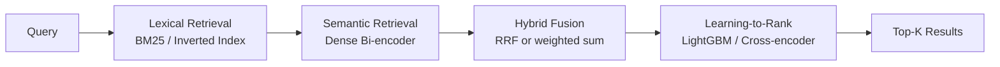

# Search Systems: BM25, Semantic Search, Hybrid Retrieval, and Learning-to-Rank

**Area G — ML System Design | Learning Memory OS Curriculum**

---

## 1. Why Search is a Systems Problem

Search is not just text matching. At scale — hundreds of millions of documents, tens of thousands of queries per second, 50ms latency budgets — search requires a layered architecture: a fast lexical retrieval stage to reduce the search space, followed by increasingly expensive semantic and personalized stages. Understanding when to apply each layer, and how to combine them, is the core systems design challenge.



The fundamental tension: exact lexical matching is fast and precise for keyword queries; dense semantic matching generalizes but is expensive. Hybrid systems combine both, while LTR learns to reorder candidates using rich features.

---

## 2. BM25 From Scratch

BM25 (Best Match 25) is the dominant lexical ranking function. It extends TF-IDF with term frequency saturation (a term appearing 100x in a document is not 100x more relevant than one appearing 5x) and document length normalization (long documents are penalized for inflated term counts).

**Score formula**:
```
BM25(q, d) = sum_{t in q}  IDF(t) * (TF(t,d) * (k1 + 1)) / (TF(t,d) + k1 * (1 - b + b * |d| / avgdl))
```

Where k1 ≈ 1.5 (saturation), b ≈ 0.75 (length normalization), avgdl = average document length in tokens.

```python
import math
from collections import defaultdict
from typing import List, Dict, Tuple

class BM25:
    """BM25 inverted index from scratch."""
    def __init__(self, k1: float = 1.5, b: float = 0.75):
        self.k1 = k1
        self.b = b
        self.index: Dict[str, Dict[int, int]] = defaultdict(dict)  # term -> {doc_id: tf}
        self.doc_lengths: Dict[int, int] = {}
        self.num_docs = 0
        self.avgdl = 0.0

    def tokenize(self, text: str) -> List[str]:
        """Simple whitespace tokenizer with lowercasing."""
        return text.lower().split()

    def add_documents(self, documents: List[str]):
        """Build the inverted index from a list of document strings."""
        for doc_id, doc in enumerate(documents):
            tokens = self.tokenize(doc)
            self.doc_lengths[doc_id] = len(tokens)
            tf_counts: Dict[str, int] = defaultdict(int)
            for token in tokens:
                tf_counts[token] += 1
            for token, count in tf_counts.items():
                self.index[token][doc_id] = count
        self.num_docs = len(documents)
        self.avgdl = sum(self.doc_lengths.values()) / max(self.num_docs, 1)

    def idf(self, term: str) -> float:
        """Smoothed IDF from Robertson & Sparck Jones (1976)."""
        df = len(self.index.get(term, {}))
        return math.log((self.num_docs - df + 0.5) / (df + 0.5) + 1)

    def score_doc(self, query: str, doc_id: int) -> float:
        """BM25 score for a (query, doc_id) pair."""
        score = 0.0
        dl = self.doc_lengths.get(doc_id, 0)
        norm = self.k1 * (1.0 - self.b + self.b * dl / self.avgdl)
        for term in self.tokenize(query):
            if doc_id not in self.index.get(term, {}):
                continue
            tf = self.index[term][doc_id]
            score += self.idf(term) * (tf * (self.k1 + 1.0)) / (tf + norm)
        return score

    def search(self, query: str, k: int = 10) -> List[Tuple[int, float]]:
        """Return top-k (doc_id, score) pairs for a query using the inverted index."""
        # Only score documents that contain at least one query term
        candidate_docs: set = set()
        for term in self.tokenize(query):
            candidate_docs.update(self.index.get(term, {}).keys())
        scored = [(doc_id, self.score_doc(query, doc_id)) for doc_id in candidate_docs]
        scored.sort(key=lambda x: x[1], reverse=True)
        return scored[:k]


# Quick smoke test
if __name__ == "__main__":
    docs = [
        "transformer architecture self-attention mechanism multi-head",
        "BM25 term frequency inverse document frequency ranking",
        "neural network training stochastic gradient descent",
        "information retrieval inverted index BM25 scoring",
    ]
    bm25 = BM25()
    bm25.add_documents(docs)
    print(bm25.search("BM25 ranking information retrieval", k=3))
    # Expected: doc 3 and doc 1 rank highest
```

### 2.1 Scaling BM25: On-Disk Inverted Indexes

Production BM25 uses on-disk sorted posting lists (Apache Lucene, OpenSearch). Key considerations:
- **Posting list compression**: VByte, PForDelta — compress doc_id deltas, not raw IDs
- **Tiered indexing**: hot shard (recent docs) + cold shard (old docs)
- **Block-max WAND**: early termination for top-K retrieval without scoring all candidates

---

## 3. Semantic Search with Sentence Transformers

Dense retrieval maps queries and documents to a shared embedding space. Similarity is cosine or dot product.

```python
from sentence_transformers import SentenceTransformer
import numpy as np
import faiss
from typing import List, Tuple

def build_semantic_index(documents: List[str],
                          model_name: str = "BAAI/bge-small-en-v1.5",
                          batch_size: int = 256) -> Tuple:
    """
    Encode documents with a bi-encoder and build a FAISS IndexFlatIP.
    Returns (model, index, embeddings_matrix).
    """
    model = SentenceTransformer(model_name)
    # normalize_embeddings=True enables cosine similarity via inner product
    embeddings = model.encode(
        documents,
        batch_size=batch_size,
        normalize_embeddings=True,
        show_progress_bar=True,
        convert_to_numpy=True,
    ).astype('float32')
    d = embeddings.shape[1]
    # IndexFlatIP: exact brute-force inner product (cosine for normalized vectors)
    index = faiss.IndexFlatIP(d)
    index.add(embeddings)
    return model, index, embeddings

def semantic_search(query: str,
                     model: SentenceTransformer,
                     index: faiss.Index,
                     k: int = 20) -> List[Tuple[int, float]]:
    """Encode query and retrieve top-k documents via FAISS."""
    q_emb = model.encode(
        [query], normalize_embeddings=True, convert_to_numpy=True
    ).astype('float32')
    distances, indices = index.search(q_emb, k)
    return list(zip(indices[0].tolist(), distances[0].tolist()))


# For large corpora: use HNSW instead of flat index
def build_hnsw_semantic_index(embeddings: np.ndarray, M: int = 32) -> faiss.Index:
    """HNSW index: O(log n) search, no training needed."""
    d = embeddings.shape[1]
    index = faiss.IndexHNSWFlat(d, M)
    index.hnsw.efConstruction = 200
    index.hnsw.efSearch = 128
    index.add(embeddings)
    return index
```

### 3.1 Bi-encoder vs. Cross-encoder

| Property | Bi-encoder | Cross-encoder |
|---|---|---|
| Query-doc encoding | Independent | Joint |
| Offline indexing | Yes (doc embeddings precomputed) | No |
| Latency at query time | Very fast (ANN lookup) | Slow (encode each candidate) |
| Accuracy | Lower | Higher |
| Use case | Candidate retrieval (top-1000) | Final reranking (top-10) |

```python
from sentence_transformers import CrossEncoder

def rerank_with_cross_encoder(
    query: str,
    candidates: List[Tuple[int, str]],  # (doc_id, doc_text)
    model_name: str = "cross-encoder/ms-marco-MiniLM-L-6-v2",
    k: int = 10,
) -> List[Tuple[int, float]]:
    """
    Use a cross-encoder to rerank the top candidates from bi-encoder retrieval.
    This is the standard two-stage retrieval+rerank pattern for production search.
    """
    reranker = CrossEncoder(model_name, max_length=512)
    pairs = [(query, doc_text) for _, doc_text in candidates]
    scores = reranker.predict(pairs)  # shape: (num_candidates,)
    scored = [(doc_id, float(s)) for (doc_id, _), s in zip(candidates, scores)]
    scored.sort(key=lambda x: x[1], reverse=True)
    return scored[:k]
```

---

## 4. Hybrid Retrieval with Reciprocal Rank Fusion

RRF combines ranked lists from multiple retrieval systems without requiring score calibration.

```python
from typing import List, Tuple, Dict

def reciprocal_rank_fusion(
    ranked_lists: List[List[Tuple[int, float]]],
    k: int = 60,
    weights: List[float] = None,
) -> List[Tuple[int, float]]:
    """
    Combine multiple ranked lists using RRF (Cormack et al., 2009).
    RRF_score(d) = sum_i  weight_i / (k + rank_i(d))
    
    ranked_lists: list of [(doc_id, score), ...], sorted by score desc
    k: RRF constant (default 60; robust to values 10-100)
    weights: per-list weights (default uniform 1.0)
    """
    if weights is None:
        weights = [1.0] * len(ranked_lists)
    rrf_scores: Dict[int, float] = {}
    for ranked, w in zip(ranked_lists, weights):
        for rank, (doc_id, _) in enumerate(ranked, start=1):
            rrf_scores[doc_id] = rrf_scores.get(doc_id, 0.0) + w / (k + rank)
    return sorted(rrf_scores.items(), key=lambda x: x[1], reverse=True)


def hybrid_search(
    query: str,
    bm25: BM25,
    sem_model: SentenceTransformer,
    sem_index: faiss.Index,
    k_retrieve: int = 100,
    k_return: int = 20,
    rrf_k: int = 60,
    sem_weight: float = 0.6,
    lex_weight: float = 0.4,
) -> List[Tuple[int, float]]:
    """Full hybrid BM25 + dense retrieval pipeline with RRF fusion."""
    lex_results = bm25.search(query, k=k_retrieve)
    sem_results = semantic_search(query, sem_model, sem_index, k=k_retrieve)
    merged = reciprocal_rank_fusion(
        [lex_results, sem_results],
        k=rrf_k,
        weights=[lex_weight, sem_weight],
    )
    return merged[:k_return]
```

---

## 5. Learning-to-Rank with LightGBM

LTR models reorder hybrid-retrieved candidates using features from query, document, and their interaction. LambdaRank is the standard — it directly optimizes NDCG.

```python
import lightgbm as lgb
import numpy as np

def extract_ltr_features(query_tokens: set, doc_tokens: set,
                          bm25_score: float, sem_score: float,
                          doc_len: int) -> np.ndarray:
    """
    Feature vector for a (query, document) pair for LTR training.
    Features should capture multiple relevance signals.
    """
    overlap = len(query_tokens & doc_tokens)
    features = [
        bm25_score,                               # 1. BM25 score
        sem_score,                                # 2. Semantic cosine similarity
        overlap,                                  # 3. Exact token overlap count
        overlap / max(len(query_tokens), 1),      # 4. Query coverage
        overlap / max(len(doc_tokens), 1),         # 5. Doc coverage (precision)
        doc_len,                                   # 6. Document length
        bm25_score * sem_score,                   # 7. Score interaction
        float(doc_len < 200),                     # 8. Short doc indicator
    ]
    return np.array(features, dtype=np.float32)

def train_lambdarank(X: np.ndarray, y: np.ndarray, groups: np.ndarray):
    """
    Train LightGBM LambdaRank model.
    X: (N, F) feature matrix
    y: (N,) relevance labels (0-3 graded)
    groups: (Q,) array of query group sizes (sum must equal N)
    """
    n_train = int(0.8 * len(groups))
    train_n = sum(groups[:n_train])
    
    X_train, X_val = X[:train_n], X[train_n:]
    y_train, y_val = y[:train_n], y[train_n:]
    groups_train, groups_val = groups[:n_train], groups[n_train:]

    dtrain = lgb.Dataset(X_train, label=y_train, group=groups_train)
    dval = lgb.Dataset(X_val, label=y_val, group=groups_val, reference=dtrain)

    params = {
        "objective": "lambdarank",
        "metric": "ndcg",
        "eval_at": [1, 5, 10],
        "num_leaves": 31,
        "learning_rate": 0.05,
        "min_data_in_leaf": 5,
        "lambdarank_truncation_level": 10,
        "verbosity": -1,
    }
    model = lgb.train(
        params, dtrain, num_boost_round=500,
        valid_sets=[dval],
        callbacks=[lgb.early_stopping(50), lgb.log_evaluation(100)],
    )
    return model
```

---

## 6. Evaluation: NDCG, MRR, MAP

```python
import math
import numpy as np

def ndcg_at_k(relevances: List[float], k: int) -> float:
    """
    NDCG@K: normalized discounted cumulative gain.
    relevances: ordered list of relevance scores for retrieved docs.
    """
    dcg = sum(rel / math.log2(rank + 2)
              for rank, rel in enumerate(relevances[:k]))
    ideal = sorted(relevances, reverse=True)[:k]
    idcg = sum(rel / math.log2(rank + 2) for rank, rel in enumerate(ideal))
    return dcg / max(idcg, 1e-9)

def mrr(relevant_flags: List[int]) -> float:
    """Mean Reciprocal Rank: 1/rank of first relevant result."""
    for rank, rel in enumerate(relevant_flags, start=1):
        if rel > 0:
            return 1.0 / rank
    return 0.0

def mean_average_precision(relevant_flags: List[int]) -> float:
    """MAP: mean of precision@k for each relevant result position."""
    relevant_count = 0
    precision_sum = 0.0
    for rank, rel in enumerate(relevant_flags, start=1):
        if rel > 0:
            relevant_count += 1
            precision_sum += relevant_count / rank
    if relevant_count == 0:
        return 0.0
    return precision_sum / relevant_count

def batch_evaluate(retrieve_fn, queries: dict, qrels: dict, k: int = 10) -> dict:
    """
    Evaluate a retrieval function over all queries.
    queries: {query_id: query_text}
    qrels: {query_id: {doc_id: relevance_score}}
    retrieve_fn: query_id -> [(doc_id, score), ...]
    """
    ndcgs, mrrs, maps = [], [], []
    for qid, qtext in queries.items():
        results = retrieve_fn(qid)[:k]
        relevances = [qrels.get(qid, {}).get(doc_id, 0) for doc_id, _ in results]
        binary = [1 if r > 0 else 0 for r in relevances]
        ndcgs.append(ndcg_at_k(relevances, k))
        mrrs.append(mrr(binary))
        maps.append(mean_average_precision(binary))
    return {
        f"ndcg@{k}": float(np.mean(ndcgs)),
        "mrr": float(np.mean(mrrs)),
        "map": float(np.mean(maps)),
    }
```

---

## 7. Common Misconceptions

**Misconception: "Semantic search is always better than BM25."**
Correction: BM25 outperforms dense retrieval on keyword-centric queries, exact string matches (product IDs, person names), and out-of-domain text where embedding models weren't trained. On the BEIR benchmark, BM25 beats many dense models on biomedical and legal domains. Always measure; hybrid systems typically win.

**Misconception: "RRF is just a heuristic — score calibration is more principled."**
Correction: Score calibration across BM25 (unnormalized, unbounded) and dense retrieval (cosine similarity in [-1, 1]) is difficult and system-dependent. RRF's rank-based fusion sidesteps calibration and empirically matches or exceeds calibrated score fusion on standard benchmarks. The k=60 constant provides robust performance across diverse settings.

**Misconception: "Larger bi-encoder models always give better retrieval."**
Correction: Bi-encoder quality depends on training data quality and hard negative mining strategy. A well-trained small model (BAAI/bge-small-en, 33M params) often beats a poorly-trained large model. Distillation from a cross-encoder teacher is typically more effective than scaling the bi-encoder alone.

**Misconception: "LTR requires pairwise preference labels (A is better than B)."**
Correction: LambdaRank and LambdaMART work with graded relevance labels (0/1/2/3). The gradient computation internally constructs implicit pairwise comparisons during training but the training labels are graded, not binary pairs. Listwise approaches (LambdaMART, SoftRank) optimize ranking metrics directly from graded labels.

**Misconception: "NDCG@10 is the only metric that matters for search."**
Correction: Metric selection depends on the application. E-commerce: revenue per session, conversion rate. Web search: query abandonment rate, zero-result rate. QA: Exact Match, F1. NDCG and MRR are offline proxies; the arbiter is online A/B test lift on business metrics. A system with higher NDCG@10 offline but worse click-through-rate online is worse.

---

## 8. Hands-On Labs

### Exercise 1: Implement BM25 and Evaluate on BEIR

**Goal**: Build a BM25 index from scratch and evaluate it on a BEIR benchmark dataset. Confirm NDCG@10 ≥ 0.55 on BEIR/scifact.

**Starter code**:
```python
from beir.datasets.data_loader import GenericDataLoader
from beir.retrieval.evaluation import EvaluateRetrieval
import os

def run_bm25_on_beir(dataset_name: str = "scifact", out_dir: str = "/tmp/beir"):
    """
    Download BEIR dataset, index with BM25, and evaluate.
    """
    from beir import util
    url = f"https://public.ukp.informatik.tu-darmstadt.de/thakur/BEIR/datasets/{dataset_name}.zip"
    data_path = util.download_and_unzip(url, out_dir)
    corpus, queries, qrels = GenericDataLoader(data_folder=data_path).load(split="test")
    
    # 1. Build BM25 index
    docs = list(corpus.values())
    doc_ids = list(corpus.keys())
    bm25 = BM25()
    bm25.add_documents([d["title"] + " " + d["text"] for d in docs])
    
    # 2. Retrieve top-100 for each query
    results = {}
    for qid, qtext in queries.items():
        hits = bm25.search(qtext, k=100)
        results[qid] = {doc_ids[doc_idx]: score for doc_idx, score in hits}
    
    # 3. Evaluate
    evaluator = EvaluateRetrieval()
    metrics = evaluator.evaluate(qrels, results, [1, 5, 10, 100])
    print(f"NDCG@10: {metrics['NDCG']['NDCG@10']:.4f}")
    return metrics
```

**Acceptance criteria**: NDCG@10 ≥ 0.55 on BEIR/scifact.
**Stretch**: Add stemming with NLTK `PorterStemmer` and stopword removal. Measure impact on NDCG@10. Try the `rank_bm25` library and compare speed.

---

### Exercise 2: Hybrid Search Pipeline with RRF

**Goal**: Build a hybrid BM25 + sentence-transformer system and show it beats either alone on semantic queries.

**Starter code**:
```python
def build_hybrid_pipeline(documents: List[str], doc_ids: List[str],
                           model_name: str = "BAAI/bge-small-en-v1.5"):
    """
    Build a hybrid search function combining BM25 and dense retrieval.
    Returns search_fn: (query, k) -> [(doc_id, score), ...]
    """
    # 1. Build BM25 index
    bm25 = BM25()
    bm25.add_documents(documents)
    
    # 2. Build semantic index
    model, sem_index, _ = build_semantic_index(documents, model_name)
    
    def search_fn(query: str, k: int = 20) -> List[Tuple[str, float]]:
        # TODO: implement hybrid search with RRF
        # Return [(doc_id_str, rrf_score), ...]
        pass
    
    return search_fn
```

**Acceptance criteria**: On 10 semantic test queries (e.g., "What causes inflation?"), the hybrid system achieves NDCG@10 ≥ 5% higher than BM25-only.
**Stretch**: Implement query-type routing: classify queries as "keyword" vs "semantic" using a logistic regression on query features (length, named entities, question words), then route to BM25-only or hybrid accordingly.

---

### Exercise 3: Cross-Encoder Re-ranker Evaluation

**Goal**: Show that adding a cross-encoder re-ranker on top of bi-encoder retrieval improves NDCG@10.

**Starter code**:
```python
def two_stage_search(query: str,
                     bi_encoder_fn,     # returns [(doc_id, score), ...]
                     corpus: dict,       # doc_id -> {"title": ..., "text": ...}
                     reranker_model_name: str = "cross-encoder/ms-marco-MiniLM-L-6-v2",
                     k_retrieve: int = 100,
                     k_return: int = 10) -> List[Tuple[str, float]]:
    """
    Stage 1: retrieve top-k_retrieve with bi-encoder
    Stage 2: rerank top candidates with cross-encoder
    """
    # TODO: implement two-stage pipeline
    pass

# Evaluate: compare bi-encoder alone vs bi-encoder + cross-encoder
```

**Acceptance criteria**: Cross-encoder re-ranking improves NDCG@10 by ≥ 3 points over bi-encoder alone on MS MARCO dev.
**Stretch**: Measure the latency trade-off (bi-encoder alone vs. with cross-encoder) and find the Pareto-optimal top-K for re-ranking (at what K does adding the cross-encoder stop helping?).

---

## 9. Query Understanding and Expansion

Before retrieval, preprocessing the query improves recall:

```python
import re
from typing import List, Optional

def query_expansion_with_synonyms(query: str,
                                   synonym_dict: dict = None) -> str:
    """
    Simple query expansion: replace query terms with term OR synonym.
    synonym_dict: {term: [synonym1, synonym2, ...]}
    Returns expanded query string.
    """
    if synonym_dict is None:
        synonym_dict = {
            "buy": ["purchase", "order", "acquire"],
            "fast": ["quick", "rapid", "speedy"],
            "cheap": ["affordable", "budget", "low-cost"],
        }
    tokens = query.lower().split()
    expanded = []
    for token in tokens:
        if token in synonym_dict:
            synonyms = synonym_dict[token]
            expanded.append(f"({token} OR {' OR '.join(synonyms)})")
        else:
            expanded.append(token)
    return " ".join(expanded)


def hypothetical_document_embedding(query: str, llm_fn) -> str:
    """
    HyDE (Gao et al., 2022): generate a hypothetical answer to the query,
    embed the hypothetical answer instead of the query.
    This improves recall for questions where the query phrasing differs
    significantly from how answers are phrased in documents.
    
    llm_fn: callable(prompt) -> str
    """
    prompt = (
        f"Write a brief factual answer to the following question in 2-3 sentences:\n"
        f"Question: {query}\nAnswer:"
    )
    hypothetical_answer = llm_fn(prompt)
    return hypothetical_answer  # embed this instead of the raw query


def detect_query_type(query: str) -> str:
    """
    Classify query as 'keyword', 'semantic', or 'navigational'.
    Used to route to appropriate retrieval pipeline.
    """
    tokens = query.split()
    # Heuristics
    if len(tokens) <= 3 and not query.endswith("?") and "?" not in query:
        # Short, no question mark: likely keyword
        return "keyword"
    question_words = {"what", "how", "why", "when", "where", "who", "which"}
    if query.split()[0].lower() in question_words or "?" in query:
        return "semantic"
    # Check for named entity patterns (simple heuristic)
    if re.search(r'\b[A-Z][a-z]+ [A-Z][a-z]+\b', query):
        return "navigational"
    return "semantic"
```

---

## 10. Reference Reading

- Cormack et al. (2009): "Reciprocal Rank Fusion outperforms Condorcet and individual Rank Learning Methods" (RRF paper)
- Thakur et al. (2021): BEIR: A Heterogeneous Benchmark for Zero-shot Evaluation of IR models
- Nogueira and Cho (2019): Passage Re-ranking with BERT
- Robertson and Zaragoza (2009): The Probabilistic Relevance Framework — BM25 foundations
- Gao et al. (2022): Precise Zero-Shot Dense Retrieval without Relevance Labels (HyDE)
- Formal et al. (2021): SPLADE: Sparse Lexical and Expansion Model for First Stage Ranking
