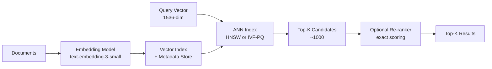

# Vector Database Design: HNSW, IVF-PQ, Sharding, and Hybrid Search

**Area G — ML System Design | Learning Memory OS Curriculum**

---

## 1. Why Vector Databases Are a New Infrastructure Category

Traditional databases store and retrieve structured or semi-structured data by exact match or range queries. Vector databases store high-dimensional embedding vectors and retrieve by approximate nearest-neighbor (ANN) similarity. This capability is fundamental to modern ML systems: RAG pipelines, semantic search, recommendation systems, and image retrieval all require fast similarity search over millions to billions of vectors.

The key engineering insight: ANN is a latency-accuracy trade-off problem. Exact nearest neighbor search scales as O(n*d) — infeasible for 100M vectors at 1536 dimensions. Approximate algorithms sacrifice some recall for orders-of-magnitude speedup via indexing structures that organize vectors spatially.



---

## 2. HNSW: Hierarchical Navigable Small World Graphs

HNSW (Malkov and Yashunin, 2018) is the most widely used ANN algorithm for high recall requirements. It builds a multi-layer proximity graph where each layer is a "small world network" — most nodes connect to nearby nodes, but a few long-range links enable fast traversal.

### 2.1 HNSW Conceptual Implementation

```python
import heapq
import random
import math
from collections import defaultdict
from typing import List, Tuple, Set, Dict

def cosine_distance(a: List[float], b: List[float]) -> float:
    """Compute cosine distance (1 - cosine_similarity)."""
    dot = sum(x * y for x, y in zip(a, b))
    norm_a = math.sqrt(sum(x*x for x in a))
    norm_b = math.sqrt(sum(y*y for y in b))
    if norm_a == 0 or norm_b == 0:
        return 1.0
    return 1.0 - dot / (norm_a * norm_b)

class HNSWSketch:
    """
    Simplified HNSW index sketch (for pedagogical understanding, not production use).
    Real implementation: use faiss or hnswlib.
    """
    def __init__(self, M: int = 16, ef_construction: int = 200, M0: int = None):
        self.M = M                           # max connections per node per layer
        self.M0 = M0 or M * 2               # max connections at layer 0
        self.ef_construction = ef_construction
        self.vectors: Dict[int, List[float]] = {}
        self.graphs: Dict[int, Dict[int, Set[int]]] = defaultdict(
            lambda: defaultdict(set)
        )  # graphs[layer][node_id] = set of neighbor ids
        self.node_max_layer: Dict[int, int] = {}
        self.entry_point: int = -1
        self.max_layer: int = -1

    def _random_layer(self) -> int:
        """Sample the max layer for a new node using exponential distribution."""
        mL = 1.0 / math.log(self.M)
        return int(-math.log(random.random()) * mL)

    def _search_layer(self, query: List[float], entry_id: int,
                       ef: int, layer: int) -> List[Tuple[float, int]]:
        """Search layer for ef nearest neighbors to query starting from entry_id."""
        visited: Set[int] = {entry_id}
        candidates = [(cosine_distance(query, self.vectors[entry_id]), entry_id)]
        dynamic_list = candidates.copy()
        heapq.heapify(candidates)
        
        while candidates:
            dist, node = heapq.heappop(candidates)
            worst_in_list = max(dynamic_list, key=lambda x: x[0])[0]
            if dist > worst_in_list:
                break
            for neighbor in self.graphs[layer][node]:
                if neighbor not in visited:
                    visited.add(neighbor)
                    ndist = cosine_distance(query, self.vectors[neighbor])
                    if len(dynamic_list) < ef or ndist < worst_in_list:
                        heapq.heappush(candidates, (ndist, neighbor))
                        dynamic_list.append((ndist, neighbor))
                        if len(dynamic_list) > ef:
                            dynamic_list.remove(max(dynamic_list, key=lambda x: x[0]))
        return sorted(dynamic_list)[:ef]

    def add(self, node_id: int, vector: List[float]):
        """Insert a node into the HNSW index."""
        self.vectors[node_id] = vector
        layer = self._random_layer()
        self.node_max_layer[node_id] = layer
        if self.entry_point == -1:
            self.entry_point = node_id
            self.max_layer = layer
            return
        ep = self.entry_point
        for lc in range(self.max_layer, layer, -1):
            neighbors = self._search_layer(vector, ep, ef=1, layer=lc)
            ep = neighbors[0][1]
        for lc in range(min(layer, self.max_layer), -1, -1):
            M = self.M0 if lc == 0 else self.M
            neighbors = self._search_layer(vector, ep, ef=self.ef_construction, layer=lc)
            selected = [n[1] for n in neighbors[:M]]
            for nb in selected:
                self.graphs[lc][node_id].add(nb)
                self.graphs[lc][nb].add(node_id)
                if len(self.graphs[lc][nb]) > M:
                    # Prune: keep M nearest neighbors
                    nb_vec = self.vectors[nb]
                    pruned = sorted(self.graphs[lc][nb],
                                    key=lambda x: cosine_distance(nb_vec, self.vectors[x]))[:M]
                    self.graphs[lc][nb] = set(pruned)
            ep = neighbors[0][1]
        if layer > self.max_layer:
            self.max_layer = layer
            self.entry_point = node_id

    def search(self, query: List[float], k: int = 10,
                ef_search: int = 50) -> List[Tuple[float, int]]:
        """Return top-k nearest neighbors for query vector."""
        ep = self.entry_point
        for layer in range(self.max_layer, 0, -1):
            neighbors = self._search_layer(query, ep, ef=1, layer=layer)
            ep = neighbors[0][1]
        candidates = self._search_layer(query, ep, ef=max(ef_search, k), layer=0)
        return candidates[:k]
```

### 2.2 Production HNSW with hnswlib

```python
import hnswlib
import numpy as np

def build_hnsw_index(vectors: np.ndarray, M: int = 32,
                      ef_construction: int = 200) -> hnswlib.Index:
    """
    Build an HNSW index using hnswlib (C++ backend, much faster than the sketch above).
    vectors: (N, D) float32 array
    """
    n, d = vectors.shape
    index = hnswlib.Index(space='cosine', dim=d)
    index.init_index(max_elements=n, ef_construction=ef_construction, M=M)
    index.add_items(vectors, num_threads=4)
    index.set_ef(128)  # ef_search: higher = more accurate, slower
    return index

def query_hnsw(index: hnswlib.Index, query: np.ndarray, k: int = 10):
    """Query HNSW index for k nearest neighbors."""
    labels, distances = index.knn_query(query, k=k)
    return list(zip(labels[0].tolist(), distances[0].tolist()))
```

---

## 3. IVF-PQ: Inverted File + Product Quantization

For truly large-scale deployments (500M+ vectors), HNSW memory footprint becomes prohibitive (500M * 1536 * 4 bytes ≈ 3TB). IVF-PQ compresses vectors via product quantization, reducing memory ~32x at the cost of some recall.

```python
import faiss
import numpy as np

def build_ivfpq_index(vectors: np.ndarray,
                       nlist: int = 4096,   # number of Voronoi clusters
                       m: int = 32,         # number of sub-quantizers
                       nbits: int = 8,      # bits per sub-quantizer (256 codes)
                       nprobe: int = 64     # clusters to probe at query time
                       ) -> faiss.Index:
    """
    Build IVF-PQ index with FAISS.
    Memory reduction: original size / m bytes per sub-vector
    For D=1536, m=48: 1536/48 = 32 bytes per vector vs. 6144 bytes (float32)
    """
    d = vectors.shape[1]
    assert d % m == 0, f"d={d} must be divisible by m={m}"
    
    # Quantizer: coarse clustering into nlist Voronoi cells
    quantizer = faiss.IndexFlatL2(d)
    # IVF-PQ index
    index = faiss.IndexIVFPQ(quantizer, d, nlist, m, nbits)
    
    # Training: requires at least 39 * nlist vectors
    print(f"Training IVF-PQ index on {len(vectors)} vectors...")
    index.train(vectors.astype('float32'))
    
    # Adding vectors in batches
    batch_size = 50_000
    for i in range(0, len(vectors), batch_size):
        batch = vectors[i:i+batch_size].astype('float32')
        index.add(batch)
        print(f"  Added {min(i+batch_size, len(vectors))}/{len(vectors)}")
    
    index.nprobe = nprobe
    print(f"Index built: {index.ntotal} vectors, nprobe={nprobe}")
    return index

def build_flat_index_gpu(vectors: np.ndarray) -> faiss.Index:
    """
    Exact search on GPU: 100x faster than CPU for moderate sizes.
    Requires faiss-gpu package.
    """
    d = vectors.shape[1]
    res = faiss.StandardGpuResources()
    index_flat = faiss.IndexFlatL2(d)
    index_gpu = faiss.index_cpu_to_gpu(res, 0, index_flat)
    index_gpu.add(vectors.astype('float32'))
    return index_gpu

def benchmark_recall(exact_index: faiss.Index,
                      approx_index: faiss.Index,
                      queries: np.ndarray, k: int = 10) -> float:
    """
    Measure recall@k of approximate index vs exact index.
    recall@k = fraction of true top-k that appear in approximate top-k
    """
    _, exact_ids = exact_index.search(queries, k)
    _, approx_ids = approx_index.search(queries, k)
    recalls = []
    for exact_row, approx_row in zip(exact_ids, approx_ids):
        exact_set = set(exact_row.tolist())
        approx_set = set(approx_row.tolist())
        recalls.append(len(exact_set & approx_set) / k)
    return float(np.mean(recalls))
```

---

## 4. pgvector: Vector Search in PostgreSQL

For applications that need vector search alongside relational queries, pgvector adds ANN indexes to PostgreSQL. This eliminates the need for a separate vector database for moderate-scale applications.

```python
import psycopg2
import numpy as np
from typing import List, Tuple

def setup_pgvector(conn_str: str, dim: int = 1536):
    """Create pgvector extension and a vector table."""
    with psycopg2.connect(conn_str) as conn:
        with conn.cursor() as cur:
            cur.execute("CREATE EXTENSION IF NOT EXISTS vector;")
            cur.execute(f"""
                CREATE TABLE IF NOT EXISTS documents (
                    id SERIAL PRIMARY KEY,
                    content TEXT NOT NULL,
                    metadata JSONB,
                    embedding vector({dim})
                );
            """)
            # HNSW index: fast approximate search
            cur.execute(f"""
                CREATE INDEX IF NOT EXISTS idx_documents_embedding
                ON documents USING hnsw (embedding vector_cosine_ops)
                WITH (m = 16, ef_construction = 64);
            """)
        conn.commit()

def upsert_documents(conn_str: str,
                      documents: List[Tuple[str, dict, np.ndarray]]):
    """
    Bulk insert (content, metadata, embedding) into pgvector table.
    documents: list of (text, metadata_dict, embedding_array)
    """
    with psycopg2.connect(conn_str) as conn:
        with conn.cursor() as cur:
            cur.executemany(
                """INSERT INTO documents (content, metadata, embedding)
                   VALUES (%s, %s, %s::vector)
                   ON CONFLICT DO NOTHING""",
                [(text, psycopg2.extras.Json(meta), embedding.tolist())
                 for text, meta, embedding in documents]
            )
        conn.commit()

def vector_search(conn_str: str, query_embedding: np.ndarray,
                   k: int = 10, metadata_filter: dict = None) -> List[dict]:
    """
    Hybrid vector + metadata filter search with pgvector.
    Returns top-k documents by cosine similarity.
    """
    with psycopg2.connect(conn_str) as conn:
        with conn.cursor(cursor_factory=psycopg2.extras.RealDictCursor) as cur:
            emb_str = str(query_embedding.tolist())
            if metadata_filter:
                # Example: filter by metadata->>'source' = 'arxiv'
                filter_clause = " AND " + " AND ".join(
                    f"metadata->>'{k}' = %s" for k in metadata_filter
                )
                filter_values = list(metadata_filter.values())
            else:
                filter_clause = ""
                filter_values = []
            
            cur.execute(
                f"""SELECT id, content, metadata,
                        1 - (embedding <=> %s::vector) AS similarity
                    FROM documents
                    WHERE TRUE {filter_clause}
                    ORDER BY embedding <=> %s::vector
                    LIMIT %s""",
                [emb_str] + filter_values + [emb_str, k]
            )
            return [dict(row) for row in cur.fetchall()]
```

---

## 5. Hybrid BM25 + Vector Search with RRF

```python
from rank_bm25 import BM25Okapi
import numpy as np
from typing import List, Tuple, Dict

def hybrid_search_with_rrf(
    query: str,
    documents: List[str],
    query_embedding: np.ndarray,
    doc_embeddings: np.ndarray,
    k_retrieve: int = 100,
    k_return: int = 20,
    rrf_k: int = 60,
) -> List[Tuple[int, float]]:
    """
    Hybrid search combining BM25 and FAISS ANN retrieval with RRF.
    """
    import faiss
    
    # BM25 retrieval
    tokenized = [doc.lower().split() for doc in documents]
    bm25 = BM25Okapi(tokenized)
    query_tokens = query.lower().split()
    bm25_scores = bm25.get_scores(query_tokens)
    bm25_ranked = sorted(enumerate(bm25_scores), key=lambda x: x[1], reverse=True)[:k_retrieve]
    
    # Vector retrieval with FAISS
    d = doc_embeddings.shape[1]
    index = faiss.IndexFlatIP(d)
    norms = np.linalg.norm(doc_embeddings, axis=1, keepdims=True)
    normalized = doc_embeddings / np.maximum(norms, 1e-9)
    index.add(normalized.astype('float32'))
    qnorm = np.linalg.norm(query_embedding)
    q = (query_embedding / max(qnorm, 1e-9)).reshape(1, -1).astype('float32')
    distances, indices = index.search(q, k_retrieve)
    vec_ranked = list(zip(indices[0].tolist(), distances[0].tolist()))
    
    # RRF fusion
    rrf_scores: Dict[int, float] = {}
    for rank, (doc_id, _) in enumerate(bm25_ranked, start=1):
        rrf_scores[doc_id] = rrf_scores.get(doc_id, 0.0) + 1.0 / (rrf_k + rank)
    for rank, (doc_id, _) in enumerate(vec_ranked, start=1):
        rrf_scores[doc_id] = rrf_scores.get(doc_id, 0.0) + 1.0 / (rrf_k + rank)
    
    return sorted(rrf_scores.items(), key=lambda x: x[1], reverse=True)[:k_return]
```

---

## 6. Sharding a Vector Index

For billions of vectors, a single index doesn't fit in memory. Shard by document ID (hash sharding) or by embedding cluster (semantic sharding).

```python
import faiss
import numpy as np
from typing import List, Tuple

class ShardedVectorIndex:
    """
    Simple sharded vector index using hash-based sharding.
    In production: distribute shards across machines; fan-out queries; merge results.
    """
    def __init__(self, n_shards: int, dim: int, index_type: str = "flat"):
        self.n_shards = n_shards
        self.dim = dim
        self.shards = []
        self.shard_id_maps: List[List[int]] = [[] for _ in range(n_shards)]
        for _ in range(n_shards):
            if index_type == "flat":
                self.shards.append(faiss.IndexFlatIP(dim))
            elif index_type == "hnsw":
                idx = faiss.IndexHNSWFlat(dim, 32)
                self.shards.append(idx)
    
    def _shard_for_id(self, doc_id: int) -> int:
        return doc_id % self.n_shards
    
    def add(self, doc_id: int, vector: np.ndarray):
        shard_idx = self._shard_for_id(doc_id)
        self.shards[shard_idx].add(vector.reshape(1, -1).astype('float32'))
        self.shard_id_maps[shard_idx].append(doc_id)
    
    def search(self, query: np.ndarray, k: int = 10) -> List[Tuple[int, float]]:
        """Fan-out query to all shards, merge and return top-k."""
        q = query.reshape(1, -1).astype('float32')
        all_results = []
        for shard_idx, (shard, id_map) in enumerate(zip(self.shards, self.shard_id_maps)):
            if shard.ntotal == 0:
                continue
            shard_k = min(k, shard.ntotal)
            distances, local_ids = shard.search(q, shard_k)
            for local_id, dist in zip(local_ids[0], distances[0]):
                if local_id >= 0 and local_id < len(id_map):
                    all_results.append((id_map[local_id], float(dist)))
        # Merge: take global top-k
        return sorted(all_results, key=lambda x: x[1], reverse=True)[:k]
```

---

## 7. Common Misconceptions

**Misconception: "Vector databases replace traditional databases."**
Correction: Vector databases complement relational databases; they don't replace them. Production systems typically use both: pgvector or a dedicated vector DB for similarity search, and PostgreSQL/MySQL for transactional data, metadata filtering, and joins. The metadata filter in pgvector shows how to combine both in one query.

**Misconception: "HNSW is always the best ANN algorithm."**
Correction: HNSW has excellent recall and latency but high memory usage (each node stores M neighbors as pointers). For billion-scale corpora, IVF-PQ is more practical: it reduces memory 32x via product quantization. DiskANN further enables search from SSD storage. Algorithm choice depends on dataset size, memory budget, latency requirements, and recall targets.

**Misconception: "Higher embedding dimension always means better search quality."**
Correction: Embedding models trained on specific tasks outperform generic models regardless of dimension. text-embedding-3-small (1536d) typically outperforms text-embedding-ada-002 (1536d) on retrieval tasks because of training improvements, not dimension. Matryoshka embeddings (e.g., bge-m3) allow truncation to 256d with minimal quality loss, saving 6x index memory.

**Misconception: "ANN recall@10 = 0.95 means 95% of searches return the correct result."**
Correction: Recall@K measures whether the true top-K exact nearest neighbors appear in the approximate top-K. A recall@10 of 0.95 means that for 95% of queries, all 10 true nearest neighbors are in the returned 10. For most RAG applications, the relevant documents are not the single nearest neighbor — recall@100 is a more meaningful metric, and it's typically much higher (0.99+) for HNSW with tuned ef_search.

**Misconception: "Cosine similarity and L2 distance give equivalent results for ANN."**
Correction: They're equivalent only for L2-normalized vectors. If vectors are not normalized, L2 distance and cosine similarity rank differently — L2 penalizes magnitude differences while cosine ignores them. Always normalize vectors when semantic similarity (not magnitude) is the intent, and choose the index metric accordingly (faiss: IndexFlatIP for cosine after normalization; IndexFlatL2 for L2 distance).

---

## 8. Hands-On Labs

### Exercise 1: Build and Benchmark FAISS Indexes

**Goal**: Build IVF-PQ and HNSW indexes on a 1M-vector dataset and measure recall vs. latency trade-off.

**Starter code**:
```python
import faiss
import numpy as np
import time

def generate_test_vectors(n: int = 1_000_000, d: int = 128, seed: int = 42) -> tuple:
    """Generate random vectors for benchmarking."""
    rng = np.random.RandomState(seed)
    vectors = rng.randn(n, d).astype('float32')
    faiss.normalize_L2(vectors)
    # Separate query set
    queries = rng.randn(1000, d).astype('float32')
    faiss.normalize_L2(queries)
    return vectors, queries

def benchmark_index(index_type: str, vectors: np.ndarray,
                     queries: np.ndarray, k: int = 10) -> dict:
    """Build index, measure build time, search latency, and recall@k vs exact."""
    # 1. Build index (time it)
    # 2. Search all queries (time it)
    # 3. Compare to exact search for recall@k
    # 4. Return {"build_sec": ..., "qps": ..., "recall@k": ...}
    pass
```

**Acceptance criteria**: HNSW achieves recall@10 ≥ 0.95 at ≥ 500 QPS on 1M vectors. IVF-PQ achieves recall@10 ≥ 0.85 at ≥ 2000 QPS with 8x less memory than HNSW.
**Stretch**: Plot the recall vs. latency Pareto frontier for HNSW (varying ef_search) and IVF-PQ (varying nprobe) on the same axes.

---

### Exercise 2: Hybrid BM25 + pgvector Search

**Goal**: Implement hybrid search over a small document corpus stored in pgvector.

**Starter code**:
```python
import psycopg2
from sentence_transformers import SentenceTransformer
import numpy as np

def build_pgvector_corpus(conn_str: str, documents: List[str],
                           model_name: str = "BAAI/bge-small-en-v1.5"):
    """Encode documents and store in pgvector."""
    model = SentenceTransformer(model_name)
    embeddings = model.encode(documents, normalize_embeddings=True)
    # TODO: setup_pgvector, upsert_documents
    pass

def hybrid_pgvector_bm25_search(conn_str: str, query: str,
                                  model: SentenceTransformer,
                                  all_docs: List[str],
                                  k: int = 10) -> List[dict]:
    """
    Hybrid search: BM25 over in-memory corpus + pgvector ANN.
    Combine with RRF.
    """
    # TODO: implement
    pass
```

**Acceptance criteria**: Hybrid search outperforms either BM25 or pgvector alone on 20 test queries spanning both keyword and semantic query types (NDCG@10 comparison).
**Stretch**: Add metadata filtering (e.g., only search documents from "source": "arxiv") and measure the recall-with-filter vs. without-filter.

---

### Exercise 3: Sharded Index Consistency Test

**Goal**: Verify the `ShardedVectorIndex` correctly partitions data and returns identical top-K to a single-shard flat index.

**Starter code**:
```python
import numpy as np

def test_sharded_vs_flat(n_vectors: int = 10_000, dim: int = 64,
                          n_shards: int = 4, k: int = 10, seed: int = 42):
    """
    1. Generate n_vectors random vectors.
    2. Build ShardedVectorIndex (n_shards shards).
    3. Build single FAISS IndexFlatIP.
    4. For 100 random queries, compare top-K results.
    5. Assert recall@k >= 0.99 (only disagreements are ties).
    """
    rng = np.random.RandomState(seed)
    vectors = rng.randn(n_vectors, dim).astype('float32')
    # TODO: build both indexes, run comparison
    pass
```

**Acceptance criteria**: Sharded index returns identical top-K to flat index (recall@K = 1.0) for all queries with no tie-breaking ambiguity.
**Stretch**: Implement semantic sharding (cluster all vectors into n_shards clusters; assign each vector to its nearest cluster). Measure if semantic sharding reduces cross-shard fan-out for typical queries (i.e., most results come from 1-2 shards instead of all shards).

---

## 9. Reference Reading

- Malkov and Yashunin (2018): Efficient and Robust Approximate Nearest Neighbor Search Using HNSW
- Johnson et al. (2019): Billion-Scale Similarity Search with FAISS
- pgvector GitHub: https://github.com/pgvector/pgvector
- DiskANN: Jayaram et al. (2019) — Disk-based ANN for billion-scale datasets
- Subramanya et al. (2019): DiskANN: Fast Accurate Billion-point Nearest Neighbor Search on a Single Node
