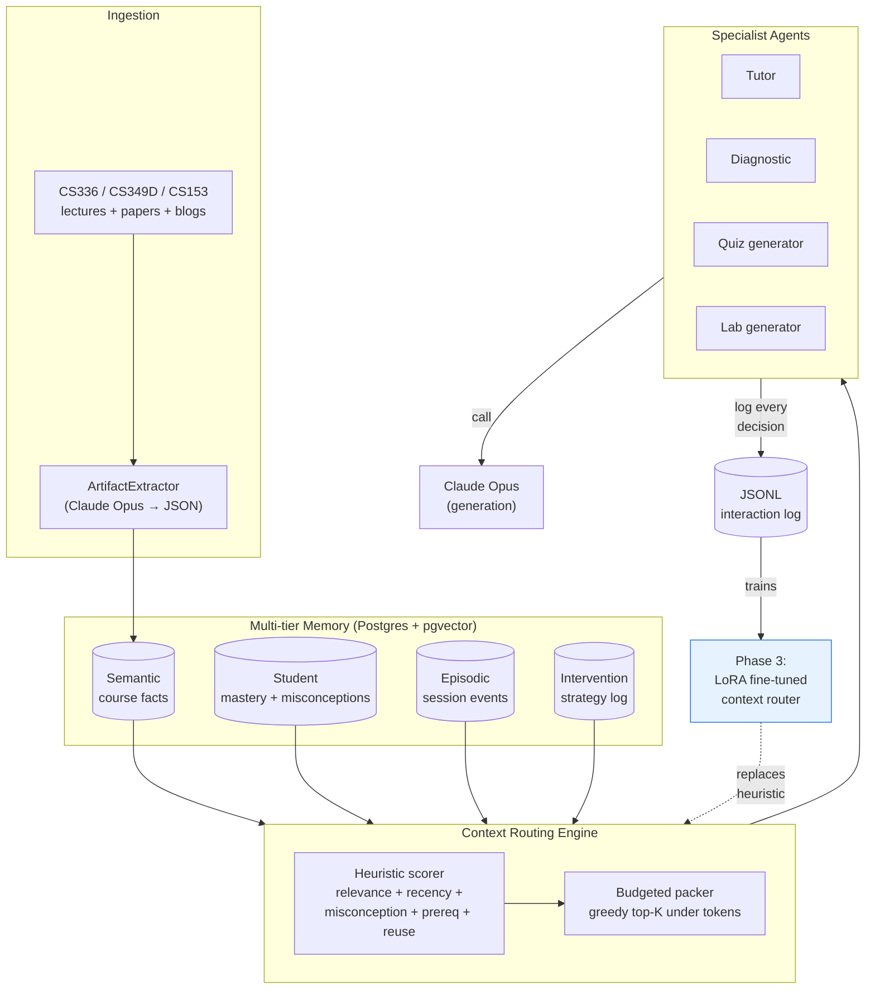

# Learning Memory OS — System Architecture

## Layers

1. **Ingestion** — Heterogeneous source material (Stanford CS336/CS349D/CS153 lectures, canonical papers, blogs) is converted into structured Pydantic artifacts via a strong-LLM-driven extractor.
2. **Multi-tier memory** — Postgres + pgvector, four tiers:
   - *Semantic*: stable course/topic facts
   - *Student*: per-student mastery state + active misconceptions
   - *Episodic*: append-only events (questions, replies, quiz attempts)
   - *Intervention*: log of which tutoring strategy was used + its outcome
3. **Context routing engine** — Three phases:
   - *Phase 1 (MVP)*: heuristic ranker (relevance + recency + misconception priority + prerequisite + reuse) + budgeted packer
   - *Phase 2*: combinatorial selector (knapsack with redundancy penalty + dependency bonus)
   - *Phase 3 (resume bullet)*: LoRA fine-tuned small open model trained on synthetic trajectories
4. **Specialist agents** — Each agent calls the routing engine for context; none receive raw global state. Tutor, Diagnostic, Quiz/Lab generators, Critic.
5. **Interaction log** — JSONL of every routing decision + agent output. Evaluation-ready; also the data flywheel for Phase 3 training signal.

## The recursion

Area E of the curriculum (`agent_memory`, `context_selection`, `multi_agent_orchestration`) teaches exactly the techniques the system uses to build itself. The author is student-zero; the system trains the engineer in the engineering of itself.
