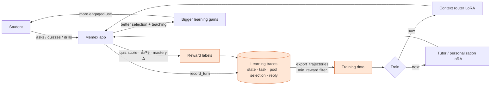
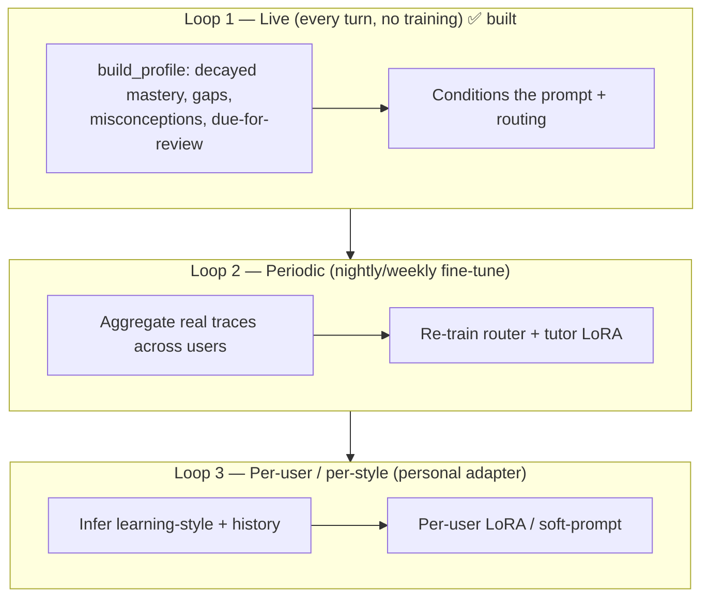
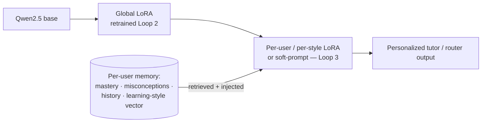
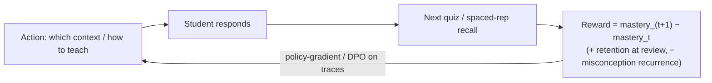
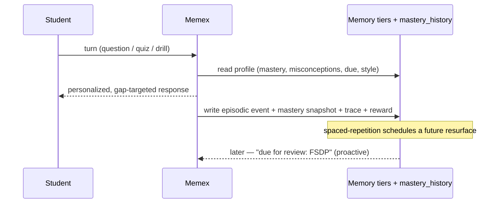

# Continuous Improvement → a Personalized, Self-Adapting Tutor LLM — Design Spec

Date: 2026-06-03
Status: Design (Phase B) — builds on the *Implemented* `2026-06-01-per-user-adaptation-and-finetune-capture` spec.

> Diagrams below render inline (Mermaid). Rendered PNGs for slides/the demo video live
> in [`docs/diagrams/`](../../diagrams/): `flywheel`, `three_loops`,
> `personalized_architecture`, `rl_from_outcomes`, `memory_lifecycle`.

## Thesis — why this matters now

When AI writes the code, the scarce, durable human skill is **systems-engineering
judgment**: choosing FSDP vs. tensor-parallel, reasoning about arithmetic intensity and
the memory wall, diagnosing an NCCL stall, deciding the latency/quality/cost operating
point. You can't prompt your way to that judgment — you have to *build* it, deliberately,
over time. Memex's job is to manufacture that judgment, and to do it with a model that
**continuously adapts to each learner**: it learns *how you learn*, remembers *what
you've learned*, and trains you to be an ML-systems engineer — not a code typist.

This spec defines the **data → model loop** that turns every interaction into a better,
more personalized tutor.

## The data flywheel

We already capture every turn richly (`memory/trace.py`). The flywheel turns that
capture into compounding model quality:

The asset that compounds is **not the answers** (a commodity) — it's the **labeled
learning-outcome data** no stateless chatbot collects.

## Three loops of adaptation (different timescales)

Adaptation happens at three speeds; only Loop 1 exists today.

- **Loop 1 — Live personalization (implemented).** `LearnerProfile` is rebuilt every
  turn from decayed mastery + misconceptions + spaced-repetition; it conditions the
  tutor's `STUDENT PROFILE` block and the router. Zero training, instant adaptation.
- **Loop 2 — Periodic retraining (next).** Accumulated **real** traces (not just
  synthetic) periodically re-train the context router and, later, a tutor LoRA — moving
  off pure oracle distillation toward learning from what actually helped students.
- **Loop 3 — Per-user / per-style adapter (the personalized LLM).** A lightweight
  per-user (or per-learning-style-cluster) LoRA / soft-prompt that biases generation
  toward *how this student learns best*, conditioned on their long-term memory.

## The personalized model: architecture

A shared base, a globally-improving adapter, and a thin personal layer — so we get
personalization without training a 7B per student.

- **Retrieval + parametric.** Long-term "what you've learned" lives in the **memory
  tiers** (semantic / student / episodic / intervention / XTrace) and is *retrieved*
  into context (cheap, editable, auditable). The **per-user adapter** captures the
  harder-to-retrieve *style* (pacing, depth, analogy-vs-formal, code-first-vs-theory).
- **Cold start → personalized.** New users ride the global adapter + their growing
  profile; the per-user adapter kicks in once enough labeled turns exist (e.g. ≥N with
  reward), or by assigning them to a **learning-style cluster** adapter immediately.

## Learning-style modeling ("learns how you learn")

Infer a per-user **style vector** from observable signals, refresh it continuously, and
condition generation on it.

| Signal (already logged) | Style dimension |
|---|---|
| quiz score vs. explanation depth requested | needs-scaffolding ↔ wants-rigor |
| follow-up rate, "go deeper" clicks | breadth ↔ depth |
| diagram/mermaid engagement | visual ↔ textual |
| time-to-correct after a miss | fast ↔ deliberate |
| misconception recurrence | needs-repetition ↔ one-shot |
| topic dwell + reuse | exploratory ↔ focused |

Stored as a small JSON/vector on the learner profile; **(a)** injected into the prompt
now (Loop 1), and **(b)** used to pick a style-cluster adapter / fine-tune target later
(Loop 3).

## RL from outcomes ("trains you to be a systems engineer", not imitates an oracle)

Today's router is **oracle-distilled** — ceiling = the oracle's judgment. The upgrade is
to optimize the thing we actually care about: **did the student learn?**

- **Reward** = realized **mastery gain** and **retention** (does it stick at the next
  spaced-rep review?), penalizing misconception recurrence — already capturable from
  `mastery_history` + `attach_reward`.
- **Method:** start with reward-weighted SFT / DPO on the trace store (offline, safe),
  graduate to online policy updates (Loop 2 → live). This is how the tutor can *exceed*
  the oracle, and how "select context / teach in a way that maximizes learning" becomes
  the literal training objective.

## "Remembers what you've learned" — long-term state lifecycle

Memory is **durable, structured, and inspectable** (the "Your AI" view + export/delete),
so the student owns it and can correct it — the opposite of opaque chatbot memory.

## What this makes possible (the product claim)

A tutor that, over weeks, *measurably* converts a learner into an ML-systems engineer:
- proven **mastery/readiness gains over time** (Loop-1 data, today),
- teaching that **adapts to their style and history** (Loops 1→3),
- a model that **gets better for everyone** as more people learn on it (Loop 2),
- aimed squarely at the **judgment** that survives AI-written code.

## Metrics

- **Learning gain**: Δmastery per concept; readiness lift per week (primary).
- **Retention**: pass rate at the *next* spaced-rep review.
- **Router-on-real-data**: Jaccard vs. realized-helpful selection (not just oracle).
- **Personalization lift**: A/B per-user/style adapter vs. global on learning gain.
- **Engagement→outcome**: turns-to-mastery; misconception resolution rate.

## Privacy & governance

Per-user data is **opt-in, exportable, and deletable** (already: `GET .../traces/export`,
`DELETE .../traces`, the "Your AI" consent panel). Per-user adapters are derived
artifacts — deleting a user's data invalidates/retrains them. No cross-user leakage:
personal adapters never train on another user's raw content.

## Phased rollout (what to build, in order)

1. **Style vector v1** — compute from existing signals, store on profile, inject into
   prompt (Loop 1 extension; low risk, no training).
2. **Reward-weighted export** — use `mastery_history` deltas + `attach_reward` to label
   traces by *realized learning gain*; extend `export_trajectories`.
3. **Loop-2 retrain job** — scheduled router (then tutor) LoRA fine-tune on real,
   reward-filtered traces; reuse the `cluster/` sweep + eval Pareto.
4. **Per-style cluster adapters** — cluster learners by style vector; train one adapter
   per cluster; route users to their cluster's adapter (Loop 3, shared cost).
5. **Per-user personalization** — for power users, a personal LoRA/soft-prompt on top.
6. **Online RL-from-outcomes** — graduate from offline reward-weighted SFT/DPO to live
   policy updates; guardrail with the heuristic engine as a safety floor.

## Non-goals (for this phase)

- Not training a full 7B per user (cost) — personalization is LoRA/soft-prompt + memory.
- Not abandoning retrieval for parametric memory — long-term facts stay in the
  inspectable memory tiers; the adapter carries *style*, not *content of record*.
- Not online RL before offline reward-weighted training is validated and safe.
